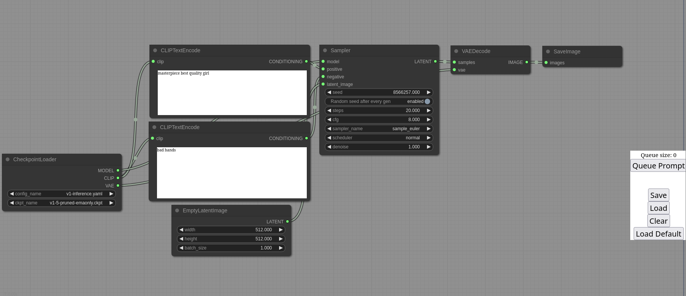

ComfyUI
=======
The most powerful and modular stable diffusion GUI and backend.
-----------


This ui will let you design and execute advanced stable diffusion pipelines using a graph/nodes/flowchart based interface. For some workflow examples and see what ComfyUI can do you can check out:
### [ComfyUI Examples](https://comfyanonymous.github.io/ComfyUI_examples/)

### [Installing ComfyUI](#installing)

## Features
- Nodes/graph/flowchart interface to experiment and create complex Stable Diffusion workflows without needing to code anything.
- Fully supports SD1.x, SD2.x, [SDXL](https://comfyanonymous.github.io/ComfyUI_examples/sdxl/), [Stable Video Diffusion](https://comfyanonymous.github.io/ComfyUI_examples/video/), [Stable Cascade](https://comfyanonymous.github.io/ComfyUI_examples/stable_cascade/), [SD3](https://comfyanonymous.github.io/ComfyUI_examples/sd3/) and [Stable Audio](https://comfyanonymous.github.io/ComfyUI_examples/audio/)
- [Flux](https://comfyanonymous.github.io/ComfyUI_examples/flux/)
- Asynchronous Queue system
- Many optimizations: Only re-executes the parts of the workflow that changes between executions.
- Smart memory management: can automatically run models on GPUs with as low as 1GB vram.
- Works even if you don't have a GPU with: ```--cpu``` (slow)
- Can load ckpt, safetensors and diffusers models/checkpoints. Standalone VAEs and CLIP models.
- Embeddings/Textual inversion
- [Loras (regular, locon and loha)](https://comfyanonymous.github.io/ComfyUI_examples/lora/)
- [Hypernetworks](https://comfyanonymous.github.io/ComfyUI_examples/hypernetworks/)
- Loading full workflows (with seeds) from generated PNG, WebP and FLAC files.
- Saving/Loading workflows as Json files.
- Nodes interface can be used to create complex workflows like one for [Hires fix](https://comfyanonymous.github.io/ComfyUI_examples/2_pass_txt2img/) or much more advanced ones.
- [Area Composition](https://comfyanonymous.github.io/ComfyUI_examples/area_composition/)
- [Inpainting](https://comfyanonymous.github.io/ComfyUI_examples/inpaint/) with both regular and inpainting models.
- [ControlNet and T2I-Adapter](https://comfyanonymous.github.io/ComfyUI_examples/controlnet/)
- [Upscale Models (ESRGAN, ESRGAN variants, SwinIR, Swin2SR, etc...)](https://comfyanonymous.github.io/ComfyUI_examples/upscale_models/)
- [unCLIP Models](https://comfyanonymous.github.io/ComfyUI_examples/unclip/)
- [GLIGEN](https://comfyanonymous.github.io/ComfyUI_examples/gligen/)
- [Model Merging](https://comfyanonymous.github.io/ComfyUI_examples/model_merging/)
- [LCM models and Loras](https://comfyanonymous.github.io/ComfyUI_examples/lcm/)
- [SDXL Turbo](https://comfyanonymous.github.io/ComfyUI_examples/sdturbo/)
- [AuraFlow](https://comfyanonymous.github.io/ComfyUI_examples/aura_flow/)
- [HunyuanDiT](https://comfyanonymous.github.io/ComfyUI_examples/hunyuan_dit/)
- Latent previews with [TAESD](#how-to-show-high-quality-previews)
- Starts up very fast.
- Works fully offline: will never download anything.
- [Config file](extra_model_paths.yaml.example) to set the search paths for models.

Workflow examples can be found on the [Examples page](https://comfyanonymous.github.io/ComfyUI_examples/)

## Shortcuts

| Keybind                            | Explanation                                                                                                        |
|------------------------------------|--------------------------------------------------------------------------------------------------------------------|
| Ctrl + Enter                       | Queue up current graph for generation                                                                              |
| Ctrl + Shift + Enter               | Queue up current graph as first for generation                                                                     |
| Ctrl + Z/Ctrl + Y                  | Undo/Redo                                                                                                          |
| Ctrl + S                           | Save workflow                                                                                                      |
| Ctrl + O                           | Load workflow                                                                                                      |
| Ctrl + A                           | Select all nodes                                                                                                   |
| Alt + C                            | Collapse/uncollapse selected nodes                                                                                 |
| Ctrl + M                           | Mute/unmute selected nodes                                                                                         |
| Ctrl + B                           | Bypass selected nodes (acts like the node was removed from the graph and the wires reconnected through)            |
| Delete/Backspace                   | Delete selected nodes                                                                                              |
| Ctrl + Backspace                   | Delete the current graph                                                                                           |
| Space                              | Move the canvas around when held and moving the cursor                                                             |
| Ctrl/Shift + Click                 | Add clicked node to selection                                                                                      |
| Ctrl + C/Ctrl + V                  | Copy and paste selected nodes (without maintaining connections to outputs of unselected nodes)                     |
| Ctrl + C/Ctrl + Shift + V          | Copy and paste selected nodes (maintaining connections from outputs of unselected nodes to inputs of pasted nodes) |
| Shift + Drag                       | Move multiple selected nodes at the same time                                                                      |
| Ctrl + D                           | Load default graph                                                                                                 |
| Alt + `+`                          | Canvas Zoom in                                                                                                     |
| Alt + `-`                          | Canvas Zoom out                                                                                                    |
| Ctrl + Shift + LMB + Vertical drag | Canvas Zoom in/out                                                                                                 |
| Q                                  | Toggle visibility of the queue                                                                                     |
| H                                  | Toggle visibility of history                                                                                       |
| R                                  | Refresh graph                                                                                                      |
| Double-Click LMB                   | Open node quick search palette                                                                                     |

Ctrl can also be replaced with Cmd instead for macOS users

# Installing

## Windows

There is a portable standalone build for Windows that should work for running on Nvidia GPUs or for running on your CPU only on the [releases page](https://github.com/comfyanonymous/ComfyUI/releases).

### [Direct link to download](https://github.com/comfyanonymous/ComfyUI/releases/latest/download/ComfyUI_windows_portable_nvidia.7z)

Simply download, extract with [7-Zip](https://7-zip.org) and run. Make sure you put your Stable Diffusion checkpoints/models (the huge ckpt/safetensors files) in: ComfyUI\models\checkpoints

If you have trouble extracting it, right click the file -> properties -> unblock

#### How do I share models between another UI and ComfyUI?

See the [Config file](extra_model_paths.yaml.example) to set the search paths for models. In the standalone windows build you can find this file in the ComfyUI directory. Rename this file to extra_model_paths.yaml and edit it with your favorite text editor.

## Jupyter Notebook

To run it on services like paperspace, kaggle or colab you can use my [Jupyter Notebook](notebooks/comfyui_colab.ipynb)

## Manual Install (Windows, Linux)

Git clone this repo.

Put your SD checkpoints (the huge ckpt/safetensors files) in: models/checkpoints

Put your VAE in: models/vae


### AMD GPUs (Linux only)
AMD users can install rocm and pytorch with pip if you don't have it already installed, this is the command to install the stable version:

```pip install torch torchvision torchaudio --index-url https://download.pytorch.org/whl/rocm6.0```

This is the command to install the nightly with ROCm 6.0 which might have some performance improvements:

```pip install --pre torch torchvision torchaudio --index-url https://download.pytorch.org/whl/nightly/rocm6.1```

### NVIDIA

Nvidia users should install stable pytorch using this command:

```pip install torch torchvision torchaudio --extra-index-url https://download.pytorch.org/whl/cu121```

This is the command to install pytorch nightly instead which might have performance improvements:

```pip install --pre torch torchvision torchaudio --index-url https://download.pytorch.org/whl/nightly/cu124```

#### Troubleshooting

If you get the "Torch not compiled with CUDA enabled" error, uninstall torch with:

```pip uninstall torch```

And install it again with the command above.

### Dependencies

Install the dependencies by opening your terminal inside the ComfyUI folder and:

```pip install -r requirements.txt```

After this you should have everything installed and can proceed to running ComfyUI.

### Others:

#### Intel GPUs

Intel GPU support is available for all Intel GPUs supported by Intel's Extension for Pytorch (IPEX) with the support requirements listed in the [Installation](https://intel.github.io/intel-extension-for-pytorch/index.html#installation?platform=gpu) page. Choose your platform and method of install and follow the instructions. The steps are as follows:

1. Start by installing the drivers or kernel listed or newer in the Installation page of IPEX linked above for Windows and Linux if needed.
1. Follow the instructions to install [Intel's oneAPI Basekit](https://www.intel.com/content/www/us/en/developer/tools/oneapi/base-toolkit-download.html) for your platform.
1. Install the packages for IPEX using the instructions provided in the Installation page for your platform.
1. Follow the [ComfyUI manual installation](#manual-install-windows-linux) instructions for Windows and Linux and run ComfyUI normally as described above after everything is installed.

Additional discussion and help can be found [here](https://github.com/comfyanonymous/ComfyUI/discussions/476).

#### Apple Mac silicon

You can install ComfyUI in Apple Mac silicon (M1 or M2) with any recent macOS version.

1. Install pytorch nightly. For instructions, read the [Accelerated PyTorch training on Mac](https://developer.apple.com/metal/pytorch/) Apple Developer guide (make sure to install the latest pytorch nightly).
1. Follow the [ComfyUI manual installation](#manual-install-windows-linux) instructions for Windows and Linux.
1. Install the ComfyUI [dependencies](#dependencies). If you have another Stable Diffusion UI [you might be able to reuse the dependencies](#i-already-have-another-ui-for-stable-diffusion-installed-do-i-really-have-to-install-all-of-these-dependencies).
1. Launch ComfyUI by running `python main.py`

> **Note**: Remember to add your models, VAE, LoRAs etc. to the corresponding Comfy folders, as discussed in [ComfyUI manual installation](#manual-install-windows-linux).

#### DirectML (AMD Cards on Windows)

```pip install torch-directml``` Then you can launch ComfyUI with: ```python main.py --directml```

### I already have another UI for Stable Diffusion installed do I really have to install all of these dependencies?

You don't. If you have another UI installed and working with its own python venv you can use that venv to run ComfyUI. You can open up your favorite terminal and activate it:

```source path_to_other_sd_gui/venv/bin/activate```

or on Windows:

With Powershell: ```"path_to_other_sd_gui\venv\Scripts\Activate.ps1"```

With cmd.exe: ```"path_to_other_sd_gui\venv\Scripts\activate.bat"```

And then you can use that terminal to run ComfyUI without installing any dependencies. Note that the venv folder might be called something else depending on the SD UI.

# Running

```python main.py```

### For AMD cards not officially supported by ROCm

Try running it with this command if you have issues:

For 6700, 6600 and maybe other RDNA2 or older: ```HSA_OVERRIDE_GFX_VERSION=10.3.0 python main.py```

For AMD 7600 and maybe other RDNA3 cards: ```HSA_OVERRIDE_GFX_VERSION=11.0.0 python main.py```

# Notes

Only parts of the graph that have an output with all the correct inputs will be executed.

Only parts of the graph that change from each execution to the next will be executed, if you submit the same graph twice only the first will be executed. If you change the last part of the graph only the part you changed and the part that depends on it will be executed.

Dragging a generated png on the webpage or loading one will give you the full workflow including seeds that were used to create it.

You can use () to change emphasis of a word or phrase like: (good code:1.2) or (bad code:0.8). The default emphasis for () is 1.1. To use () characters in your actual prompt escape them like \\( or \\).

You can use {day|night}, for wildcard/dynamic prompts. With this syntax "{wild|card|test}" will be randomly replaced by either "wild", "card" or "test" by the frontend every time you queue the prompt. To use {} characters in your actual prompt escape them like: \\{ or \\}.

Dynamic prompts also support C-style comments, like `// comment` or `/* comment */`.

To use a textual inversion concepts/embeddings in a text prompt put them in the models/embeddings directory and use them in the CLIPTextEncode node like this (you can omit the .pt extension):

```embedding:embedding_filename.pt```


## How to show high-quality previews?

Use ```--preview-method auto``` to enable previews.

The default installation includes a fast latent preview method that's low-resolution. To enable higher-quality previews with [TAESD](https://github.com/madebyollin/taesd), download the [taesd_decoder.pth](https://github.com/madebyollin/taesd/raw/main/taesd_decoder.pth) (for SD1.x and SD2.x) and [taesdxl_decoder.pth](https://github.com/madebyollin/taesd/raw/main/taesdxl_decoder.pth) (for SDXL) models and place them in the `models/vae_approx` folder. Once they're installed, restart ComfyUI to enable high-quality previews.

## How to use TLS/SSL?
Generate a self-signed certificate (not appropriate for shared/production use) and key by running the command: `openssl req -x509 -newkey rsa:4096 -keyout key.pem -out cert.pem -sha256 -days 3650 -nodes -subj "/C=XX/ST=StateName/L=CityName/O=CompanyName/OU=CompanySectionName/CN=CommonNameOrHostname"`

Use `--tls-keyfile key.pem --tls-certfile cert.pem` to enable TLS/SSL, the app will now be accessible with `https://...` instead of `http://...`.

> Note: Windows users can use [alexisrolland/docker-openssl](https://github.com/alexisrolland/docker-openssl) or one of the [3rd party binary distributions](https://wiki.openssl.org/index.php/Binaries) to run the command example above. 
<br/><br/>If you use a container, note that the volume mount `-v` can be a relative path so `... -v ".\:/openssl-certs" ...` would create the key & cert files in the current directory of your command prompt or powershell terminal.

## Support and dev channel

[Matrix space: #comfyui_space:matrix.org](https://app.element.io/#/room/%23comfyui_space%3Amatrix.org) (it's like discord but open source).

See also: [https://www.comfy.org/](https://www.comfy.org/)

# QA

### Which GPU should I buy for this?

[See this page for some recommendations](https://github.com/comfyanonymous/ComfyUI/wiki/Which-GPU-should-I-buy-for-ComfyUI)

