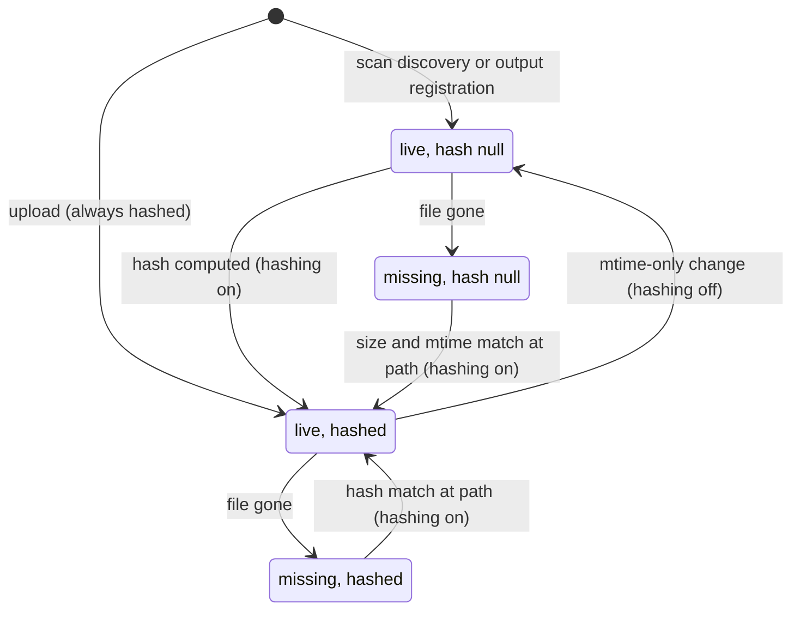

# Assets

The asset system is only active when explicitly enabled at startup; it is off by default. When it is not enabled, asset API routes return a disabled-service error and no background filesystem scanning occurs. Routes answer that same disabled-service error when the system is enabled but its database dependencies are unavailable.

## Data model

An asset record represents one user-visible entity. It owns its name, tags, `job_id`, `loader_path`, MIME type, extracted metadata, user metadata, and optional preview relationship.

A content row represents bytes at a storage location. It owns the path, byte size, modification time, hash, and missing state. Multiple asset records may reference one content row. Two content rows may have the same hash; hash uniqueness is never a database invariant.

The path is required and unique among content rows that are not missing. Missing rows keep their last known path so the scanner can attempt recovery.

Names are labels and are not unique. Records are global; the local asset system has no per-user ownership boundary.

MIME type and extracted metadata belong to the asset record because the same bytes may be interpreted in different ways. Extracted metadata may grow when an extractor learns more, but an extractor must not silently remove facts it already recorded within the same extractor version.

`loader_path` is fixed when the record is created. It records how the registry classified the path at discovery time.

## Tags

Asset records carry two kinds of tags: user-applied tags added and removed through the tagging API, and system tags the backend derives on its own.

A location tag records which storage root a file sits under: `input`, `output`, or `temp` for files under those directories, and `models` for files under any configured model base directory. A file under a models base additionally gets one `model_type:<folder_name>` tag per model category whose base directory contains the file and whose registered extension set accepts the file's extension; a file whose extension matches no category still gets the `models` tag but no `model_type:` tag. Model-type tags come from the registered category names, not from path components.

On upload, tags choose the write destination. A request must carry exactly one destination role tag (`input`, `models`, or `output`), and a `models` upload must carry exactly one `model_type:<folder_name>` tag naming the category folder to write into. Any other tags in the request land on the created record as ordinary tags.

`missing` is the one system tag the tagging API refuses to add or remove; it is projected onto records whose content is absent, as described in Missing content. Location and model-type tags carry no such protection and can be added or removed like any other tag.

## Missing content

Every asset whose content is absent stays visible and carries the client-visible `missing` tag (see Tags). Missing state belongs to the content row, so all records that reference the same content become missing together. While content is missing, it cannot be downloaded or resolved by hash: attempts to fetch it or to look it up through from-hash resolution fail rather than silently succeeding.

A content row moves through these observable states:

A reappeared file that matches no missing candidate, or more than one, does not recover any of them. The scanner creates a new content row for the file instead, and the missing candidates stay missing. The same old-missing-plus-new-content shape applies to a same-path edit or reuse: the old row is marked missing and a separate new row and record are created for the new bytes, never transformed in place.

Only a hash can recover a missing content row, with one narrow exception for rows that were never hashed. The scanner hashes the file now present at the missing path and recovers the row only when exactly one missing candidate for that path has the same hash. If no candidate matches, the scanner creates new content. If multiple candidates match, none recover. Recovery also never fires for a path a live content row already occupies: the file there belongs to that row, and ordinary change detection owns it.

A missing row can have a null hash, for example a file deleted before it was ever hashed while every server was down during an off-to-on hashing transition. Such a row can never satisfy the hash comparison, so it has its own narrower recovery condition: it recovers only when it is the single missing null-hash candidate at that path, and its recorded byte size and modification time exactly match the reappeared file's verified stat. The freshly computed hash is set on the row as part of recovery. The stat facts are the only recorded identity a never-hashed row has, so a same-path reappearance that does not preserve them creates new content instead, and the old row stays missing rather than risk recovering the wrong record.

Hash-based recovery does not compare modification times; only the null-hash recovery described above requires the recorded byte size and modification time to match exactly. With hashing disabled, recovery is unavailable.

Missing rows and their asset records persist until explicitly deleted. Routine scans do not remove them.

## Hashing modes

The `--enable-asset-hashing` flag defaults to off. It controls whether the scanner and output pipeline hash file contents, as described below.

With hashing off, the scanner uses modification time and byte size to detect changes. A modification-time change with an unchanged byte size is treated as the same file: the stored file facts refresh and the stored hash is cleared, because without hashing the digest can no longer be vouched for. A change to both modification time and size means new content. A size change without a modification-time change is undefined behaviour.

With hashing on, the scanner uses modification time as the cheap change detector and a hash as the identity check. When the modification time changes, verification runs through the background seeding and enrichment work:

- If the hash is unchanged, refresh the stored file facts on the existing content row.
- If the hash changed, mark the old content missing and create a new content row and asset record for the path.

The system persists the previous hashing mode. On a transition from off to on, it hashes every live row without a hash and revalidates every live row that already has one. A file that cannot be read after a bounded number of attempts keeps its record live with its stored hash cleared, and the transition completes without it. On a transition from on to off, it retains existing hashes as inert data.

Hashing must use a stable file snapshot. The worker checks file facts before and after hashing and accepts the digest only when they still match each other. Otherwise it retries later.

### Uploads hash independently of the scanner flag

Upload dedup runs unconditionally in both hashing modes; only scanner and output hashing are gated by `--enable-asset-hashing`. Uploads always hash, use content-addressed filenames in hash-routed destinations, and deduplicate by bytes even while background hashing is off. Deduplication must know the digest before deciding whether to store the bytes, and the upload request is already reading the whole file.

From-hash lookup is disabled while hashing is off.

## Filesystem changes

### File removed outside the API

Mark the content missing and keep every asset record visible. The usual hash-based recovery applies if a file later appears at the same path.

### File edited in place

In hash mode, verify the new bytes. Refresh the existing content row if the hash is unchanged. If the hash differs, mark the old content missing and create new content and a new asset record for the path.

With hashing off, a change to both modification time and size is handled the same way as a hash difference: the old content is marked missing and new content and a new asset record are created. A modification-time change alone refreshes the existing row's file facts and clears its stored hash (see Hashing modes).

An asset record never changes from one byte identity to another. Existing history references therefore continue to point to the old, already-missing content instead of silently serving new bytes.

### Deleted path reused

Path reuse has the same final state as an in-place edit: the old content is missing and the new bytes receive new content and a new asset record. The result must not depend on whether a scan observed the deletion before the new file appeared.

### File moved or renamed outside the API

There is no filesystem move identity. Mark the old path missing and create new content and a new asset record at the new path.

### Partial download under its final filename

The scanner skips known partial-download extensions. For other files, it records file facts during the walk, waits once per scan pass for a short stability floor, and checks the facts again before inserting.

Files that change between those checks have not finished being written and are not admitted. Such a file is parked on a bounded, de-duplicated watch list. The watch list is rechecked more than once within a single scan pass: once during the fast walk phase and again during the enrichment phase. Each parked entry is retried a limited number of times before it is dropped; a dropped file is admitted normally whenever a later scan observes it in a stable state.

The watch list holds at most one entry per path and has a fixed maximum size. On overflow the oldest entry is evicted. Eviction is not data loss: an evicted path is rediscovered by ordinary directory traversal on any subsequent scan.

Retry is bounded by scan cadence, not by a timer. There is no background poller, and settlement is not guaranteed within any particular interval. A completed prompt queues an enrichment-only pass rather than a full filesystem walk, and that pass rechecks the watch list, so a partially-written output is normally admitted soon after the generation that produced it. If a stalled partial file passes the check and later resumes, normal change detection splits it from the prematurely admitted content.

### Symlinks and hardlinks

The scanner follows symlinks, stores lexical paths, and applies an inode cycle guard. Different paths produce different content rows even when they resolve to the same inode or bytes.

### Case and Unicode path forms

Store absolute, structurally normalised paths: relative segments and repeated separators collapse at the write boundary, so every stored path is the lexical absolute form. Never canonicalize case or Unicode; compare byte-for-byte. Filesystems that treat two case or Unicode spellings as the same path may therefore produce duplicate rows.

### Registry changes

Classification is fixed at record creation. A newly visible path receives the registry classification in effect when discovered. A path that leaves all registered prefixes becomes missing. An existing in-scope path is not reclassified when the registry changes.

## Asset operations

### Delete through the API

Delete the target asset record. Leave its content row and file intact. Do not soft-delete the record or revive the deleted identity during later discovery. The retained content row is not a tombstone: it is ordinary live content describing bytes that are still there, and nothing records that a deletion happened.

Deleting a record never deletes any other record. A preview record the deleted asset nominated stays untouched; references to a preview clear only when the preview record itself is deleted. The preview reference points from the deleted record to its target, so deleting the pointer must not destroy the target.

Content left behind after all its asset records are deleted can still be resolved by hash lookup, falling back to a generic name and a guessed content type when no record is left to supply one. There is currently no mechanism that reclaims or removes such orphaned content.

That retained row is also what makes the deletion durable. A scan seeds only paths with no live content row, so an unchanged file is never given a new record however often it is rediscovered. Only new content at that path produces a fresh asset record: bytes that changed and retired the old row, or content minted after the old row itself is gone. Such a record describes the new content and must never recreate the deleted identity.

### Rename

Renames always succeed. Duplicate names are allowed. Renaming does not change tags, classification, content identity, or storage path.

### Upload the same bytes with the same name

Every upload mints a new asset record for its own request. The request's tags, user metadata, and preview nomination always land on that new record, whether or not identical bytes were already uploaded under the same name. This applies to every upload endpoint, including `/upload/image`.

Content, not records, gets deduplicated. When qualifying content already holds these bytes (live, stat-consistent, and not temporary content), the new record points at that existing content row instead of the bytes being written again. When no content qualifies, the upload writes new content as normal. Either way, a new record is always created.

Uploads are not idempotent: a client that retries an upload after a timeout accumulates a second record rather than being handed back the first. Core has no idempotency protection anywhere, including prompt submission and deletion, and this matches the shape of cached output: a cache hit reuses content but still mints a new delivery record for the new caller.

Uploads hash in both hashing modes, so this content-level dedup applies regardless of the scanner hashing flag.

### `updated_at` semantics

An asset record's `updated_at` reflects only the last explicit user or API edit to that record: a rename, a user-metadata update, a MIME-type change, a preview nomination, or a manual tag add or remove.

It never advances for serving or downloading the asset (access time is a separate concern from edit time), for scanner enrichment filling in extracted metadata, for the automatic missing or recovered tag projection, for a content split or content retire, or for the preview-deleted foreign-key cascade that clears a `preview_id`. Reading or downloading an asset's content instead updates a separate last-access marker on the record or records involved; that marker only ever moves forward, never backward. Minting a new record, whether from an upload, a cached rerun, or a content split, does not touch any other record's `updated_at`. The new record carries its own fresh timestamp from creation, and every existing record's last-explicit-edit time stays untouched.

### Upload the same bytes with a different name

When byte matching is available, create a new asset record with the requested name and point it to the existing content row, wherever in the asset store that content lives. Do not write the bytes a second time. Without byte matching, create a new content row and write the upload normally.

The dedicated `/upload/image` endpoint scopes its byte-matching check to the same destination path only: it does not reuse content stored under a different path even when the hash matches, and writes a new copy there instead.

### Upload different bytes with the same name

Create a new asset record and new content. Both records keep the shared `name`. This is distinct from `display_name`, which is computed from the content's stored path and is not guaranteed to match `name` when content is stored under a hash-derived filename.

### Byte-identical generated output

Every non-cached save event creates a new asset record and a new content row. Do not merge generated outputs automatically. Once hashed, equal hashes make the byte relationship visible without changing either identity.

### Cached output

A fully cached rerun does not execute the save node or write a file. The asset layer creates a new asset record for the new prompt and points it to the existing content row for the cached file. It does not mutate the earlier asset record or content row.

The new record's extracted metadata is copied from the earliest existing record for that same content, ordered by creation, rather than re-extracted. When no earlier record exists for that content, metadata is extracted fresh.

If the cache is invalidated or unavailable, the save node executes normally. It writes a new counter-named file, and the same rule as ordinary generated output creates new content and a new asset record.

#### Runtime-expanded cached output

Whenever final history contains a runtime-expanded output locator, a child absent from the final executed-node set is treated exactly like any other cached output. It does not write a file. The asset layer creates a new delivery record that points to the existing content, and it does not mark earlier content or records missing or mutate them.

Execution must never be inferred from omission in a pre-execution cache announcement. A fully cached wrapper that produces no child locator creates no asset-registration event.

#### Registration happens at the point of the write

The asset layer registers a produced output at the moment the producing node finishes, not after the prompt completes. Classification is determined by control flow, never by comparing final history against a set of executed nodes:

- A node that reaches output processing has, by definition, executed. Cache hits return earlier and never reach it. Such an output is EXECUTED.
- An output delivered through the cached-UI path is, by definition, CACHED.

For an EXECUTED output the asset layer creates a new content row for the path, marks any existing live content row at that path missing, creates a new asset record carrying the current prompt's `job_id`, and returns that record's identifier to the caller.

For a CACHED output the asset layer creates a new asset record pointing at the existing content row with the new prompt's `job_id`, and mutates nothing else. The same holds for a fully cached wrapper that produces no child locator: no locator, no registration event.

Classifying or registering an output never requires a hash. Every non-cached save always creates new content regardless of whether the bytes changed, so classification never depends on comparing digests.

An identifier returned to a caller must refer to the record created for this write, never the identifier of a record that describes earlier bytes at the same path.

Registration failure must not fail a generation. The failure is logged, the output entry carries no asset identifier, and cleanup is attempted so that a partially-written asset row does not normally survive.

#### Emission and output identity

Both output paths register at the moment the output is emitted, the moment it becomes visible to anything outside the executor. Emission, not sending, is the boundary:

- The executed path emits when the producing node finishes processing its output.
- The cached path emits when a cached output is served.

At each emission the asset layer creates the appropriate record, and the resulting identifier is attached to the emitted output. Registration and publication to history occur unconditionally; only transmission to a connected client is conditional. An output must be registered whether or not a client is attached, so no registration may sit behind a client-connection check.

The database is the source of truth for output identity. For a fresh prompt, identity is always resolved through registration at emission, not by pulling a value back out of the cache. The cache mechanics used for subgraph replay can carry a previously-registered identifier forward as part of replaying that subgraph's own prior output; replay logic strips that identifier before treating the value as input to a fresh registration. A cached replay therefore reports the identifier of the delivery record created for the current prompt, never an identifier retained from the prompt that first produced the file.

It follows that no component reconstructs output classification after the fact by comparing final history against a record of which nodes executed. Classification is determined once, at emission, and that is the only source of truth for it.

### Settled properties and the eventually-consistent hash

Nearly every asset property that a client can observe is settled before that asset becomes observable, with two narrow exceptions described below: the content hash, and a scanner-discovered asset's metadata during its exception window.

A client reading an asset through the assets API never sees a property that is absent merely because work has not finished yet. Size, modification time, MIME type, extracted metadata, `job_id`, tags, preview location, and missing-state are all determined at the moment the record is created and are correct from the record's first observable instant.

The content hash is the sole eventually-consistent field. It is the only property whose cost scales with file size, so it is the only one permitted to be absent on a record a client can already see. A null hash means "not yet computed", never "this content has no hash".

Capabilities that require a hash (from-hash lookup, upload deduplication, and recovery of missing content) are unavailable for an asset whose hash has not yet settled. This is the same reduced capability described for disabled hashing. Settlement has no guaranteed deadline: a hash can remain unset indefinitely if the file never stabilizes or enrichment cannot make progress. It covers freshly-registered outputs even in hashing-on mode, not only the disabled-hashing case.

#### Exception: scanner-discovered assets

Assets discovered by the filesystem scanner are the one exception to full settlement: a seeded record can be observable before its metadata has settled.

Distinguishing "not yet enriched" from "enrichment ran and found nothing" matters here: without that distinction, excluding un-enriched records from view would hide, permanently, any asset whose extraction fails. Outputs and uploads are not covered by this exception; their properties are always settled when observable.

#### Output registration never hashes on the save path

Registering a produced output computes no content hash. The record is created with a null hash unconditionally, and the background enrichment pass fills it afterwards when hashing is enabled. When hashing is disabled the hash stays null, consistent with hashing being off.

Hashing reads every byte of the file and its cost scales without bound with file size, while the save path sits inside the execution loop. No output size may add hashing latency to a generation. No hashing failure may surface on the save path either; a failed or unstable read is the enrichment pass's problem, handled later.

Uploads are outside this behaviour and hash inline, always: deduplication must know the digest before deciding whether to store the bytes, and the upload request is already reading the whole file.

#### Two producers writing one path in a single prompt

Two output producers that resolve to the same path within one prompt are unsupported. The resulting database state is undefined and nothing here constrains it.

Registration occurs per producer at emission, so a prompt containing such a collision produces one record per producer, and their relative order determines the final state. That order is not a contract.

Each producer's registration attempt is independent and best-effort, consistent with the failure handling described for output registration: a failed attempt is caught and that producer's output proceeds without an asset identifier rather than failing the generation. Only the combined outcome across producers is undefined.

Save nodes assign counter-based filenames precisely so that concurrent producers do not collide, so a workflow reaching this state has bypassed the normal naming path.

### Server restart

Persist asset and content rows across restarts. In-memory history is transient. A record may retain a `job_id` whose prompt is no longer present in history.

In-memory tracking used during scanning, such as the unstable-file watch list and the hash-transition queue, does not persist across a restart either. A fresh process rebuilds whatever state it needs by re-observing the filesystem and database rather than resuming exactly where a prior process left off.

Temp records are the exception to row persistence (see Temp and preview output).

### Temp and preview output

Startup temp cleanup deletes both temp files and the records and content rows that represent them. Two failure modes are possible: if wiping the temp rows from the database fails, filesystem cleanup for that startup is skipped entirely and neither side is committed; if the database wipe succeeds but the subsequent filesystem removal fails, the rows are already gone from the database while the files remain on disk.

Cloud temp and preview assets expire through a separate mechanism.

### Temp content shared by permanent records

Expiry belongs to the content location. Upload dedup and from-hash lookup exclude temp content, so permanent records can never point to content that startup temp cleanup will remove.

### Same model bytes in two category locations

Create one asset record and one content row per location. Equal hashes may reveal that the bytes match. Do not merge the locations.

### Byte-identical content from two local users

The local asset system has global records and no owner field. It does not isolate or duplicate records by user.

### `/view` routes

`/view` accepts two query forms: a path-based form (`type`, `filename`, `subfolder`) and a blake3-hash form (`filename=blake3:<hash>`). `/api/assets/{id}/content` accepts an asset id and serves that asset's content directly. The blake3 form resolves only to non-temp content whose file is currently present (see Lookup and dedup against missing content).

### Lookup and dedup against missing content

Hash lookup, from-hash creation, and upload dedup consider only non-temp content whose file is present. A database row is not proof that bytes can be served.

When no qualifying content exists, uploads store the bytes they received and from-hash creation refuses. A missing sibling is never substituted for requested content.

### From-hash tie-breaking

When several qualifying content rows have the requested hash, choose the oldest by `created_at`, then by lexicographic `id`.

## Jobs and provenance

### Querying a job's outputs

The asset API does not provide a job-to-outputs query. A record's `job_id` is informational. In-memory history is the mechanism for showing a run's outputs during that session.

Cached reruns create a new asset record whose `job_id` is the new prompt. The record points to the existing content row because the save node did not execute and no new file was written. Earlier asset records keep their original `job_id` values.

### Recording where a file came from

Each asset record's `job_id` identifies the prompt associated with that record's own creation event. The system does not infer provenance across records that share content.

Embedded PNG metadata is independent of the asset database. Save code writes it into the file, and the frontend may read it to restore a workflow.

## Concurrency and failure boundaries

### File changes during hashing

Accept a digest only from a stable snapshot (see Hashing modes).

### Concurrent writers

Database constraints choose the winner when scanners, hooks, or uploads race within one process. Losing writers retry or discard their work. Tag and tag-link inserts run inside a savepoint and re-read the row they collided with, so a duplicate-key collision between concurrent tag writers settles quietly instead of surfacing an error. That covers duplicate keys only; lock contention is a separate limit (see Write pressure and reader starvation).

A file lock prevents more than one server process from opening the same database, so a second process never becomes a concurrent writer in the first place. Do not add advisory locks.

### Ambiguous recovery

If more than one missing content row matches a recreated file's hash, recover none of them.

### Database replacement while running

Deleting or replacing the database file while the server is running is undefined behaviour.

## Operational limits

### Write pressure and reader starvation

The asset database is SQLite with a single database-wide writer lock and no configured busy timeout or lock-error handling on any route. Several paths hold or contend for that lock: a non-deduplicated upload writes its bytes and mints a delivery record, while a deduplicated upload reuses existing content and mints only the record; a same-path write whose hash has changed retires the old content and inserts new content, while a same-path write whose hash matches refreshes the existing record in place; execution outputs register per-emission during the generation loop; a background enrichment pass fills hashes and metadata row by row; hash-serves write access time to every record sharing the served content; and the upload dedup claim holds the write lock across its filesystem re-check and metadata extraction.

Under sustained concurrent writes, a reader such as `GET /api/assets` can exceed SQLite's default five-second busy wait and surface an unhandled `database is locked` error as HTTP 500. The failure is transient and non-corrupting: no rows are corrupted, and a later request may succeed once the write pressure eases, though nothing retries or backs off automatically. No busy timeout, lock-error translation to 503, or WAL journal mode is configured.

## Schema migration

When startup finds the schema that predates the record/content split, it drops and recreates the affected tables inside the existing database file, then rebuilds them with a full scan. Rows are not migrated into the new schema, and the database file itself is not deleted. The database is backed up to a sibling file before the migration runs; if the migration fails, the database is reverted from that backup, and if it succeeds, the backup file is left in place rather than deleted.

Scanning runs in the background after startup returns, so the asset API can already be serving requests while the rebuilt tables are still being populated.

The rebuild discards data that a scan cannot reconstruct: manual tags, user metadata, preview assignments, API-created records, `job_id` links, any record renames, and deletions — nothing records which assets were deleted, so the scan mints a record for every file still on disk. When the rebuild runs, startup logs a warning naming the backup file and what was discarded.
