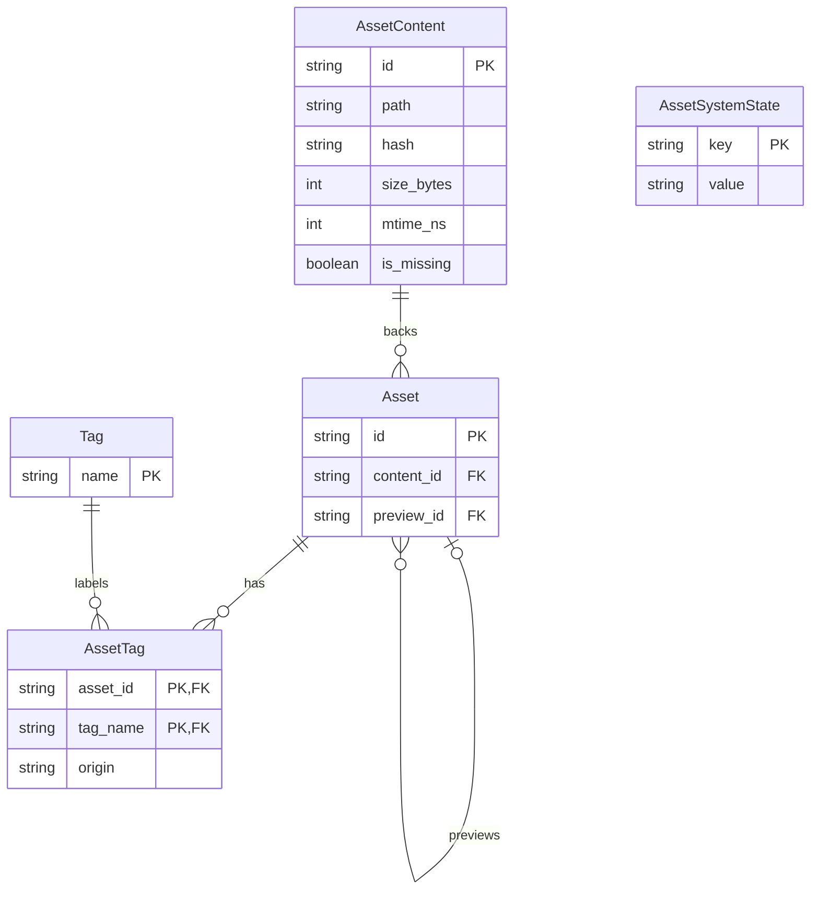
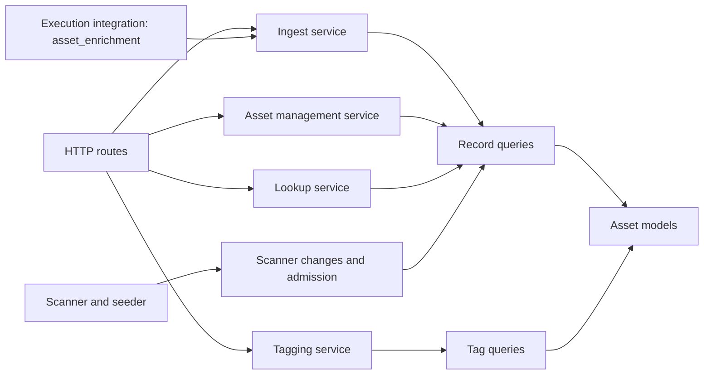

## Domain model

Legend:

- `Asset` owns a user-visible record and its interpretation of content.
- `AssetContent` owns the facts about bytes at one path.
- `AssetTag` owns a record-to-tag link and its origin.
- `Tag` owns a global tag name.
- `AssetSystemState` owns persistent asset-system state, including hash-mode state.
- `Asset.preview_id` selects zero or one preview record, and one record can preview many records.

## Entity responsibilities

An `Asset` row owns `name`, `mime_type`, `user_metadata`, `system_metadata`, `job_id`, `loader_path`, `preview_id`, and its creation, update, and last-access timestamps. An `AssetContent` row owns `path`, `size_bytes`, `mtime_ns`, `hash`, and `is_missing`. MIME type and metadata belong to the record because records for the same bytes can carry different names, MIME interpretations, metadata, jobs, loaders, and previews.

## Invariants

- At most one live `AssetContent` row exists for a `path`, enforced by the `uq_asset_contents_path_live` partial unique index where `is_missing = 0`.
- `AssetContent.hash` is not unique, so separate paths with identical bytes can have the same hash.
- Every `Asset.content_id` is non-null and uses `RESTRICT`, so content cannot be deleted while a record references it.
- An `Asset.preview_id` foreign key uses `SET NULL`, so deleting a preview target clears references to it.
- Missing state belongs to `AssetContent`, so every record sharing that content becomes missing together.
- Asset records are global and have no per-user ownership field.
- Stored hashes use the `blake3:<hex>` representation end to end.
- A `NULL` `system_metadata` value means the record has not yet been enriched, and it remains distinct from an empty dictionary.

## Component map

Legend: arrows point from a functional client to the part it depends on.

## Interface inventory

| Interface | Purpose |
| --- | --- |
| `/api/assets` route family | Lists and retrieves records, uploads files, creates records from known hashes, adds and removes tags, refines tag counts, updates and deletes records, and tests hash availability with `HEAD`. |
| `/upload/image` registration | Registers a saved image upload with the ingest service. |
| `/api/view` path and `blake3` forms | Serves local asset bytes by path parameters or by a BLAKE3 content hash. |
| `register_executed_output` and `register_cached_output` | Register execution outputs and cached outputs as asset records. |

## Tag model

Tags are global names linked to individual asset records through `AssetTag`. The `missing` tag is automatic and protected: content missing-state applies or removes it for every record sharing that content, and manual removal returns it in the protected bucket. Every other tag has manual origin.
