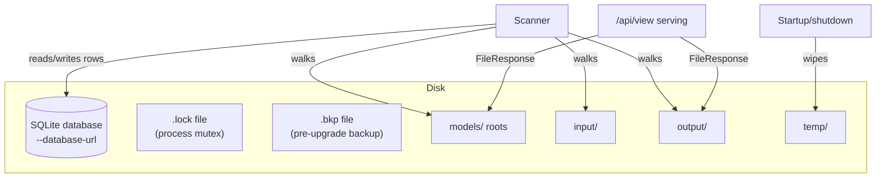

# Physical view

What the asset system runs on: the database file, the directories it watches, and how bytes reach a
client. This is a local, single-process deployment — the view is deliberately thin.

## Storage topology

Legend: one SQLite database holds every asset row. The scanner walks the registered roots
(`models`, `input`, `output`). The temp directory is transient — its files and their database rows
are removed at startup and shutdown. Content paths stored in the database are absolute and
normalised at the write boundary, which is what makes the SQL path-prefix predicates sound.

## The database file lock

`app/database/db.py` acquires a `filelock.FileLock` on `<database-path>.lock` before inspecting the
schema revision, taking the pre-upgrade backup, or running migrations, and holds it for the process
lifetime. A second ComfyUI process pointed at the same database fails fast with an error naming the
conflict instead of racing the migration or the backup. The lock is a separate file — it cannot block
the process's own Alembic connection, which is precisely why it can be taken before migrating. If
initialisation fails after acquisition, the lock is released so a failed process does not block the
next one.

## Migration safety

Before upgrading, the database file is copied to `<database-path>.bkp`. On upgrade failure the backup
is restored; on success it is kept, so the pre-migration state remains recoverable by the operator
even after a successful destructive migration.

## Serving path

Asset bytes are served by aiohttp `FileResponse` straight from the content row's path — the database
stores locations, never bytes. `/api/view` accepts either the legacy path form or a
`blake3:<hex>` hash; hash resolution considers only live (`is_missing = 0`), non-temp content whose
on-disk stat still matches the stored stat, so a stale row is never served. Preview URLs resolve
through the nominated preview record with the same missing-content filtering.

## Trust boundaries

The asset system is local and single-user by design:

- The HTTP surface trusts its caller. There is no per-user isolation; any client that can reach the
  server can list and mutate every record.
- The filesystem under the registered roots is user-controlled input. The scanner treats it
  defensively: partial downloads are gated by extension and a two-stat stability check, files that
  vanish mid-scan are skipped without aborting the batch, and hashing accepts a digest only from a
  stable snapshot (matching stats before and after the read).
- The database file itself is trusted. Replacing or deleting it while the server runs is undefined
  behaviour; the file lock protects against concurrent ComfyUI processes, not against external
  mutation.
