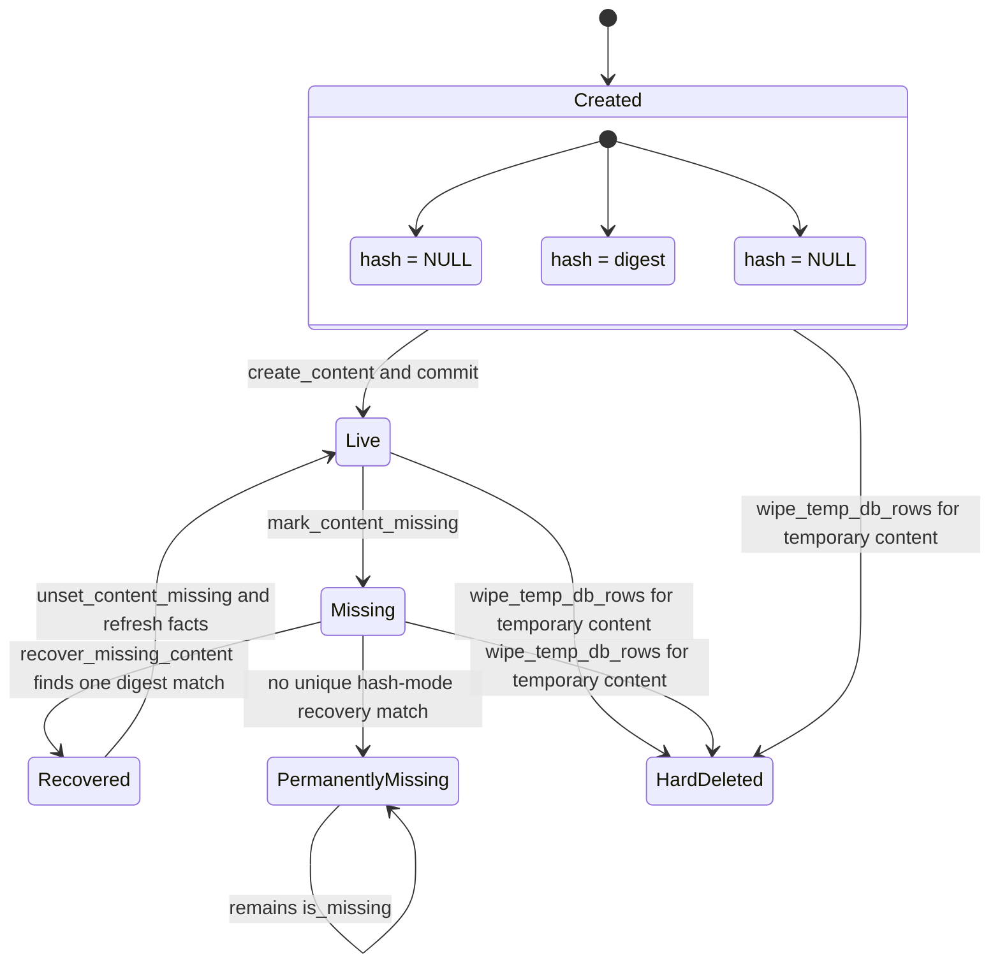
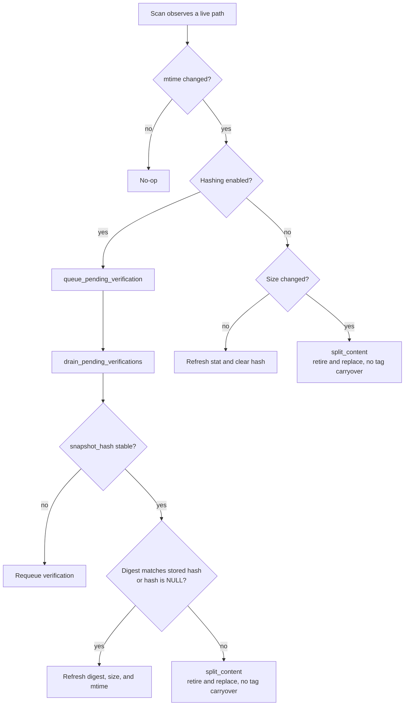
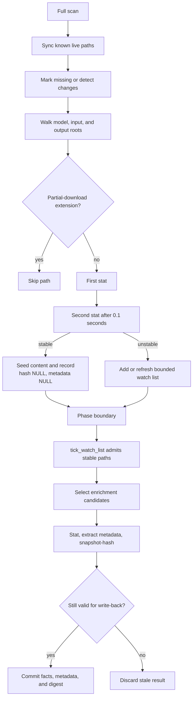
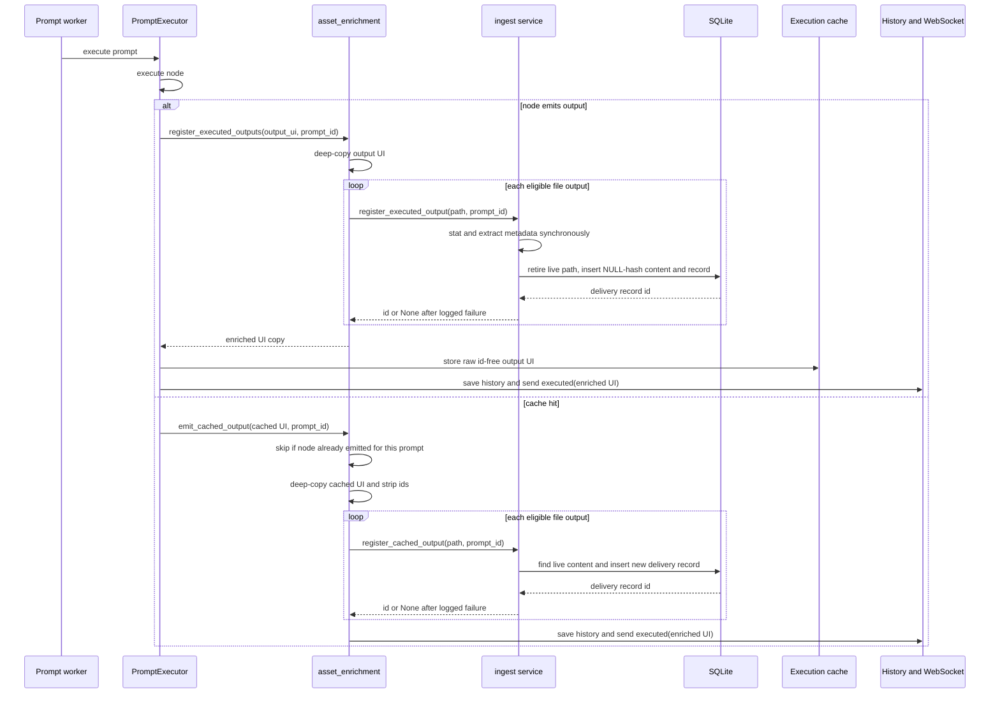

# Process view

## Runtime actors

The aiohttp server runs on the asyncio event loop. It installs routes, serves asset requests, and
publishes WebSocket events. `main.py` starts its address listeners and publish loop together.

The prompt worker is a daemon thread that takes prompts from the in-process prompt queue and runs
`PromptExecutor`. It pauses the asset seeder before executing a prompt, then queues output-only
enrichment and resumes the seeder after execution-side cleanup. Output registration runs inline
when a node emits UI output, before that output is sent over the WebSocket and recorded in prompt
history.

`asset_seeder` starts one ephemeral daemon thread for each scan. A full scan performs its fast
phase and enrich phase sequentially in that thread. The seeder runs beside the aiohttp loop and is
paused while the prompt worker executes. Startup runs database initialization and asset maintenance
before the server begins serving; shutdown joins the seeder before it cleans temporary assets.

The actors share the SQLite database through sessions scoped to the operation or scan batch. They
also communicate through process-local queues: the prompt queue, the seeder's pending enrichment
request, pending change verifications, missing-content recovery paths, hashing-mode transition
paths, and the bounded unstable-file watch list. These queues coordinate current-process work only.

## Content-row lifecycle

The row begins when scan seeding, upload registration, or executed-output registration calls
`create_content`. Scanner and executed-output rows defer their digest with `hash = NULL`; uploads
store their verified digest. The committed row is live and is the only live row for its path.

Legend. `sync_prefixes_with_filesystem` and `mark_contents_missing_outside_prefixes` call
`mark_content_missing` when a file vanishes or its path is no longer owned. `split_content` retires
the incumbent when bytes change, and `register_executed_output` retires it before registering a new
emission at the path. In hashing mode, `recover_missing_content` accepts a returned file only when
exactly one missing row at that path has its digest; it calls `unset_content_missing` and refreshes
the file facts. Without that unique match, the row remains permanently missing. `wipe_temp_db_rows`
is the sole hard-delete transition, and applies only to temporary-directory rows.

## Change detection state machine

`detect_content_change` treats an unchanged mtime as a no-op. In hashing mode it only queues the
content id; `drain_pending_verifications` owns the stable snapshot and digest comparison. A stable
digest refreshes the content facts when it equals the stored digest, and also claims a previously
unhashed row. A changed digest invokes `split_content`, which marks the old content missing and
creates a replacement record from the path's current name and tags rather than copying the old
record's tags. An unreadable path becomes missing, while an unstable snapshot goes back to the
in-process verification queue.

Legend. With hashing off, `detect_content_change` treats an mtime change with the same size as the
same file and refreshes its stat facts. It also clears `hash`: off mode cannot vouch for a digest
after that mtime change, so retaining it would assert an identity the scanner did not verify. The
cleared row becomes a hash-mode enrichment candidate when hashing is enabled. A size change calls
`split_content` immediately.

## Scan pipeline

`_run_fast_phase` first calls `sync_root_safely` for each selected root. The sync checks every
known live row, marks vanished paths missing, and passes changed paths to `detect_content_change`.
It then collects candidate paths. `build_asset_specs` skips partial-download extensions and empty or
known files, waits 0.1 seconds in `_two_stat_admit`, and sends only stable new paths to
`seed_asset_specs`. Seeding creates a content row and a record with no hash and no system metadata.

Legend. Unstable paths enter `_WATCH_LIST`, capped at 256 entries. `tick_watch_list` rechecks them
at the fast-to-enrich and enrich-phase boundaries, seeds a stable path, and drops a path that keeps
changing after its retry budget. In hashing mode, `get_unenriched_assets_for_roots` selects live rows
where `hash IS NULL OR system_metadata IS NULL`; with hashing off, it selects rows where
`system_metadata IS NULL`. `enrich_asset` reads metadata and, in hashing mode, uses `snapshot_hash`
to require one unchanged filesystem snapshot before accepting the digest. It discards a result when
the row's stored mtime no longer matches the stat observed before the read.

Per-path failures do not stop the batch. Scanner seeding logs and skips a file that vanishes between
admission and insertion. Enrichment catches an individual file error, rolls back that file's work,
and advances to the next candidate. Hash-mode work logs and skips an out-of-root path rather than
splitting it.

## Hashing-mode transition

`AssetSystemState` persists the scanner hashing mode under the `hash_mode` key. During database
initialization, `record_transition_intent` compares that value with the active CLI mode. A first
startup records the active mode without transition work.

When the stored mode is off and the active mode is on, `enqueue_transition_work` puts every live
content path into the in-process transition queue. `drain_mode_transition_work` drains that queue
synchronously during asset startup. `drain_transition_queue` writes a digest in place for an
unhashed row, refreshes its stat facts, and retires then replaces a row whose stored digest differs
from the stable snapshot. An unstable or temporarily unreadable file stays queued.

The persisted mode changes to `on` only when an actual off-to-on transition is in flight and its
queue drains completely. This prevents a partial transition from being recorded as complete. An
on-to-off startup records `off` immediately but leaves existing hashes in their rows. Hashing-off
scans treat those hashes as inert and clear them when an mtime-only same-size refresh makes them
unverifiable.

## Execution-time registration

Legend. A normal node emission calls `register_executed_outputs`, which deep-copies the node UI
value and adds asset ids only to that copy. `register_executed_output` retires any live content at
the emitted path, creates a new `hash = NULL` content row, creates its record with synchronously
extracted metadata, and returns the new id. The history result and WebSocket receive the enriched
copy; the execution cache receives the original id-free value.

On a cache hit, `emit_cached_output` calls `register_cached_outputs`, which mints a new delivery
record with the current prompt id against the existing live content. `register_cached_output` copies
system metadata from the oldest sibling record when one exists, otherwise it extracts metadata from
the file. Registration errors log and return no id, so they never raise into execution. The
`ui_outputs` membership check in `emit_cached_output` permits only one delivery per node per prompt.

## Concurrency and failure semantics

Database work uses sessions scoped to an operation. The scanner opens sessions for root sync,
seeding, phase-boundary queue drains, and candidate selection; `enrich_assets_batch` keeps one
batch-scoped session but commits each successful asset. Registration opens its own session. No actor
shares an ORM session across threads.

The live-path unique index, `uq_asset_contents_path_live`, resolves a concurrent
`create_content` call for the same path. The losing insert rolls back its savepoint and
`create_content` reads and returns the winner's live row. The caller therefore adopts the durable
row rather than keeping a conflicting in-memory row.

Asset registration is best effort at the execution boundary. `register_executed_output` and
`register_cached_output` log failures and return `None`; `_enrich_in_place` also catches an
individual output error. Prompt execution, history construction, and WebSocket delivery continue.
Scanner seeding reports a failed insert batch and continues with later batches. Enrichment rolls back
an individual file failure and continues with the remaining candidates.

The verification queue, recovery paths, transition queue, watch list, and queued enrich request are
in-memory state. They disappear on restart. Startup begins a new full seeder scan, so filesystem
reconciliation reconstructs deferred work rather than restoring those queues.

Startup initializes the database while its file lock covers migrations, records any hashing-mode
transition intent, removes temporary database rows with `wipe_temp_db_rows`, then removes the
temporary filesystem tree with `cleanup_temp_filesystem`. It drains transition work synchronously
and starts the seeder last. With assets disabled, startup performs only the temporary filesystem
sweep. Shutdown joins the seeder, then removes temporary database rows before removing the temporary
filesystem tree.
