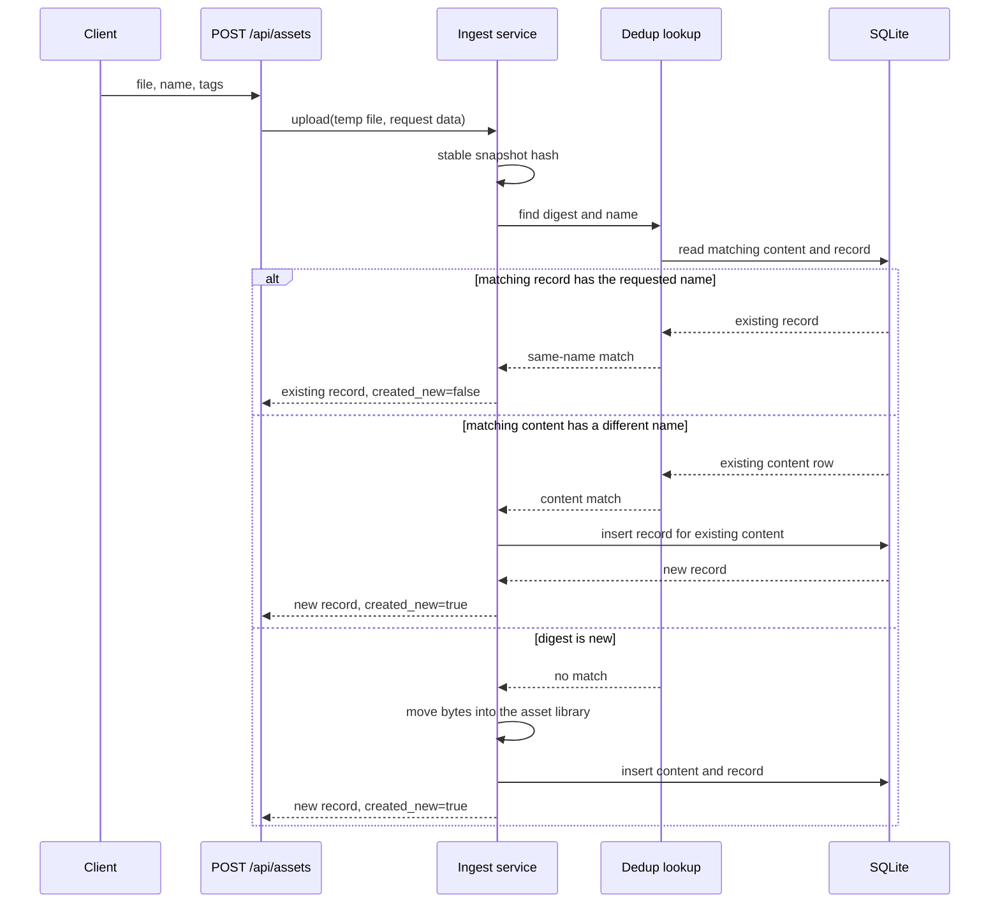
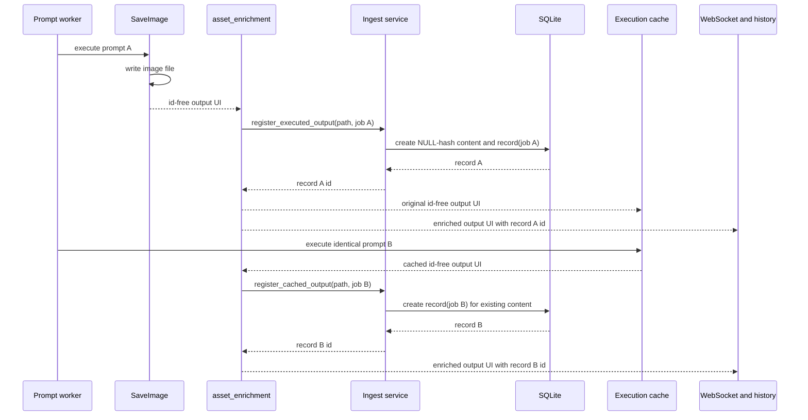

# Scenario view

Concrete asset journeys through the parts described in the [logical](logical.md),
[process](process.md), [development](development.md), and [physical](physical.md) views.

## Upload the same bytes twice

A client sends a file to `POST /api/assets`. The route passes the temporary
file to the ingest service, which takes a stable hash before deciding where the
bytes belong. Upload hashing is independent of scanner hashing mode.

With the same requested name, the existing record is the response and the
upload creates nothing. With a different name, ingest creates a second record
that points at the existing content row. The uploaded bytes are not written a
second time. The content and record split follows the [domain model](logical.md#domain-model).

## Generate an image, then rerun the identical prompt

A prompt worker executes a graph containing `SaveImage`. The node writes its
file, then emits its UI output. Registration happens at that emission boundary,
before the worker publishes the output or stores it in history.

The cache hit executes no node and writes no file. `register_cached_outputs`
strips any delivery ids from the cached value, then creates a new record for the
new prompt against the live content row. The first record remains unchanged.
After the rerun, one content row backs two records with distinct `job_id`
values. This is the [execution-time registration](process.md#execution-time-registration)
path.

## Edit a file in place (hashing on)

The scanner sees a live path whose mtime has changed while hashing is enabled.
It queues the content id for verification rather than treating the stat change
as a new identity. The queue drain hashes one stable filesystem snapshot and
compares its digest with the content row.

If the digest matches, the scanner refreshes size and mtime on the same content
row. Its records, tags, and metadata retain their identity. If the digest
differs, `split_content` marks the incumbent content missing. Its records keep
pointing at that old content and receive the automatic `missing` tag. The
scanner then creates a new content row and a new record for the current path.
That record starts with `system_metadata = NULL` and receives metadata on the
next enrich pass. Old records never silently point at the new bytes. These are
the [change detection](process.md#change-detection-state-machine) and
[content-row lifecycle](process.md#content-row-lifecycle) paths.

## Touch a file without changing it (hashing off)

An rsync, backup, or similar external actor updates a file's mtime without
changing its size while scanner hashing is disabled. The scanner treats the
stat change as the same file. It refreshes the content row's size and mtime,
keeps the row and all of its records, and preserves their tags and metadata.

The scanner clears the stored hash because mtime and size alone cannot prove
that the old digest still describes the bytes. The row becomes an enrichment
candidate. When the active mode changes from off to on, the startup transition
hashes that live row in place. With hashing enabled, the same mtime change
queues verification instead; a matching stable digest keeps the hash and the
same content identity. See [change detection](process.md#change-detection-state-machine)
and the [hashing-mode transition](process.md#hashing-mode-transition).

## Delete a file outside ComfyUI, then restore it

An external actor removes a file from an asset root. On its next scan, the
scanner marks the path's content row missing. Every record that references the
row remains listed and carries the automatic `missing` tag. Asset serving,
download, and lookup by BLAKE3 hash refuse that content.

When a file appears again at the same path, hashing mode determines whether it
can reclaim the missing identity. With hashing enabled, the scanner takes a
stable digest and searches for missing rows at that path. Exactly one row with
the matching digest is recovered in place: the records retain their identity
and lose `missing`. With hashing disabled, or when the digest matches zero or
more than one missing candidate, the scanner seeds the file as new content with
a new record. The older records remain missing. The states are defined by the
[content-row lifecycle](process.md#content-row-lifecycle).

## Delete a record through the API

A client sends `DELETE /api/assets/{id}` for one record. The route hard-deletes
that record only. Its content row and the on-disk file remain, and other
records that share the content remain untouched.

Record deletion never deletes another record. A record nominated as a preview
is also independent: deleting a record that points at a preview leaves the
preview target intact. Deleting the preview target clears its incoming
`preview_id` foreign keys, but leaves every referencing record intact. A
subsequent scan can seed a fresh record for the file that still exists, with a
new record identity. The ownership and foreign-key rules are in the
[domain model](logical.md#domain-model).

## Turn hashing on for an existing library

At startup, the asset system compares the active hashing mode with the
persisted mode row. When the stored mode is `off` and the active mode is `on`,
it queues every live content row and drains that queue synchronously before the
server starts serving assets.

The drain takes a stable hash for each path. It fills a `NULL` hash in place
and refreshes the row's file facts. When a stored digest differs from the
verified digest, it marks the old content missing and creates a new content row
and record for the current bytes. The mode row becomes `on` only after the
queue drains completely. Out-of-root and vanished paths are skipped and logged;
they do not make startup fatal. The transition is described in
[hashing-mode transition](process.md#hashing-mode-transition).

## Failure-mode index

| What goes wrong | What the system does |
| --- | --- |
| A file vanishes during scanner admission or enrichment | Logs and skips that file; the remaining batch continues. |
| Asset registration fails while a prompt emits output | Logs the failure, continues execution, and leaves no partial asset rows. |
| Two processes create content for one live path | The live-path unique index selects the winner; the loser adopts the durable content row. |
| Asset database initialization fails | Disables assets for the session and releases the database lock. |
