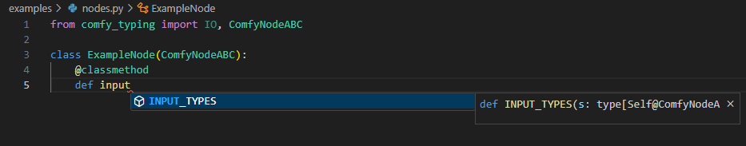
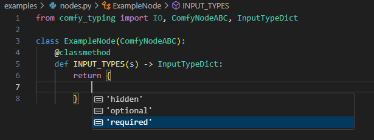
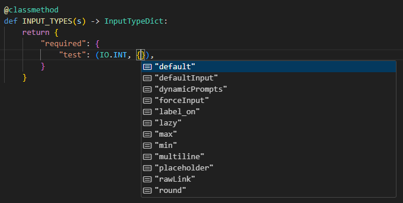

# Comfy Typing
## Type hinting for ComfyUI Node development

This module provides type hinting and concrete convenience types for node developers.
If cloned to the custom_nodes directory of ComfyUI, types can be imported using:

```python
from comfy.comfy_types import IO, ComfyNodeABC, CheckLazyMixin

class ExampleNode(ComfyNodeABC):
    @classmethod
    def INPUT_TYPES(s) -> InputTypeDict:
        return {"required": {}}
```

Full example is in [examples/example_nodes.py](examples/example_nodes.py).

# Types
A few primary types are documented below.  More complete information is available via the docstrings on each type.

## `IO`

A string enum of built-in and a few custom data types.  Includes the following special types and their requisite plumbing:

- `ANY`: `"*"`
- `NUMBER`: `"FLOAT,INT"`
- `PRIMITIVE`: `"STRING,FLOAT,INT,BOOLEAN"`

## `ComfyNodeABC`

An abstract base class for nodes, offering type-hinting / autocomplete, and somewhat-alright docstrings.

### Type hinting for `INPUT_TYPES`



### `INPUT_TYPES` return dict



### Options for individual inputs


