# ComfyUI Manager

**ComfyUI-Manager** is an extension designed to enhance the usability of [ComfyUI](https://github.com/comfyanonymous/ComfyUI). It offers management functions to **install, remove, disable, and enable** various custom nodes of ComfyUI. Furthermore, this extension provides a hub feature and convenience functions to access a wide range of information within ComfyUI.

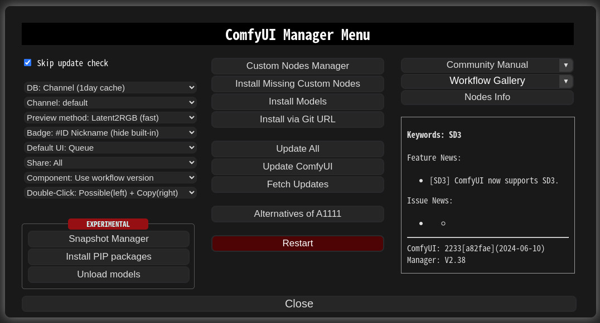

## NOTICE
* V2.37 Show a ✅ mark to accounts that have been active on GitHub for more than six months.
* V2.33 Security policy is applied.
* V2.21 [cm-cli](docs/en/cm-cli.md) tool is added.
* V2.18 to V2.18.3 is not functioning due to a severe bug. Users on these versions are advised to promptly update to V2.18.4. Please navigate to the `ComfyUI/custom_nodes/ComfyUI-Manager` directory and execute `git pull` to update.
* You can see whole nodes info on [ComfyUI Nodes Info](https://ltdrdata.github.io/) page.

## Installation

### Installation[method1] (General installation method: ComfyUI-Manager only)

To install ComfyUI-Manager in addition to an existing installation of ComfyUI, you can follow the following steps:

1. goto `ComfyUI/custom_nodes` dir in terminal(cmd)
2. `git clone https://github.com/ltdrdata/ComfyUI-Manager.git`
3. Restart ComfyUI


### Installation[method2] (Installation for portable ComfyUI version: ComfyUI-Manager only)
1. install git 
- https://git-scm.com/download/win
- standalone version  
- select option: use windows default console window
2. Download [scripts/install-manager-for-portable-version.bat](https://github.com/ltdrdata/ComfyUI-Manager/raw/main/scripts/install-manager-for-portable-version.bat) into installed `"ComfyUI_windows_portable"` directory
3. double click `install-manager-for-portable-version.bat` batch file

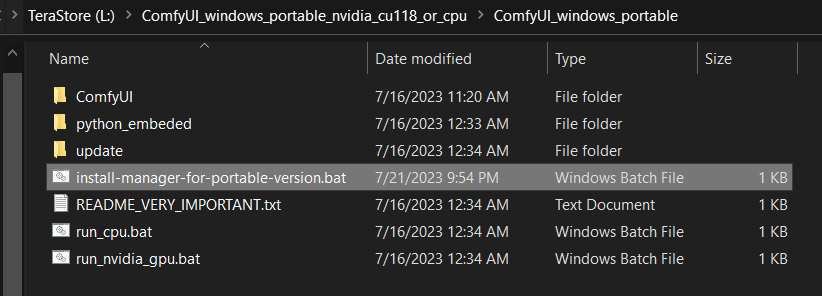


### Installation[method3] (Installation through comfy-cli: install ComfyUI and ComfyUI-Manager at once.)  
> RECOMMENDED: comfy-cli provides various features to manage ComfyUI from the CLI.

* **prerequisite: python 3, git**

Windows:
```commandline
python -m venv venv
venv\Scripts\activate
pip install comfy-cli
comfy install
```

Linux/OSX:
```commandline
python -m venv venv
. venv/bin/activate
pip install comfy-cli
comfy install
```


### Installation[method4] (Installation for linux+venv: ComfyUI + ComfyUI-Manager)

To install ComfyUI with ComfyUI-Manager on Linux using a venv environment, you can follow these steps:
* **prerequisite: python-is-python3, python3-venv, git**

1. Download [scripts/install-comfyui-venv-linux.sh](https://github.com/ltdrdata/ComfyUI-Manager/raw/main/scripts/install-comfyui-venv-linux.sh) into empty install directory
- ComfyUI will be installed in the subdirectory of the specified directory, and the directory will contain the generated executable script.
2. `chmod +x install-comfyui-venv-linux.sh`
3. `./install-comfyui-venv-linux.sh`

### Installation Precautions
* **DO**: `ComfyUI-Manager` files must be accurately located in the path `ComfyUI/custom_nodes/ComfyUI-Manager`
  * Installing in a compressed file format is not recommended.
* **DON'T**: Decompress directly into the `ComfyUI/custom_nodes` location, resulting in the Manager contents like `__init__.py` being placed directly in that directory.
  * You have to remove all ComfyUI-Manager files from `ComfyUI/custom_nodes`
* **DON'T**: In a form where decompression occurs in a path such as `ComfyUI/custom_nodes/ComfyUI-Manager/ComfyUI-Manager`.
  * You have to move `ComfyUI/custom_nodes/ComfyUI-Manager/ComfyUI-Manager` to `ComfyUI/custom_nodes/ComfyUI-Manager`
* **DON'T**: In a form where decompression occurs in a path such as `ComfyUI/custom_nodes/ComfyUI-Manager-main`.
  * In such cases, `ComfyUI-Manager` may operate, but it won't be recognized within `ComfyUI-Manager`, and updates cannot be performed. It also poses the risk of duplicate installations.
  * You have to rename `ComfyUI/custom_nodes/ComfyUI-Manager-main` to `ComfyUI/custom_nodes/ComfyUI-Manager`


You can execute ComfyUI by running either `./run_gpu.sh` or `./run_cpu.sh` depending on your system configuration.

## Colab Notebook
This repository provides Colab notebooks that allow you to install and use ComfyUI, including ComfyUI-Manager. To use ComfyUI, [click on this link](https://colab.research.google.com/github/ltdrdata/ComfyUI-Manager/blob/main/notebooks/comfyui_colab_with_manager.ipynb).
* Support for installing ComfyUI
* Support for basic installation of ComfyUI-Manager
* Support for automatically installing dependencies of custom nodes upon restarting Colab notebooks.

## Changes
* **2.38** `Install Custom Nodes` menu is changed to `Custom Nodes Manager`.
* **2.21** [cm-cli](docs/en/cm-cli.md) tool is added.
* **2.4** Copy the connections of the nearest node by double-clicking.
* **2.2.3** Support Components System
* **0.29** Add `Update all` feature
* **0.25** support db channel
  * You can directly modify the db channel settings in the `config.ini` file.
  * If you want to maintain a new DB channel, please modify the `channels.list` and submit a PR.
* **0.23** support multiple selection
* **0.18.1** `skip update check` feature added.
  * A feature that allows quickly opening windows in environments where update checks take a long time.
* **0.17.1** Bug fix for the issue where enable/disable of the web extension was not working. Compatibility patch for StableSwarmUI.
  * Requires latest version of ComfyUI (Revision: 1240)
* **0.17** Support preview method setting feature.
* **0.14** Support robust update.
* **0.13** Support additional 'pip' section for install spec.
* **0.12** Better installation support for Windows.
* **0.9** Support keyword search in installer menu.
* **V0.7.1** Bug fix for the issue where updates were not being applied on Windows.
  * **For those who have been using versions 0.6, please perform a manual git pull in the custom_nodes/ComfyUI-Manager directory.**
* **V0.7** To address the issue of a slow list refresh, separate the fetch update and update check processes.
* **V0.6** Support extension installation for missing nodes.
* **V0.5** Removed external git program dependencies.


## How To Use

1. Click "Manager" button on main menu

    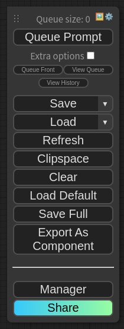


2. If you click on 'Install Custom Nodes' or 'Install Models', an installer dialog will open.

    

    * There are three DB modes: `DB: Channel (1day cache)`, `DB: Local`, and `DB: Channel (remote)`. 
      * `Channel (1day cache)` utilizes Channel cache information with a validity period of one day to quickly display the list.
        * This information will be updated when there is no cache, when the cache expires, or when external information is retrieved through the Channel (remote).
        * Whenever you start ComfyUI anew, this mode is always set as the **default** mode.
      * `Local` uses information stored locally in ComfyUI-Manager.
        * This information will be updated only when you update ComfyUI-Manager.
        * For custom node developers, they should use this mode when registering their nodes in `custom-node-list.json` and testing them.
      * `Channel (remote)` retrieves information from the remote channel, always displaying the latest list.
      * In cases where retrieval is not possible due to network errors, it will forcibly use local information.

    * The ```Fetch Updates``` menu retrieves update data for custom nodes locally. Actual updates are applied by clicking the ```Update``` button in the ```Install Custom Nodes``` menu.

3. Click 'Install' or 'Try Install' button.

    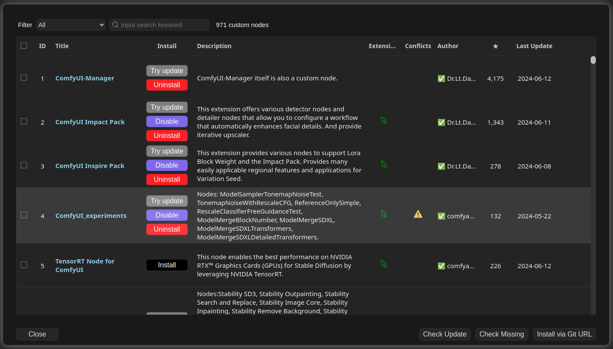

    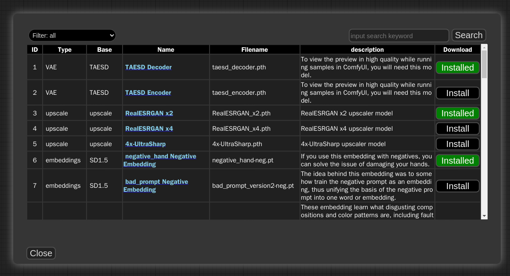

    * Installed: This item is already installed.
    * Install: Clicking this button will install the item.
    * Try Install: This is a custom node of which installation information cannot be confirmed. Click the button to try installing it.

    * If a red background `Channel` indicator appears at the top, it means it is not the default channel. Since the amount of information held is different from the default channel, many custom nodes may not appear in this channel state.
      * Channel settings have a broad impact, affecting not only the node list but also all functions like "Update all."
    * Conflicted Nodes with a yellow background show a list of nodes conflicting with other extensions in the respective extension. This issue needs to be addressed by the developer, and users should be aware that due to these conflicts, some nodes may not function correctly and may need to be installed accordingly.

4. If you set the `Badge:` item in the menu as `Badge: Nickname`, `Badge: Nickname (hide built-in)`, `Badge: #ID Nickname`, `Badge: #ID Nickname (hide built-in)` the information badge will be displayed on the node.
    * When selecting (hide built-in), it hides the 🦊 icon, which signifies built-in nodes.
      * Nodes without any indication on the badge are custom nodes that Manager cannot recognize.
    * `Badge: Nickname` displays the nickname of custom nodes, while `Badge: #ID Nickname` also includes the internal ID of the node.

    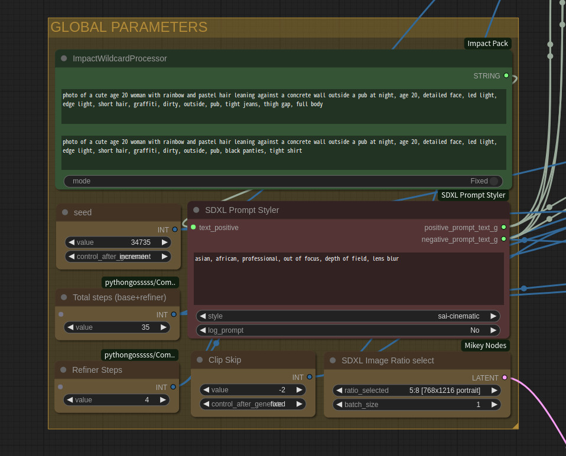


5. Share
   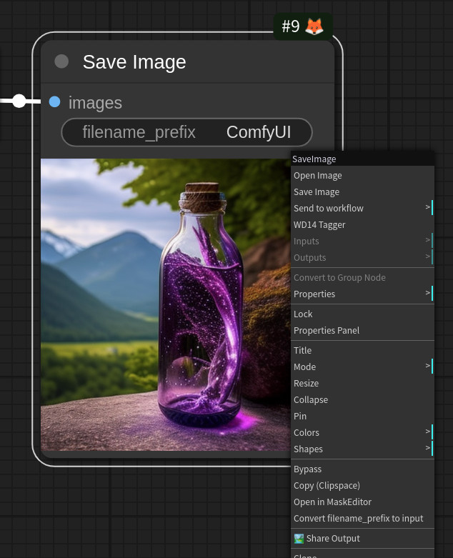 

  * You can share the workflow by clicking the Share button at the bottom of the main menu or selecting Share Output from the Context Menu of the Image node.
  * Currently, it supports sharing via [https://comfyworkflows.com/](https://comfyworkflows.com/),
    [https://openart.ai](https://openart.ai/workflows/dev), [https://youml.com](https://youml.com) 
    as well as through the Matrix channel.

  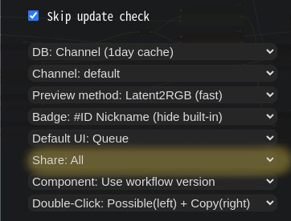
  
  * Through the Share settings in the Manager menu, you can configure the behavior of the Share button in the Main menu or Share Ouput button on Context Menu.
    * `None`: hide from Main menu
    * `All`: Show a dialog where the user can select a title for sharing.


## Snapshot-Manager
* When you press `Save snapshot` or use `Update All` on `Manager Menu`, the current installation status snapshot is saved.
  * Snapshot file dir: `ComfyUI-Manager/snapshots`
  * You can rename snapshot file.
* Press the "Restore" button to revert to the installation status of the respective snapshot.
  * However, for custom nodes not managed by Git, snapshot support is incomplete.
* When you press `Restore`, it will take effect on the next ComfyUI startup.
  * The selected snapshot file is saved in `ComfyUI-Manager/startup-scripts/restore-snapshot.json`, and upon restarting ComfyUI, the snapshot is applied and then deleted.

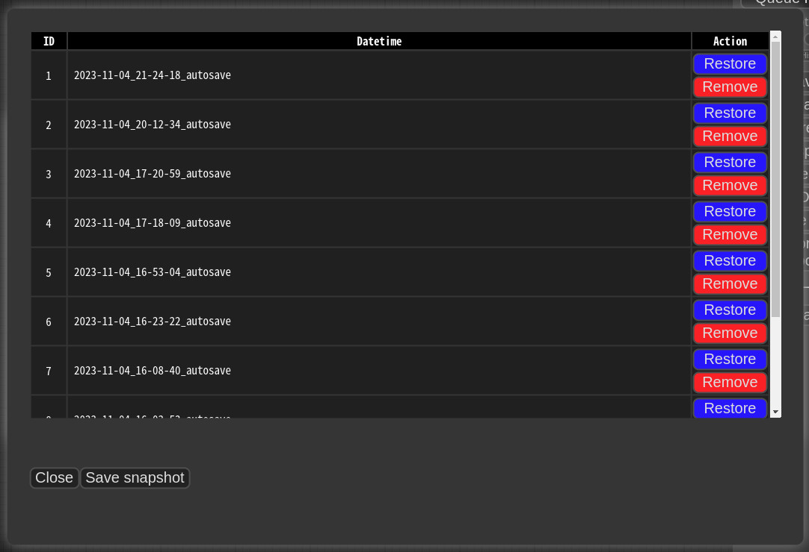


## cm-cli: command line tools for power user
* A tool is provided that allows you to use the features of ComfyUI-Manager without running ComfyUI.
* For more details, please refer to the [cm-cli documentation](docs/en/cm-cli.md).


## How to register your custom node into ComfyUI-Manager

* Add an entry to `custom-node-list.json` located in the root of ComfyUI-Manager and submit a Pull Request.
* NOTE: Before submitting the PR after making changes, please check `Use local DB` and ensure that the extension list loads without any issues in the `Install custom nodes` dialog. Occasionally, missing or extra commas can lead to JSON syntax errors.
* The remaining JSON will be updated through scripts in the future, so you don't need to worry about it.


## Custom node support guide

* Currently, the system operates by cloning the git repository and sequentially installing the dependencies listed in requirements.txt using pip, followed by invoking the install.py script. In the future, we plan to discuss and determine the specifications for supporting custom nodes.

* Please submit a pull request to update either the custom-node-list.json or model-list.json file.

* The scanner currently provides a detection function for missing nodes, which is capable of detecting nodes described by the following two patterns.
  * Or you can provide manually `node_list.json` file.

```
NODE_CLASS_MAPPINGS = {
    "ExecutionSwitch": ExecutionSwitch,
    "ExecutionBlocker": ExecutionBlocker,
    ...
}

NODE_CLASS_MAPPINGS.update({
    "UniFormer-SemSegPreprocessor": Uniformer_SemSegPreprocessor,
    "SemSegPreprocessor": Uniformer_SemSegPreprocessor,
})
```

* When you write a docstring in the header of the .py file for the Node as follows, it will be used for managing the database in the Manager.
  * Currently, only the `nickname` is being used, but other parts will also be utilized in the future.
  * The `nickname` will be the name displayed on the badge of the node.
  * If there is no `nickname`, it will be truncated to 20 characters from the arbitrarily written title and used.
```
"""
@author: Dr.Lt.Data
@title: Impact Pack
@nickname: Impact Pack
@description: This extension offers various detector nodes and detailer nodes that allow you to configure a workflow that automatically enhances facial details. And provide iterative upscaler.
"""
```


* **Special purpose files** (optional)
  * `node_list.json` - When your custom nodes pattern of NODE_CLASS_MAPPINGS is not conventional, it is used to manually provide a list of nodes for reference. ([example](https://github.com/melMass/comfy_mtb/raw/main/node_list.json))
  * `requirements.txt` - When installing, this pip requirements will be installed automatically 
  * `install.py` - When installing, it is automatically called
  * `uninstall.py` - When uninstalling, it is automatically called
  * `disable.py` - When disabled, it is automatically called
    * When installing a custom node setup `.js` file, it is recommended to write this script for disabling.
  * `enable.py` - When enabled, it is automatically called
  * **All scripts are executed from the root path of the corresponding custom node.**


## Component Sharing
* **Copy & Paste**
  * [Demo Page](https://ltdrdata.github.io/component-demo/)
  * When pasting a component from the clipboard, it supports text in the following JSON format. (text/plain)
    ```
    {
      "kind": "ComfyUI Components",
      "timestamp": <current timestamp>,
      "components": 
        {
          <component name>: <component nodedata>
        }
    }
    ```
  * `<current timestamp>` Ensure that the timestamp is always unique.
    * "components" should have the same structure as the content of the file stored in ComfyUI-Manager/components.
      * `<component name>`: The name should be in the format `<prefix>::<node name>`.
        * `<compnent nodeata>`: In the nodedata of the group node.
          * `<version>`: Only two formats are allowed: `major.minor.patch` or `major.minor`. (e.g. `1.0`, `2.2.1`)
          * `<datetime>`: Saved time
          * `<packname>`: If the packname is not empty, the category becomes packname/workflow, and it is saved in the <packname>.pack file in ComfyUI-Manager/components.
          * `<category>`: If there is neither a category nor a packname, it is saved in the components category.
          ```
              "version":"1.0",
              "datetime": 1705390656516,
              "packname": "mypack",
              "category": "util/pipe",
          ```
* **Drag & Drop**
  * Dragging and dropping a `.pack` or `.json` file will add the corresponding components.
  * Example pack: [Impact.pack](misc/Impact.pack)

* Dragging and dropping or pasting a single component will add a node. However, when adding multiple components, nodes will not be added.


## Support of missing nodes installation

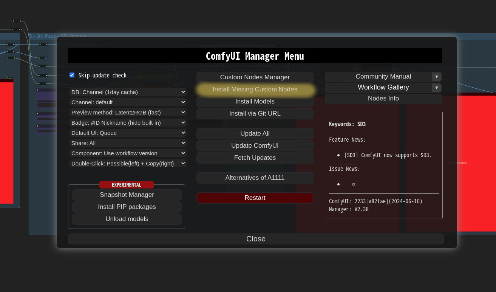

* When you click on the ```Install Missing Custom Nodes``` button in the menu, it displays a list of extension nodes that contain nodes not currently present in the workflow.

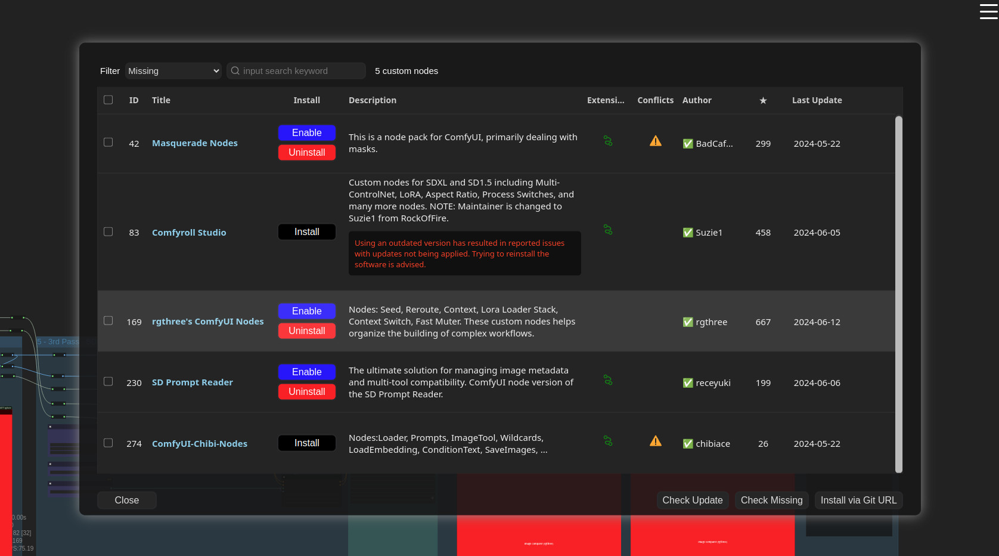


## Additional Feature
* Logging to file feature
  * This feature is enabled by default and can be disabled by setting `file_logging = False` in the `config.ini`.

* Fix node(recreate): When right-clicking on a node and selecting `Fix node (recreate)`, you can recreate the node. The widget's values are reset, while the connections maintain those with the same names.
  * It is used to correct errors in nodes of old workflows created before, which are incompatible with the version changes of custom nodes.

* Double-Click Node Title: You can set the double click behavior of nodes in the ComfyUI-Manager menu.
  * `Copy All Connections`, `Copy Input Connections`: Double-clicking a node copies the connections of the nearest node.
    * This action targets the nearest node within a straight-line distance of 1000 pixels from the center of the node.
    * In the case of `Copy All Connections`, it duplicates existing outputs, but since it does not allow duplicate connections, the existing output connections of the original node are disconnected.
    * This feature copies only the input and output that match the names.
  
  * `Possible Input Connections`: It connects all outputs that match the closest type within the specified range.
    * This connection links to the closest outputs among the nodes located on the left side of the target node.
    
  * `Possible(left) + Copy(right)`: When you Double-Click on the left half of the title, it operates as `Possible Input Connections`, and when you Double-Click on the right half, it operates as `Copy All Connections`.

* Prevent downgrade of specific packages
  * List the package names in the `downgrade_blacklist` section of the `config.ini` file, separating them with commas.
    * e.g
    ```
      downgrade_blacklist = diffusers, kornia
    ```

* Custom pip mapping
  * When you create the `pip_overrides.json` file, it changes the installation of specific pip packages to installations defined by the user.
    * Please refer to the `pip_overrides.json.template` file.
    
* Use `aria2` as downloader
  * [howto](docs/en/use_aria2.md)

## Scanner
When you run the `scan.sh` script:

* It updates the `extension-node-map.json`.
  * To do this, it pulls or clones the custom nodes listed in `custom-node-list.json` into `~/.tmp/default`.
  * To skip this step, add the `--skip-update` option.
  * If you want to specify a different path instead of `~/.tmp/default`, run `python scanner.py [path]` directly instead of `scan.sh`.

* It updates the `github-stats.json`.
  * This uses the GitHub API, so set your token with `export GITHUB_TOKEN=your_token_here` to avoid quickly reaching the rate limit and malfunctioning.
  * To skip this step, add the `--skip-update-stat` option.

* The `--skip-all` option applies both `--skip-update` and `--skip-stat-update`.


## Troubleshooting
* If your `git.exe` is installed in a specific location other than system git, please install ComfyUI-Manager and run ComfyUI. Then, specify the path including the file name in `git_exe = ` in the ComfyUI-Manager/config.ini file that is generated.
* If updating ComfyUI-Manager itself fails, please go to the **ComfyUI-Manager** directory and execute the command `git update-ref refs/remotes/origin/main a361cc1 && git fetch --all && git pull`.
 * Alternatively, download the update-fix.py script from [update-fix.py](https://github.com/ltdrdata/ComfyUI-Manager/raw/main/scripts/update-fix.py) and place it in the ComfyUI-Manager directory. Then, run it using your Python command.
   For the portable version, use `..\..\..\python_embeded\python.exe update-fix.py`.
* For cases where nodes like `PreviewTextNode` from `ComfyUI_Custom_Nodes_AlekPet` are only supported as front-end nodes, we currently do not provide missing nodes for them.
* Currently, `vid2vid` is not being updated, causing compatibility issues.
* If you encounter the error message `Overlapped Object has pending operation at deallocation on Comfyui Manager load` under Windows
  * Edit `config.ini` file: add `windows_selector_event_loop_policy = True`
* if `SSL: CERTIFICATE_VERIFY_FAILED` error is occured.
  * Edit `config.ini` file: add `bypass_ssl = True`

## Security policy
  * Edit `config.ini` file: add `security_level = <LEVEL>`
    * `strong`
      * doesn't allow `high` and `middle` level risky feature
    * `normal`
      * doesn't allow `high` level risky feature if `--listen` is specified and not starts with `127.`
      * `middle` level risky feature is available
    * `weak`
      * all feature is available
    
  * `high` level risky features
    * `Install via git url`, `pip install`
    * Installation of custom nodes registered not in the `default channel`.
    * Display terminal log
  
  * `middle` level risky features
    * Uninstall/Update/Fix custom nodes
    * Installation of custom nodes registered in the `default channel`.
    * Restore/Remove Snapshot
    * Restart
  
  * `low` level risky features
    * Update ComfyUI


## TODO: Unconventional form of custom node list

* https://github.com/diontimmer/Sample-Diffusion-ComfyUI-Extension
* https://github.com/senshilabs/NINJA-plugin
* https://github.com/MockbaTheBorg/Nodes
* https://github.com/StartHua/Comfyui_GPT_Story
* https://github.com/NielsGercama/comfyui_customsampling
* https://github.com/wrightdaniel2017/ComfyUI-VideoLipSync
* https://github.com/bxdsjs/ComfyUI-Image-preprocessing
* https://github.com/SMUELDigital/ComfyUI-ONSET
* https://github.com/SimithWang/comfyui-renameImages
* https://github.com/icefairy64/comfyui-model-tilt
* https://github.com/andrewharp/ComfyUI-EasyNodes
* https://github.com/SimithWang/comfyui-renameImages
* https://github.com/Tcheko243/ComfyUI-Photographer-Alpha7-Nodes
* https://github.com/Limbicnation/ComfyUINodeToolbox

## Roadmap

- [x] System displaying information about failed custom nodes import.
- [x] Guide for missing nodes in ComfyUI vanilla nodes.
- [x] Collision checking system for nodes with the same ID across extensions.
- [x] Template sharing system. (-> Component system based on Group Nodes)
- [x] 3rd party API system.
- [ ] Auto migration for custom nodes with changed structures.
- [ ] Version control feature for nodes.
- [ ] List of currently used custom nodes.
- [x] Download support multiple model download.
- [x] Model download via url.
- [x] List sorting (custom nodes).
- [x] List sorting (model).
- [ ] Provides description of node.


# Disclaimer

* This extension simply provides the convenience of installing custom nodes and does not guarantee their proper functioning.


## Credit
ComfyUI/[ComfyUI](https://github.com/comfyanonymous/ComfyUI) - A powerful and modular stable diffusion GUI.

**And, for all ComfyUI custom node developers**
