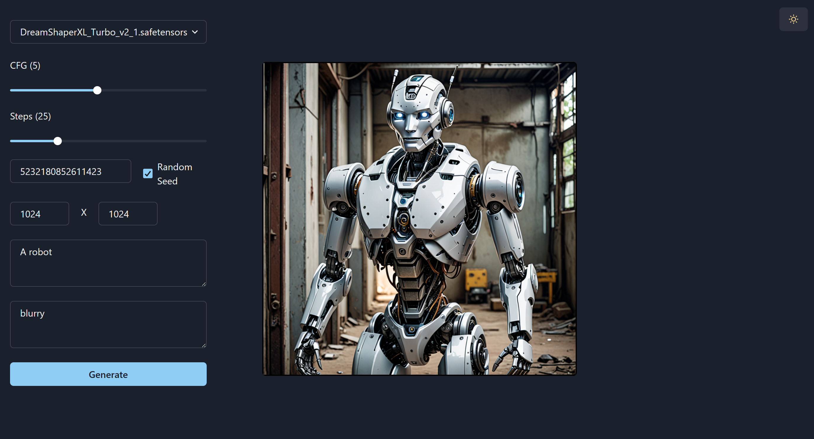

# ComfyUI-React-SDK

# 🚦 WIP 🚦

This project is for building React application as an overlay upon ComfyUI.

Providing an ability to run custom UI levraging ComfyUI API and workflows.

Inspired by: https://github.com/cubiq/Comfy_Dungeon

## Getting started

To view the demo of this repo, just clone it to custom_nodes, restart comfy and enter the browser at \<your-comfy-url>/root.

### Example screen shot

