# CG Image Filter

---

**If you are reporting a bug, please read [how to report a bug well](#how-to-report-a-bug-well) first!**

---

A set of nodes designed to pause execution of the workflow to allow you to make selections and/or edits before continuing.
There's an example workflow that illustrates all of them at the end.

- ['Image Filter'](#image-filter) - pause the flow and pick which images from a set you want to proceed with
- ['Mask Image Filter'](#mask-image-filter) - launch the mask editor for the image, and return the image and mask
- ['Text Image Filter with Extras'](#text-image-filter-with-extras) - as 'Text Image Filter' but with three extra single line texts fields that are also returned

There are also some helper nodes.

If you prefer trying a workflow to reading docs, use of the nodes is illustrated in this blob (drag the image into Comfy):

## New in 1.6 ##

- `Masked Section` node to crop images to just the masked area

## New in 1.5 ##

- Floating window for extras and tips
- Mask editor node now has option for text extras
- Keyboard and mouse navigation in zoomed view

## New in 1.4 ##

Video previews!

## New in 1.3.2 ##

- works with old mask editor as well
- keyboard shortcuts are back
- various minor fixes

## New in 1.3 ##

- pick_list to automatically select images in `Image Filter`
- optional initial mask input to `Mask Image Filter`

## Examples of what you might do with them

- Generate an image or batch, and select which ones you want before spending the time upscaling
- Generate an image and pick part of it to inpaint all in one go (the example workflow below does this)
- Edit auto-generated captions before saving them
- Iterate through a folder of images, picking a masked area to inpaint (and the inpainting prompt) for each
- you ideas here...

---

## Global Options

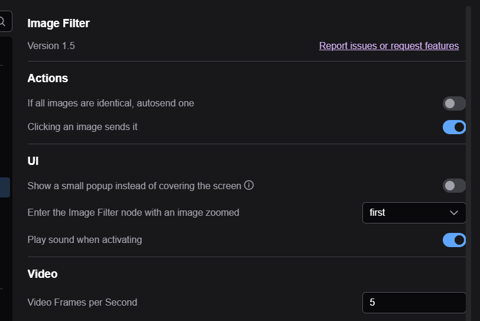

- `If all images are identical, autosend one` - in the ImageFilter node, if all images are identical (including if there is just one image) then send
an image without user interaction. 
- `Clicking an image sends it` - In the ImageFilter node, clicking an image sends it instead of selecting it. Useful if you know you only ever want to send one image at most.
- `Show a small popup instead of covering the screen` - instead of taking over the whole screen immediately, display a tiny version of the image in the top left. Click that image to go into the full screen mode. You can move the tiny image window around to where you want it by dragging the title bar.
- `Enter the Image Filter node with an image zoomed` - instead of showing the grid of images, zoom in on one. Options are `first` or `last`
- `Play sound when activating` - play a 'ding' sound when any of the filter nodes becomes active. You can change the sound by replacing the file `ding.mp3` in the `js` subfolder.
- `Video Frames per Second` - when previewing vidoe(s), try to play them at this speed

---

## Keyboard shortcuts

In `Image Filter` and `Text Image Filter` (not `Mask Image Filter`)

- `Space` when hovering over an image enlarges it. See `Zoom` in the `Image Filter` section below.
- `Escape` to click the cancel button
- `Enter`to click the send button
- digits `0`, `1`, etc. to click an image (zero-indexed) (select/deselect or send, depending on the value of `ClickSends`)

In `Image Filter` only

- `ctrl-A` to select/unselect all images

---

## Image Filter

The image filter node pauses execution of the workflow while you choose which, if any, of the images produced, you want to progress.

Insert it like this:

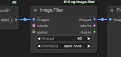

When you run the workflow, and get to this point, a popup window will appear displaying the image(s) for you to select which, if any, 
you want to progress:

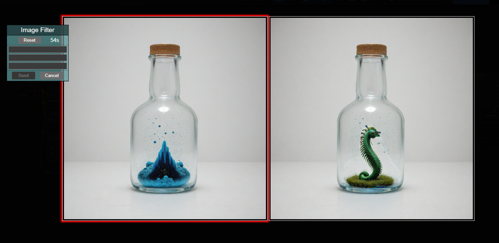

Click the images that you want to keep (their border will turn green) and then click 'Send' to continue the workflow. 
If you don't want to keep any of the images, click 'Cancel' (or press 'escape') to terminate the workflow. 

The node also has a timeout specified, and a countdown is shown on the left hand side. If you don't Send or Cancel before the timeout, 
the node will either cancel or send all the images, depending on the option you have selected.

Here's a simple use: generate a batch of images and pick which ones you want to save:

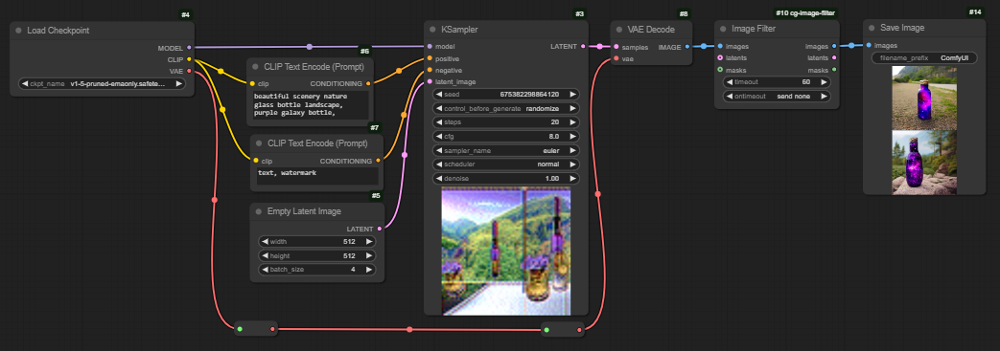

### Zoom

If you hover over an image (it gets a red border) and press the space bar, it will zoom to fill the screen. 
You can also use the `Enter the Image Filter node with an image zoomed` setting to start in this mode.

While zoomed, you can navigate with keyboard or mouse:

| |Mouse|Keyboard|Notes|
|-|-|-|-|
|Select/unselect/send|Click the zoomed image|`Arrow Up`|Will select/unselect the image, or send it if you have `Clicking an image sends it` turned on|
|Previous/Next|Click the arrows to the left or right|`Arrow Left` `Arrow Right`|The image number is shown near the top right|
|Unzoom| |`Space`|Back to the grid view|

### Optional inputs

The Latent and Mask inputs are optional. If used, they should have the same number of latents (or masks) as the image batch, 
and the latents (or masks) corresponding to the selected images will be output. Use this if (for instance) you want to 
select from a batch of images, but the next stage uses the latent - that way you avoid the decode-recode loss, or if you want
to pick a mask (perhaps from options automatically generated)

Other things (like prompts, segs etc.) that have been used can be selected using the `Pick from List` helper node.

### pick_list

Sometimes you know which images you are going to want. If you provide a comma separated list of integers in `pick_list`,
these images will be selected without user input. Values will be taken modulo the number of images (which means you can use `-1` for the last image).

You could also use this to make a larger batch of images (repeat a value and the image will appear repeated times in the output).

Note that this uses zero indexing (the first image is '0').

### video_frames

If you set this to greater than one, the image filter node will batch up each set of n images and treat them as a video snip. 

Set the FPS for playback in the global settings.

This is a new, experimental feature, so please report any issues...

---

## Mask Image Filter

Designed for a single image, when executed the Mask Image Filter node will automatically launch the mask editor. 

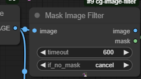

When you finish mask editing the image and mask will be output. Here's a simple use - generate an image, and then 
mask the bit you don't like, before doing an img2img step.

Again, there is a timeout, and if you don't save a mask before the end of the timeout (or if you press the cancel button in the mask editor), 
it will either cancel, or send a blank mask, depending on the option chosen.

### Mask in

There is an optional mask input (added in 1.3), which allows you to specify the mask when the editor is launched:

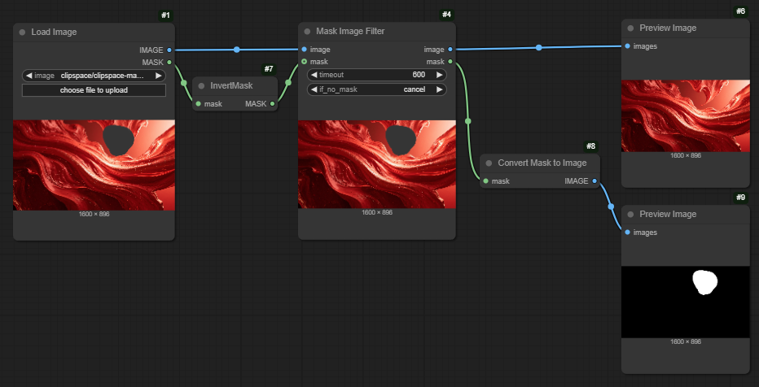

**Note that the Mask Image Filter works with the new Mask Editor; it does not work with the old one**

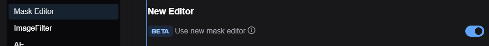

---

## Text Image Filter

Also designed for a single image, this node will show the image and a string of text; you can edit the text and then press send. 

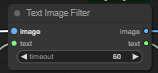

The image and (edited) text are output. The intended use is for captioning workflows; you can read and edit each caption as it is
generated. Here's a trivial workflow:

---

# A few more things

## Extras

'Text Image Filter' and 'Image Filter', each provide three extra text fields, intended for short form - like specifying the denoising you want on the next step, or a prefix to save the file with.

If you use the optional 'tip' input, the contents will be displayed under the extras input fields, so you can remind yourself what they are for!

---

## Helper Nodes

### Masked Section

`Masked Section` takes a mask and a (batch of) images and outputs the images cropped to the bounding box of the mask (with a minimum size). 
Here's how you might use it to preview the parts of the image that were changed in img2img (also using `Pick from List` and `Image List from Batch` described below)

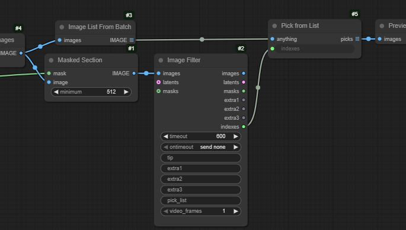

### String handling

- `Split String by Commas` allows you to split a text string into up to five pieces, splitting on `,`, `|`, or `^`. It also strips whitespace, so that the strings can be easily parsed, especially by...
- `String to Int` and `String to Float` convert a string to an int or a float, with a fallback default 

Together, these nodes allow you to specify lots of information in the `extras` fields. For instance, if doing an inpaint, you might have an extras field that takes the format `0.4, 20` meaning 'denoise 0.4, 20 steps'. Split the string, feed the pieces into the converters, and feed that into other nodes. Like this:

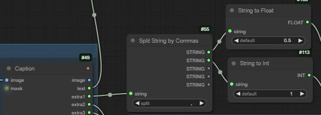

`Split String by Commas` produces five string outputs. If there are fewer than five terms, the extra ones will havee an empty string; if there are more than five terms the fifth output will be a comma separated list of the fifth and subsequent terms.

There is also a sixth output which is a list of all the strings.

### List and Batch Handling

**When working with multiple images** - `Image Filter` expects a batch, `Mask Image Filter` and `Text Image Filter` need a list.

So if you generate a load of images using lists of, for instance, prompts, to feed them into `Image Filter` you will want to combine them with the helper node `Batch from Image List`.

If you generate a batch of images and want to use the `Mask Image Filter` or `Text Image Filter`, which only handle a single image, you will want to do the opposite - convert the batch to a list with `Image List From Batch`. Then the images will be shown sequentially.

The `Image Filter` node outputs a string, `indexes`, which is a comma separated list of the indexes 
(0 based by default, but you can pick a different start value if you need to with `pick_list_start`) of the images selected. 
Connect this to a `Pick from List` node, and connect a list of anything to the `anything` input, and the `Pick from List` node will output a list corresponding to the selected images.

For instance, if you create a set of images using a list of prompts, this can be used to select the prompts that correspond to the selected images. But you might well want to batch the images if you did use lists - see below.

So something like this:

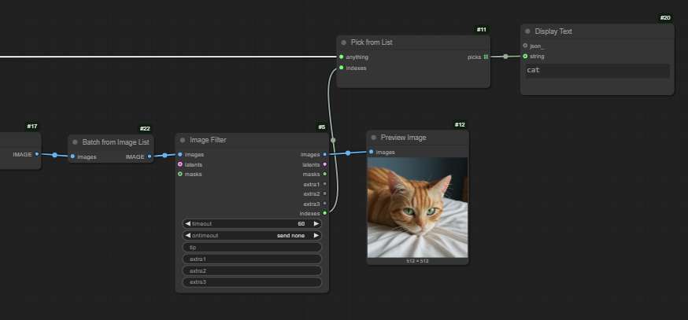

---

# Example Workflow

This workflow:
- generates an image
- uses 'Mask Image Filter' to allow you to mask part of the image for inpainting
- uses 'Text Image Filter with Extras' to enter a prompt (and negative prompt) for the inpainting
- inpaints
- uses 'Image Filter' to choose which, if either, of the two images (before and after inpaint) to save

The workflow is embedded in the blob in a bottle:

# Bugs, Ideas, and the future

Take a look at the [issues list](https://github.com/chrisgoringe/cg-image-filter/issues) to see what I'm thinking of,
to report problems, or to make suggestions.

## How to report a bug well

Please read [this guide](https://github.com/chrisgoringe/cg-image-filter/discussions/60) before you post a bug!
