# UE Nodes

Love this node? [Buy me a coffee!](https://www.buymeacoffee.com/chrisgoringe)

Getting started? Download the test workflow below and see how it works.

Problems? Jump down to [logging and debugging](https://github.com/chrisgoringe/cg-use-everywhere/blob/main/README.md#loggingdebugging)

Ideas for how to improve the nodes (or bug reports) - [raise an issue](https://github.com/chrisgoringe/cg-use-everywhere/issues)

Shameless plug for my other nodes -> Check out [Image Picker](https://github.com/chrisgoringe/cg-image-filter) for another way to make some workflows smoother. And leave a star if you like something!

---

# Important!

I've merged v7 of UE to coincide with the update to ComfyUI, but the instructions below have not been updated.

Please see [this discussion](https://github.com/chrisgoringe/cg-use-everywhere/discussions/334) (but ignore the bits about branches).

---

Over the next few releases I am aiming to reduce the UE zoo down to a single node that can do everything, but is as easy (or easier) to use than the current nodes.

The first step in this process is merging the `AnythingEverywhere` and `AnythingEverywhere?` nodes by moving the regex restrictions into a separate dialog that can be used by either. In future iterations the group and color restrictions will also move to this dialog (so people find them!)

---

# 6.3 Update for ComfyUI front end (version TBC) - subgraphs

With the addition of subgraphs, group nodes are no longer supported in UE from 6.3 onwards.

Instead, UE 6.3 has the following support for subgraphs:

- UE nodes can be used in the main graph and in subgraphs. 
- UE nodes only broadcast within the graph or subgraph they are in. 
- Subgraph nodes are just nodes. You can connect UE nodes to their outputs, and UE links will connect to their inputs.
- Within a subgraph you can connect from the input panel to a UE node.
- UE nodes within the subgraph will *not* broadcast to the output panel.
- When you convert a set of nodes to a subgraph, UE links will work as long as:
  - the UE node (Control) and the node feeding it (Source) are both in the subgraph, or
  - neither the Source nor Control are in the subgraph, or
  - the Source is in the subgraph, and the Control is not, and no Target nodes are in the subgraph


## Subgraph creation

There are three nodes involved in every UE link: 
- Source (the link sending the data), 
- Control (the UE node connected to the source), 
- Target (the node that is receiving the data as an input)

This is how those cases are treated:

|Support|Source|Control|Target||
|-|-|-|-|-|
|Yes|Graph|Graph|Graph|Nothing changes|
|Yes|Graph|Graph|Subgraph|The subgraph will have inputs for the data; in the subgraph the input panel is connected to the Target with a real link|
|No|Graph|Subgraph|Graph|Not supported|
|No*|Graph|Subgraph|Subgraph|Not supported|
|Yes|Subgraph|Graph|Graph|The subgraph will be connected to the Control|
|No|Subgraph|Graph|Subgraph|Not supported|
|Yes|Subgraph|Subgraph|Graph|The Source will be connected to the Control *and* the output panel in the subgraph, the output will be connected to the Target with a real link|
|Yes|Subgraph|Subgraph|Subgraph|All nodes will be connected in the subgraph as they were in the graph|

No* indicates a case that does not work, but might get implemented.

No indicates a case I'm unlikely ever to support

---

## Test workflow

|This workflow uses all five nodes, and can be used to test (and understand!) the nodes. You wouldn't build it like this, it's just an example...|Here's an image with the workflow in|
|-|-|
|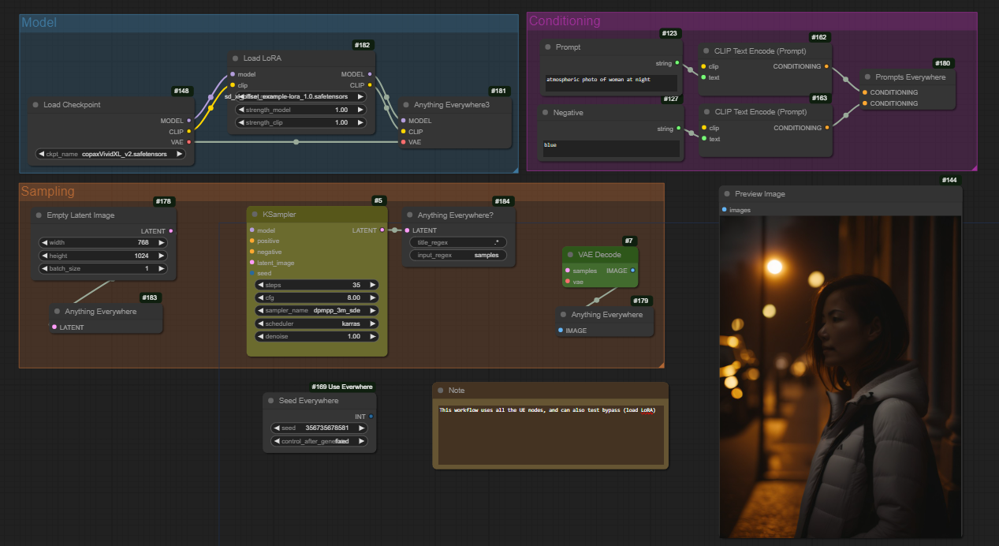||

Or [the workflow as json](docs/test-workflow.json)

## Current known limitations

There are some situations that UE nodes can't cope with at present. Here are some I know about, and possible workarounds.

### Pythonssss Preset Text

[pythonsssss](https://github.com/pythongosssss/ComfyUI-Custom-Scripts) custom nodes are great, but there are some limitations in using them with UE nodes. In particular, you can't feed the output of a Preset Text node directly into a UE node (see https://github.com/chrisgoringe/cg-use-everywhere/issues/154). 

### Group nodes

UE nodes mostly work with group nodes. But there are a couple of important things to note:

- when you create a group node the input names and node names can change. This might break UE? regex connections.

## Latest updates

6.3 June/July 2025
- support for ComfyUI subgraphs

6.1 (May 2025)
- Mostly some bug-fixes (#216, #217, #300)
- New option to show UE links differently without animation for better performance

6.0 (April 2025)
- Very major rebuild to deal with latest version of Comfy

## Installing

Use Comfy Manager. If you really want to do it manually, just clone this repository in your custom_nodes directory.

## Anything Everywhere (start here!)

The `Anything Everywhere` node has a single input, initially labelled 'anything'. Connect anything to it (directly - not via a reroute), and the input name changes to match the input type. Disconnect and it goes back to 'anything'.

When you run the prompt, any unconnected input, anywhere in the workflow, which matches that type, will act as if it were connected to the same input. 

To visualise what it's being connected to, right-click on the background canvas and select `Toggle UE Link Visibility`.

## Anything Everywhere? - control matching with regex rules

This node adds two widgets - title_regex and input_regex. It will only send to inputs which match. So in the example, title_regex is 'Preview' so the image is sent to the Preview Image node but not the Save Image node. Note that you can rename node and input titles, which can help! 

(From 4.6 you can also specify a group regex to only match inputs on nodes which are in groups that match the regex.)

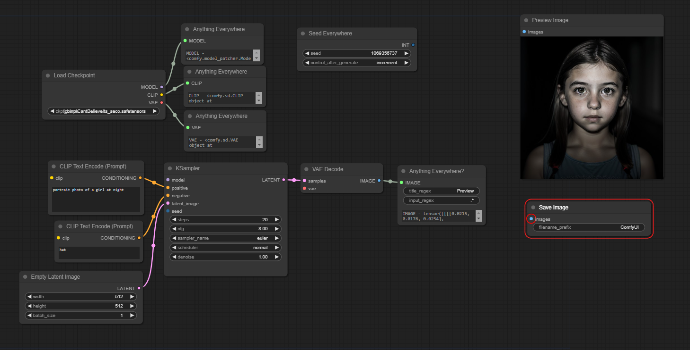

*The matches are regular expressions, not string matches.* Most simple strings will work (matching any part of the title or input name), but some characters have special meanings (including various sorts of brackets, ^, $, /, and . in particular) so just avoid them if you aren't regex-inclined.

Using regex means you can use `^prompt` to match `prompt` at the beginning of the title only, to avoid matching `negative_prompt`.

Regex 101 - `^` means 'the start', `$` means 'the end', `.` matches any single character, `.*` matches anything of any length (including zero). For more than that, visit [regex101](https://regex101.com/) (the flavour you want is ECMAScript, though that probably won't matter).

### Can I make the regex an input instead of a widget?

Sort of.

Because the regex needs to be known before the workflow is submitted (in order to calculate the links), you can't pass a string into the `Anything Everywhere?` node and expect it to work. The *only* thing that is supported is if the input comes *directly* from a node which sets it with a string widget. The `Simple String` node that is included in this pack will work. 

|This works|This doesn't. And never will.|
|-|-|
|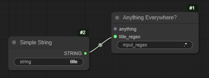|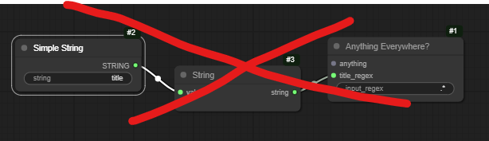|


## Seed Everywhere

Seed Everywhere connects to any unconnected INT input with `seed` in the input name (seed, noise_seed, etc), and it has the control_after_generate feature. So if you convert the seed widgets to inputs you can use the same seed everywhere.

## Anything Everywhere3 - One node, three inputs.

Really just three `Anything Everywhere` nodes packaged together.  Designed for the outputs of Checkpoint Loader. 

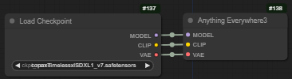

## Prompts Everywhere - two strings or conditionings

Prompt Everywhere has two inputs. They will be sent with regex matching rules of `(^prompt|^positive)` and `neg` respectively. These should match the various versions of names that get used for prompts and negative prompts or conditionings.

|strings|conditionings|
|-|-|
|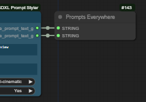|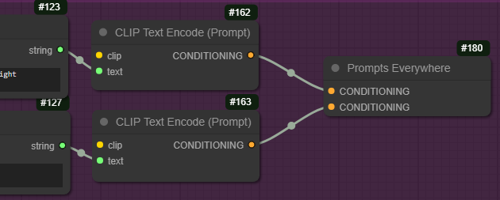

# Primitives and COMBOs and the like

UE nodes don't work with primitives and COMBOs (the data type used for dropdown lists, which are also a type of primitive within Comfy). It's unlikely they ever will. 

If you want to use UE to control sampler or sigma, you can do this with the built in `SamplerCustom` nodes:


For more on this, see [this discussion](https://github.com/chrisgoringe/cg-use-everywhere/issues/69)

# Other features

## Third Party Integration

At the suggestion of [@fighting-tx](https://github.com/fighting-tx), 
I've added a method that third party nodes can use if they want to see the prompt as generated by UE. 
It's attached to the `app` object, so you can check if it is present and use it something like this:

```js
var prompt
if (app.ue_modified_prompt) {
  prompt = await app.ue_modified_prompt()
} else {
  prompt = await original_graphToPrompt.apply(app)
}
```

Other methods could be exposed if there is interest - raise an issue if you'd like to see something. 

## Reject links

Right click on a node and you can set it to reject UE links

## Show links - visualisation and animation.

If you want to see the UE links, you can turn them on and off by right-clicking on the canvas. For finer control, the main settings menu has options to show links when the mouse moves over the node at either end, or when one of those nodes is selected.

The links can be animated to distinguish them from normal links - this animation can take the form of moving dots, a pulsing glow, or both. This may impact performance in some cases - note that the pulse animation requires less processing than the moving dots. Control this in the main settings menu.

By default the animations turn off when the workflow is running to minimise impact on CPU/GPU - you can change this in the settings too.

## Convert to real links

If you want to share a workflow without UE nodes being required, or to save an API version of a workflow, you can replace the virtual links created by UE nodes with real links (and remove the UE nodes).

This can be done for a single node by right-clicking on it and selecting `Convert to real links`, or for all UE nodes in a workflow by right-clicking the background and selecting `Convert all UEs to real links`.

## Shift drag

Shift click on an output node and drag then release to get an autocreate menu. This replaces the default behaviour (which gives you a search box), so you can disable it with the `Anything Everywhere replace search` setting.

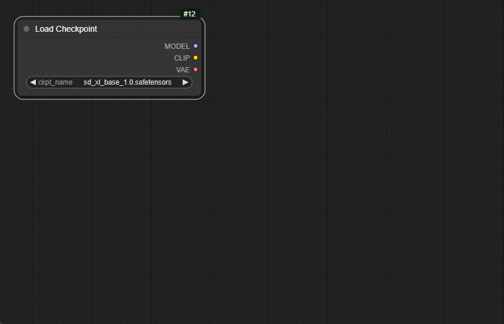

## Group and color restriction

UE nodes can be restricted to send only to nodes of the same color, or only to nodes that *aren't* the same color.

They can also be restricted to send only to nodes in the same group (any group in common), or only to nodes that aren't in the same group.

Right-click on the node and select `Group restrictions` or `Color restrictions`. UE nodes which are restricted (in either or both ways) have a green circle in the top-left corner. 

## Highway nodes

Trung 0246's [Highway nodes](https://github.com/Trung0246/ComfyUI-0246) are a pretty cool way of piping data around. You can target them with an `Anything Everywhere?` node by using an `input_regex` which matches the unconnected input name with the '+', like this:
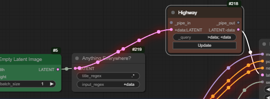

This is new, so please report any issues!

## Loop checking

By default workflows are checked for loops before they are submitted (because UE can introduce them, and a loop results in a bad python outcome). If a loop is detected you'll get a JavaScript warning showing you the node ids involved. However, especially if there are other custom nodes involved, it's possible that the check will miss a loop, or flag one that isn't real.

If you get a warning and don't believe there is a loop (having checked the node ids listed!) you can turn loop checking off in the main settings menu. If something flagged as a loop runs fine, please [raise an issue](https://github.com/chrisgoringe/cg-use-everywhere/issues) and include the workflow in the report (save the json and zip it, because GitHub doesn't accept .json files). Likewise if a loop doesn't get caught.

I've written code for the core Comfy backend to catch loops, maybe it'll be included - [PR for ComfyUI](https://github.com/comfyanonymous/ComfyUI/pull/1652) - or maybe they have another plan.

## Priorities

If there is more than one sending node that matches an input, the basic rules is that the more specific node wins. The order of priorities is:

- `Anything Everywhere?` 
- `Seed Everywhere` and `Prompts Everywhere`
- `Anything Everywhere`
- `Anything Everywhere3`

For nodes of the same time, those with colour restrictions and group restriction are prioritised (colour+group > colour > group > none).

If two nodes with the same priority both match *neither will connect* - better to fail fast than have an ambiguous outcome. If there are ambiguous matches you can display them using `Show UE broadcast clashes` (right-click on background - the option only appears if there are clashes).

## See what is sent

The nodes which only have one output can also gain a text box showing exactly what passed through the node. You need to turn this on if you want it - it's in the main settings, 'Anything Everywhere node details'.

## Logging/Debugging

The JavaScript console (press f12 in some browsers) has logging information about what is being connected. You can change the level of detail by finding the file `[comfy_install]/custom_nodes/cg-use-everywhere/js/use_everywhre_utilities.js` and near the top finding this bit:
```javascript
    static ERROR       = 0; // actual errors
    static PROBLEM     = 1; // things that stop the workflow working
    static INFORMATION = 2; // record of good things
    static DETAIL      = 3; // details

    static LEVEL = Logger.PROBLEM;
    static TRACE = false;   // most of the method calls
```
Change the `LEVEL` to `Logger.INFORMATION` for more, or `Logger.DETAIL` for even more; set `TRACE` to `true` for some other debugging information.

If you have a problem, pressing f12 to see the JavaScript console can often help. The following steps are really helpful in making a good bug report:

- update to the latest version
- restart ComfyUI
- clear the canvas
- close the browser
- open a new Comfy window (with no workflow), look in console (f12) to see if there were any errors as ComfyUI started up
- load your workflow, and look again
- run, and look again

The other thing worth trying is clearing out all the custom node javascript from where it gets copied when ComfyUI starts:

- stop Comfy
- go to [comfy root]/web/extensions     (*not* under custom_nodes)
- remove everything there EXCEPT for `core`. Leave `core` (it's ComfyUI stuff)
- restart Comfy (all custom nodes will reinstall their javascript at startup)

If you find a bug, please [raise an issue](https://github.com/chrisgoringe/cg-use-everywhere/issues) - if you can include the workflow, that's a huge help (you'll need to save it as .txt, or zip the .json file, because GitHub doesn't accept .json).

## Cautions

Bypassing and disabling nodes works, but with one catch. If you have a UE nodes that does matching (`Anything Everywhere?` and `Prompt Everywhere`) and you bypass the node it matches to, the link won't be made. So

|If you use a ? node to send to a node...|...and bypass the recipient, it doesn't get connected |
|-|-|
|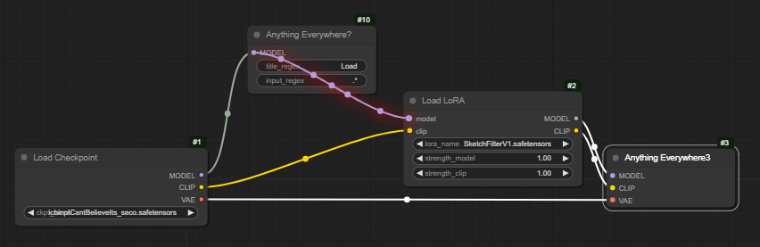|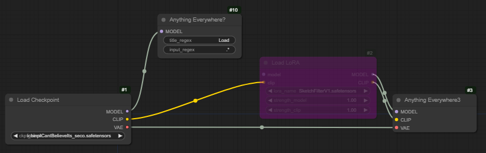|

This is unlikely to be fixed, but should be fairly easy to avoid!


---
# Some older information

# Update for ComfyUI front end 1.16 and above

ComfyUI front end 1.16 made a major change to the way that inputs and widgets work, which had a significant impact on the UE nodes.

A widget is no longer converted to an input in order to connect to it; instead, you just connect an output to it, and it converts.

This is quite cool - except that it meant that there was no way for UE to tell if a widget was supposed to be an empty input for UE to feed.

So there is a new mechanism for this. Here's a picture of a node that I have right-clicked:

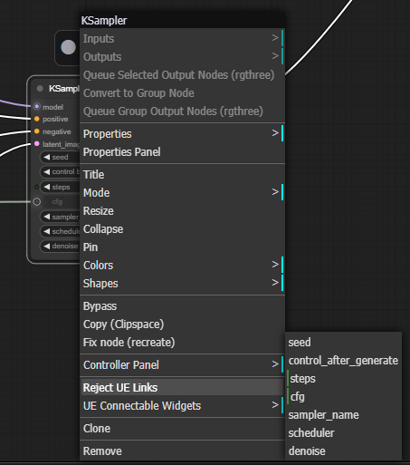

Things to notice:

- There is a new menu `UE Connectable Widgets` which lists all the widgets. Those marked as connectable have a green bar to the left of the name.
  - Select a widget to toggle its value
- Next to the widget, where an input would be, the connectable widgets have a graphical indication of their state.
  - The smaller dark circle (next to steps) indicate a connectable node which is not connected (widget value will be used)
  - The light circle (next to cfg) and greying out the widget indicates that a UE node will provide the value
  - No icon (all the other widgets) indicates that they are not UE connectable
- Other inputs still have the indications of normal connection or UE connection (here model is a UE connection)

You'll probably find that turning the `showlinks` option on helps, and the `highlight` option is required for those widget indicators which help a lot.

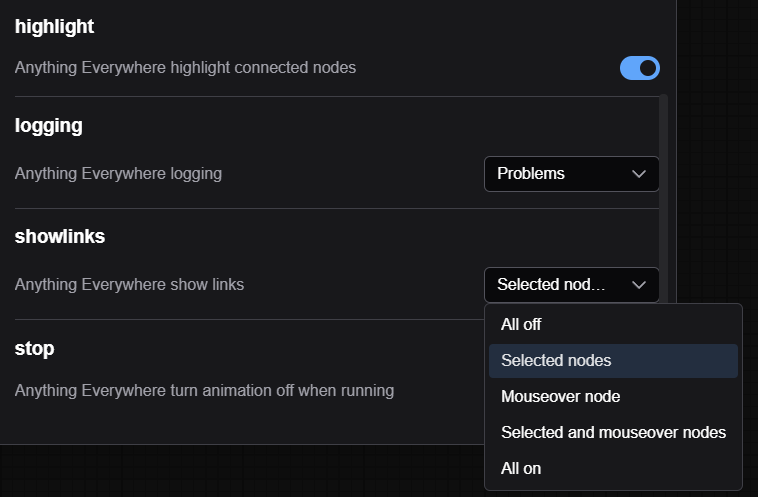

Hopefully old workflows will be automatically converted when you load them. Hopefully.

## Naming widgets

The `Prompts Everywhere`, `Seed Everywhere`, and `Anything Everywhere?` all make use of the name of an input. On some occasions this might mean you want to rename an input.

For an input that can't be a widget, that's trivial - right click on the input dot and select `Rename Slot`. The name will be updated, and the new name displayed next to the dot.

If an input *can* be a widget, you can rename it in the same way, but the new name *does not get displayed*. The name has changed, and the UE nodes will use the new name, but the old name is still shown. I consider this to be a bug in the Comfy front-end, and have raised an issue [here](https://github.com/Comfy-Org/ComfyUI_frontend/issues/3654). Unfortunately it appears that Comfy UI is going to remove the ability to rename a widget entirely, so best to avoid using widget input names if at all possible.
