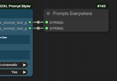
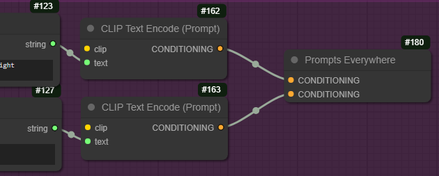

# UE Nodes

Love this node? [Buy me a coffee!](https://www.buymeacoffee.com/chrisgoringe)

Getting started? Download the test workflow below and see how it works.

Problems? Jump down to [logging and debugging](https://github.com/chrisgoringe/cg-use-everywhere/blob/main/README.md#loggingdebugging)

Ideas for how to improve the nodes (or bug reports) - [raise an issue](https://github.com/chrisgoringe/cg-use-everywhere/issues)

Shameless plug for my other nodes -> Check out [Image Picker](https://github.com/chrisgoringe/cg-image-filter) for another way to make some workflows smoother. And leave a star if you like something!

---

# Anything Everywhere v7

Version 7 is a major update to the Anything Everywhere nodes, so the documentation below is all new. If you are looking for the old docs, you can find them [here](https://github.com/chrisgoringe/cg-use-everywhere/README-old).

If you are new to Anything Everywhere, skip to [Anything Everywhere]().

## Major changes

If you used Anything Everywhere prior to v7, the major improvements are:

- The `Anything Everywhere3` and `Anything Everywhere?` nodes are deprecated, as their features are now part of the standard `Anything Everywhere` node.
- `Anything Everywhere` nodes now have dynamic inputs, so you can plug as many different things into them as you like.
  - At present you can only connect one input of any given data type, but this restriction should go away in `7.1`
- All the restrictions on what nodes data will be sent to are now in a restrictions editor, that can be accessed through the right click menu of the node, or by double-clicking the body of the node.
  - In the restrictions editor you can set title, input, and group regexes, color restrictions, group restrictions, and priority (for when two nodes both match)
  - The green circle is used to indicate that _any_ restrictions are in place; if you hover over a node with restrictions they will appear in a tooltip
- Subgraphs are supported (in the majority of cases). Yay subgraphs! Seriously, they are _so_ much better than group nodes.

There are a couple of features that have been removed:

- Group nodes are no longer supported, as they are deprecated in ComfyUI in favour of the new subgraphs, which are supported (in most configurations)
- The `Simple String` mechanism to provide an input to the regex of an `Anything Everywhere?` node is no longer supported
  - Other UI mechanisms to address this need are under consideration

## Upgrade considerations

Other than the limitations noted, old workflows _should_ load and work out of the box, 
with `Anything Everywhere3` and `Anything Everywhere?` nodes automatically converted to `Anything Everywhere` nodes with the appropriate restrictions applied.

However, there may be edge cases that don't work; if you have any problems, please [raise an issue](https://github.com/chrisgoringe/cg-use-everywhere/issues).

You will _not_ be able to use workflows saved using v7 with older versions of ComfyUI or older versions of UE.

# Anything Everywhere

## Anything Everywhere 

The `Anything Everywhere` node takes one or more inputs (currently limited to one input of any data type) and sends the data to other nodes that need it. 
When you connect an input, a new one automatically appears.

By default the data will be sent to any `input` of the same data type which does not have a connection.

`Anything Everywhere` does _not_ send to `widgets` by default, but if you right-click on the node that you want to receive the data you can specify which widgets should accept UE connections. 


You can also constrain where the data gets send through  _restrictions_ applied to the `Anything Everywhere` node. 
These restrictions can be accessed by double-clicking the body of the node, or through the right-click menu.


The first three entries are [regex](https://regex101.com/) patterns. 
The node will only send data to another node if the regex matches the receiving node title, the name of the input, or the name of a group the receiving node is in, respectively.

The Group and Colour restrictions will contrain the node to only send to nodes in (or not in) the same group, and of the same (or different) colour.

If you select multiple restrictions, all must be satisfied for the node to send.

If any restrictions are applied, the `Anything Everywhere` node gets a green circle in the top left hand corner, and a tooltip if yuo hover the mouse over it.

The final line in the restrictions box is the Priority, which has an automatically calculated value which you can choose to override. 
If two more more `Anything Everywhere` nodes match the same input, the higher priority node is used. If there is a tie, _no connection is made_.
When there is a tie, if you right-click on the canvas you will find an option to show which nodes are the problem.

## Seed Everywhere

Seed Everywhere connects to any unconnected INT input with `seed` in the input name (seed, noise_seed, etc), and it has the control_after_generate feature. So if you convert the seed widgets to inputs you can use the same seed everywhere.

Hopefully this node will soon be retired, but if it is, workflows using it will be automatically converted.

## Prompts Everywhere

Prompt Everywhere has two inputs. They will be sent with regex matching rules of `(^prompt|^positive)` and `neg` respectively. These should match the various versions of names that get used for prompts and negative prompts or conditionings. The regexes can be edited, but additional inputs are not created. 

|strings|conditionings|
|-|-|
||

Hopefully this node will soon be retired, but if it is, workflows using it will be automatically converted.

## Primitives and COMBOs and the like

UE nodes don't work with primitives and COMBOs (the data type used for dropdown lists, which are also a type of primitive within Comfy). It's unlikely they ever will. 

For more on this, see [this discussion](https://github.com/chrisgoringe/cg-use-everywhere/issues/69)

# Options

In the main settings menu, you will find the Use Everywhere options:


The top set, `Graphics`, modify the visual appearance only. 

The bottom set, `Options`, modify behaviour:

- Block workflow validation. This prevents other nodes from complaining about the lack of connections, or creating them. If you turn this off, there may be unexpected consequences.
- Logging. Increase the logging level if you are asked to help debug.
- Check loops before submitting will attempt to check for loops in the workflow created by Use Everywhere links. Comfy is much better at handling this now, so I would suggest leaving it off.
- Connect to bypassed nodes. When off, Use Everywhere will not connect to a bypassed node, and will attempt to work out whether an input is connected when upstream nodes are bypassed. 

*I recommend turning `Connect to bypassed nodes` on; the default is off for backward compatibility.*

# Other features

## Third Party Integration

At the suggestion of [@fighting-tx](https://github.com/fighting-tx), 
I've added a method that third party nodes can use if they want to see the prompt as generated by UE. 
It's attached to the `app` object, so you can check if it is present and use it something like this:

```js
var prompt
if (app.ue_modified_prompt) {
  prompt = await app.ue_modified_prompt()
} else {
  prompt = await original_graphToPrompt.apply(app)
}
```

Other methods could be exposed if there is interest - raise an issue if you'd like to see something. 

## Reject links

Right click on a node and you can set it to reject UE links

## Show links - visualisation and animation.

If you want to see the UE links, you can turn them on and off by right-clicking on the canvas. For finer control, the main settings menu has options to show links when the mouse moves over the node at either end, or when one of those nodes is selected.

The links can be animated to distinguish them from normal links - this animation can take the form of moving dots, a pulsing glow, or both. This may impact performance in some cases - note that the pulse animation requires less processing than the moving dots. Control this in the main settings menu.

By default the animations turn off when the workflow is running to minimise impact on CPU/GPU - you can change this in the settings too.

## Convert to real links

If you want to share a workflow without UE nodes being required, or to save an API version of a workflow, you can replace the virtual links created by UE nodes with real links (and remove the UE nodes).

This can be done for a single node by right-clicking on it and selecting `Convert to real links`, or for all UE nodes in a workflow by right-clicking the background and selecting `Convert all UEs to real links`.

---

# Roadmap

In the near future I hope to do the following:

- Add a mechanism to support multiple inputs of the same type
  - Once this is done, `Prompts Everywhere` will be retired
- Add a mechanism to retire `Seed Everywhere` (or auto convert to an integer node connected to a `Anything Everywhere` node)
- Add a clean way to localise for non-English language use
- Enable individual inputs to reject connections
- Negative regexes ('must not match')
- Possibly add a global variable system (so multiple modes can be changed with a single modification)

Feel free to [make suggestions](https://github.com/chrisgoringe/cg-use-everywhere/issues)

---

# More detailed notes on a few things

## Naming widgets

The restrictions make use of the name of an input. On some occasions this might mean you want to rename an input. 

For an input that can't be a widget, that's trivial - right click on the input dot and select `Rename Slot`. The name will be updated, and the new name displayed next to the dot.

If an input *can* be a widget, you cannot rename it. This is a decision taken by the Comfy team (see [here](https://github.com/Comfy-Org/ComfyUI_frontend/issues/3654)).

## Subgraph creation

There are three nodes involved in every UE link: 
- Source (the link sending the data), 
- Control (the UE node connected to the source), 
- Target (the node that is receiving the data as an input)

This is how those cases are treated:

|Support|Source|Control|Target||
|-|-|-|-|-|
|Yes|Graph|Graph|Graph|Nothing changes|
|Yes|Graph|Graph|Subgraph|The subgraph will have inputs for the data; in the subgraph the input panel is connected to the Target with a real link|
|No|Graph|Subgraph|Graph|Not supported|
|No*|Graph|Subgraph|Subgraph|Not supported|
|Yes|Subgraph|Graph|Graph|The subgraph will be connected to the Control|
|No|Subgraph|Graph|Subgraph|Not supported|
|Yes|Subgraph|Subgraph|Graph|The Source will be connected to the Control *and* the output panel in the subgraph, the output will be connected to the Target with a real link|
|Yes|Subgraph|Subgraph|Subgraph|All nodes will be connected in the subgraph as they were in the graph|

No* indicates a case that does not work, but might get implemented.

No indicates a case I'm unlikely ever to support

## Reporting a bug well

If you are having problems, the better information you give me, the more chance I can fix it! 

Read the list below and include anything that seems relevant. If you can't get the information, that's ok, it just makes it less likely I'll be able to work out what's going on!

- **describe what you did, what you expected, and what happened**
- if you have a simple workflow that recreates the problem, that's a huge help
- Comfy version information (in Settings - About, it looks like this:)

- include what all your settings are - in the Comfy settings select `AE` in the left menu
- check your version of the node (in the settings from version 6.0.4, before that look in the `cg-use-everywhere` folder in the file `__init__.py`
- press f12 and see if there are any errors in the javascript console that look like they might be relevant
- look at the server (python) console log and see if there are any errors there