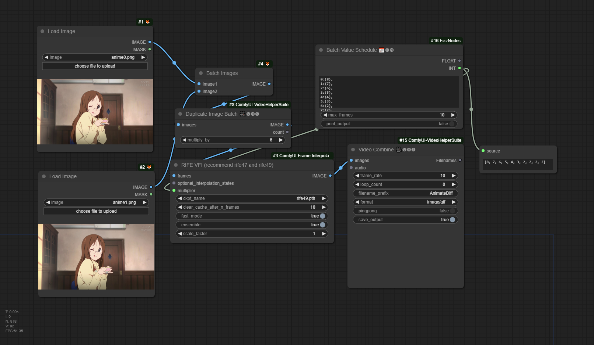
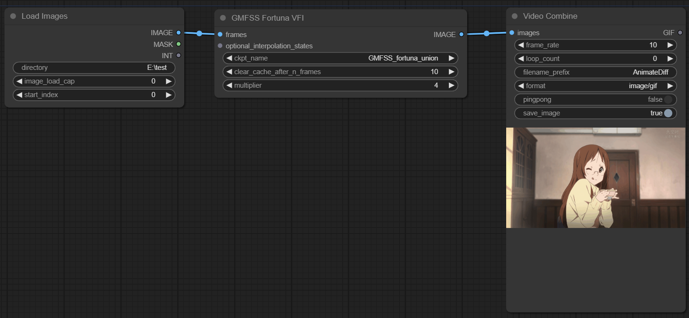
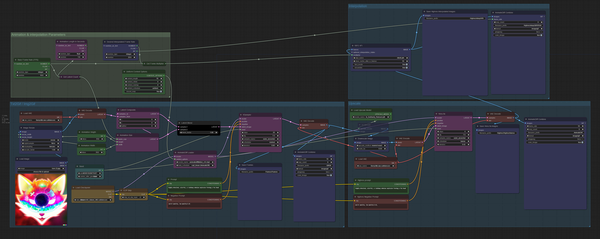

# ComfyUI Frame Interpolation (ComfyUI VFI) (WIP)

A custom node set for Video Frame Interpolation in ComfyUI.
**UPDATE** Memory management is improved. Now this extension takes less RAM and VRAM than before.

**UPDATE 2** VFI nodes now accept scheduling multipiler values




## Nodes
* KSampler Gradually Adding More Denoise (efficient)
* GMFSS Fortuna VFI
* IFRNet VFI
* IFUnet VFI
* M2M VFI
* RIFE VFI (4.0 - 4.9) (Note that option `fast_mode` won't do anything from v4.5+ as `contextnet` is removed)
* FILM VFI
* Sepconv VFI
* AMT VFI
* Make Interpolation State List
* STMFNet VFI (requires at least 4 frames, can only do 2x interpolation for now)
* FLAVR VFI (same conditions as STMFNet)

## Install
### ComfyUI Manager
Incompatibile issue with it is now fixed

Following this guide to install this extension

https://github.com/ltdrdata/ComfyUI-Manager#how-to-use
### Command-line
#### Windows
Run install.bat

For Window users, if you are having trouble with cupy, please run `install.bat` instead of `install-cupy.py` or `python install.py`.
#### Linux
Open your shell app and start venv if it is used for ComfyUI. Run:
```
python install.py
```
## Support for non-CUDA device (experimental)
If you don't have a NVidia card, you can try `taichi` ops backend powered by [Taichi Lang](https://www.taichi-lang.org/)

On Windows, you can install it by running `install.bat` or `pip install taichi` on Linux

Then change value of `ops_backend` from `cupy` to `taichi` in `config.yaml`

If `NotImplementedError` appears, a VFI node in the workflow isn't supported by taichi

## Usage
All VFI nodes can be accessed in **category** `ComfyUI-Frame-Interpolation/VFI` if the installation is successful and require a `IMAGE` containing frames (at least 2, or at least 4 for STMF-Net/FLAVR).

Regarding STMFNet and FLAVR, if you only have two or three frames, you should use: Load Images -> Other VFI node (FILM is recommended in this case) with `multiplier=4` -> STMFNet VFI/FLAVR VFI

`clear_cache_after_n_frames` is used to avoid out-of-memory. Decreasing it makes the chance lower but also increases processing time.

It is recommended to use LoadImages (LoadImagesFromDirectory) from [ComfyUI-Advanced-ControlNet](https://github.com/Kosinkadink/ComfyUI-Advanced-ControlNet/) and [ComfyUI-VideoHelperSuite](https://github.com/Kosinkadink/ComfyUI-VideoHelperSuite) along side with this extension.

## Example
### Simple workflow
Workflow metadata isn't embeded
Download these two images [anime0.png](./demo_frames/anime0.png) and [anime1.png](./demo_frames/anime0.png) and put them into a folder like `E:\test` in this image.


### Complex workflow
It's used in AnimationDiff (can load workflow metadata)


## Credit
Big thanks for styler00dollar for making [VSGAN-tensorrt-docker](https://github.com/styler00dollar/VSGAN-tensorrt-docker). About 99% the code of this repo comes from it.

Citation for each VFI node:
### GMFSS Fortuna
The All-In-One GMFSS: Dedicated for Anime Video Frame Interpolation

https://github.com/98mxr/GMFSS_Fortuna

### IFRNet
```bibtex
@InProceedings{Kong_2022_CVPR, 
  author = {Kong, Lingtong and Jiang, Boyuan and Luo, Donghao and Chu, Wenqing and Huang, Xiaoming and Tai, Ying and Wang, Chengjie and Yang, Jie}, 
  title = {IFRNet: Intermediate Feature Refine Network for Efficient Frame Interpolation}, 
  booktitle = {Proceedings of the IEEE/CVF Conference on Computer Vision and Pattern Recognition (CVPR)}, 
  year = {2022}
}
```

### IFUnet
RIFE with IFUNet, FusionNet and RefineNet

https://github.com/98mxr/IFUNet
### M2M
```bibtex
@InProceedings{hu2022m2m,
    title={Many-to-many Splatting for Efficient Video Frame Interpolation},
    author={Hu, Ping and Niklaus, Simon and Sclaroff, Stan and Saenko, Kate},
    journal={CVPR},
    year={2022}
    }
```

### RIFE
```bibtex
@inproceedings{huang2022rife,
  title={Real-Time Intermediate Flow Estimation for Video Frame Interpolation},
  author={Huang, Zhewei and Zhang, Tianyuan and Heng, Wen and Shi, Boxin and Zhou, Shuchang},
  booktitle={Proceedings of the European Conference on Computer Vision (ECCV)},
  year={2022}
}
```

### FILM
[Frame interpolation in PyTorch](https://github.com/dajes/frame-interpolation-pytorch)

```bibtex
@inproceedings{reda2022film,
 title = {FILM: Frame Interpolation for Large Motion},
 author = {Fitsum Reda and Janne Kontkanen and Eric Tabellion and Deqing Sun and Caroline Pantofaru and Brian Curless},
 booktitle = {European Conference on Computer Vision (ECCV)},
 year = {2022}
}
```

```bibtex
@misc{film-tf,
  title = {Tensorflow 2 Implementation of "FILM: Frame Interpolation for Large Motion"},
  author = {Fitsum Reda and Janne Kontkanen and Eric Tabellion and Deqing Sun and Caroline Pantofaru and Brian Curless},
  year = {2022},
  publisher = {GitHub},
  journal = {GitHub repository},
  howpublished = {\url{https://github.com/google-research/frame-interpolation}}
}
```

### Sepconv
```bibtex
[1]  @inproceedings{Niklaus_WACV_2021,
         author = {Simon Niklaus and Long Mai and Oliver Wang},
         title = {Revisiting Adaptive Convolutions for Video Frame Interpolation},
         booktitle = {IEEE Winter Conference on Applications of Computer Vision},
         year = {2021}
     }
```

```bibtex
[2]  @inproceedings{Niklaus_ICCV_2017,
         author = {Simon Niklaus and Long Mai and Feng Liu},
         title = {Video Frame Interpolation via Adaptive Separable Convolution},
         booktitle = {IEEE International Conference on Computer Vision},
         year = {2017}
     }
```

```bibtex
[3]  @inproceedings{Niklaus_CVPR_2017,
         author = {Simon Niklaus and Long Mai and Feng Liu},
         title = {Video Frame Interpolation via Adaptive Convolution},
         booktitle = {IEEE Conference on Computer Vision and Pattern Recognition},
         year = {2017}
     }
```

### AMT
   ```bibtex
   @inproceedings{licvpr23amt,
      title={AMT: All-Pairs Multi-Field Transforms for Efficient Frame Interpolation},
      author={Li, Zhen and Zhu, Zuo-Liang and Han, Ling-Hao and Hou, Qibin and Guo, Chun-Le and Cheng, Ming-Ming},
      booktitle={IEEE Conference on Computer Vision and Pattern Recognition (CVPR)},
      year={2023}
   }
   ```

### ST-MFNet
```bibtex
@InProceedings{Danier_2022_CVPR,
    author    = {Danier, Duolikun and Zhang, Fan and Bull, David},
    title     = {ST-MFNet: A Spatio-Temporal Multi-Flow Network for Frame Interpolation},
    booktitle = {Proceedings of the IEEE/CVF Conference on Computer Vision and Pattern Recognition (CVPR)},
    month     = {June},
    year      = {2022},
    pages     = {3521-3531}
}
```

### FLAVR
```bibtex
@article{kalluri2021flavr,
  title={FLAVR: Flow-Agnostic Video Representations for Fast Frame Interpolation},
  author={Kalluri, Tarun and Pathak, Deepak and Chandraker, Manmohan and Tran, Du},
  booktitle={arxiv},
  year={2021}
}
```
