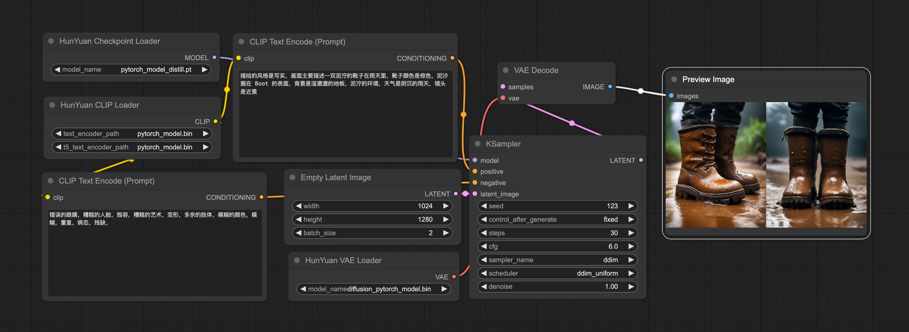

# comfyui-hydit

This repository houses a tailored node and workflow designed specifically for HunYuan DIT. The official tests conducted on DDPM, DDIM, and DPMMS have consistently yielded results that align with those obtained through the Diffusers library. However, it's important to note that we cannot assure the consistency of results from other ComfyUI native samplers with the Diffusers inference. We cordially invite users to explore our workflow and are open to receiving any inquiries or suggestions you may have.

## Overview


### Workflow text2image



[workflow_ksampler](workflow/workflow_ksampler.json) file for HunyuanDiT txt2image with ksampler backend.


## Usage

Make sure you run the following command inside [ComfyUI](https://github.com/comfyanonymous/ComfyUI) project with our [comfyui-hydit](.) and have correct conda environment.

```shell
# Download comfyui code
git clone https://github.com/comfyanonymous/ComfyUI.git

# Install torch, torchvision, torchaudio
pip install torch==2.0.1 torchvision==0.15.2 torchaudio==2.0.2 --index-url https://download.pytorch.org/whl/cu117 --default-timeout=100 future

# Install Comfyui essential python package
cd ComfyUI
pip install -r requirements.txt

# ComfyUI has been successfully installed!


# Move to the ComfyUI custom_nodes folder and copy comfyui-hydit folder from HunyuanDiT Repo.
cd custom_nodes
git clone https://github.com/Tencent/HunyuanDiT.git
cp -r HunyuanDiT/comfyui-hydit ./
rm -rf HunyuanDiT
cd comfyui-hydit

# If using windows system !!
cd custom_nodes
git clone https://github.com/Tencent/HunyuanDiT.git
xcopy /E /I HunyuanDiT\comfyui-hydit comfyui-hydit
rmdir /S /Q HunyuanDiT
cd comfyui-hydit

# Install some essential python Package.
pip install -r requirements.txt

# Our tool has been successfully installed!

# Go to ComfyUI main folder
cd ../..
# Run the ComfyUI Lauch command
python main.py --listen --port 80

# Running ComfyUI successfully!
```


## Download weights for ksampler mode
Download the [clip encoder](https://huggingface.co/Tencent-Hunyuan/HunyuanDiT-v1.2/blob/main/t2i/clip_text_encoder/pytorch_model.bin) and place it in `ComfyUI/models/clip`  
Download the [mt5](https://huggingface.co/Tencent-Hunyuan/HunyuanDiT-v1.2/blob/main/t2i/mt5/pytorch_model.bin) and place it in `ComfyUI/models/t5`  
Download the [base model](https://huggingface.co/Tencent-Hunyuan/HunyuanDiT-v1.2/blob/main/t2i/model/pytorch_model_ema.pt) and place it in `ComfyUI/models/checkpoints`  
Download the [sdxl vae](https://huggingface.co/Tencent-Hunyuan/HunyuanDiT-v1.2/blob/main/t2i/sdxl-vae-fp16-fix/diffusion_pytorch_model.bin) and place it in `ComfyUI/models/vae`   


## Custom Node
Below I'm trying to document all the nodes, thanks for some good work[[1]](#1)[[2]](#2).

#### HunYuan Checkpoint Loader
- Loads the base model for HunYuanDiT in ksampler backend.  
- **model_name** is the weight list of comfyui checkpoint folder.


#### HunYuan CLIP Loader
- Loads the clip and mt5 model for HunYuanDiT in ksampler backend.  
- **text_encoder_path** is the weight list of comfyui clip model folder.
- **t5_text_encoder_path** is the weight list of comfyui t5 model folder.

#### HunYuan VAE Loader
- Loads the vae model for HunYuanDiT in ksampler backend.  
- **model_name** is the weight list of comfyui vae model folder.


## Reference 
<a id="1">[1]</a> 
https://github.com/Limitex/ComfyUI-Diffusers  
<a id="2">[2]</a>
https://github.com/Tencent/HunyuanDiT/pull/59
