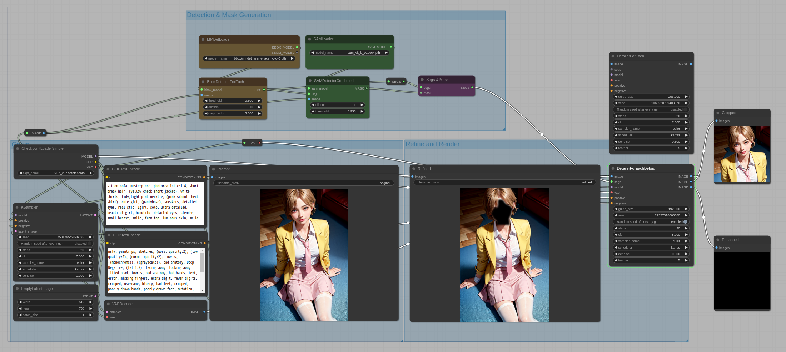
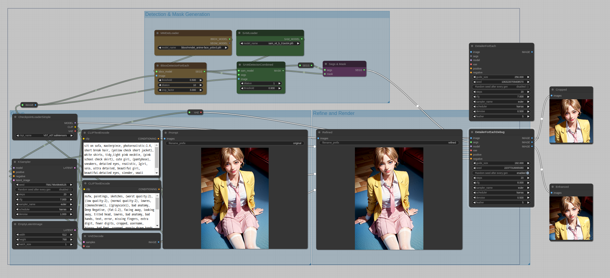

## When a permission error occurs during the installation process (on Windows)

* There are cases where the package you are trying to install is already being used by another custom node that has been loaded.
    * This issue occurs only on Windows.
* Please close ComfyUI and execute install.py directly using Python in the custom_nodes/ComfyUI-Impact-Pack directory.
    * In case **portable** version:
        1. goto **ComfyUI_windows_portable** directory in **cmd**
        2. execute ```.\python_embeded\python -s -m custom_nodes\ComfyUI-Impact-Pack\install.py```
    * In case **venv**:
        1. activate venv
        2. execute ```python -s -m custom_nodes\ComfyUI-Impact-Pack\install.py```
    * Others:
        1. Please modify the path of 'python' according to your Python environment.
        2. execute ```(YOUR PYTHON) -s -m custom_nodes\ComfyUI-Impact-Pack\install.py```


## If the nodes of the Impact Pack hang during execution

* During the execution of processes related to dilation, issues like this may arise depending on the compatibility of the computer environment.
* Please set `disable_gpu_opencv = True` in the `ComfyUI-Impact-Pack/impact-pack.ini` file. Occasionally, issues may arise when the OpenCV GPU mode is activated depending on the environment.

    e.g.
```
[default]
dependency_version = 17
mmdet_skip = True
sam_editor_cpu = False
sam_editor_model = sam_vit_b_01ec64.pth
custom_wildcards = /home/me/github/ComfyUI/custom_nodes/ComfyUI-Impact-Pack/custom_wildcards
disable_gpu_opencv = True
```

## An issue has occurred with importing Ultralytics.
```
    AttributeError: 'Logger' object has no attribute 'reconfigure'

    or 

    AttributeError: 'Logger' object has no attribute 'encoding'
```
* Update `ComfyUI-Manager` to V1.1.2 or above


## An issue has occurred about 'cv2'

```
    AttributeError: module 'cv2' has no attribute 'setNumThreads'
```

* Update 'opencv-python' and 'opencv-python-headless' to latest version
    * Once you update to the latest version, you can also downgrade back to 4.6.0.66 if needed.
    *  For the portable version, navigate to the portable installation directory in the command prompt, and enter the following command: 

    ```
    .\python_embeded\python.exe -m pip install -U opencv-python opencv-python-headless
    ```

    * When using the WAS node suite or reactor nodes, using the latest version may not work as expected. You can downgrade using the following command:

    ```
    .\python_embeded\python.exe -m pip install -U opencv-python==4.6.0.66 opencv-python-headless==4.6.0.66
    ```


## Destortion on Detailer

* Please also note that this issue may be caused by a bug in xformers 0.0.18. If you encounter this problem, please try adjusting the guide_size parameter.




* guide_size changed from 256 -> 192
