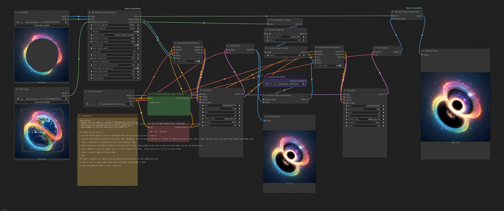

ComfyUI-Inpaint-CropAndStitch

Copyright (c) 2024-2025, Luis Quesada Torres - https://github.com/lquesada | www.luisquesada.com

Check ComfyUI here: https://github.com/comfyanonymous/ComfyUI

# Overview

The '✂️ Inpaint Crop' and '✂️ Inpaint Stitch' nodes enable inpainting only on masked area very easily

"✂️  Inpaint Crop" crops the image around the masked area (optionally with a context area that marks all parts relevant to the context), taking care of pre-resizing the image if desired, extending it for outpainting, filling mask holes, growing or blurring the mask, cutting around a larger context area, and resizing the cropped area to a target resolution.

The cropped image can be used in any standard workflow for sampling. It can even be rescaled up with any model (please keep the aspect ratio) and hiRes-fixed and it will be retrofit in the original image.

Then, the "✂️  Inpaint Stitch" node stitches the inpainted image back into the original image without altering unmasked areas.

The main advantages of inpainting only in a masked area with these nodes are:
  - It is much faster than sampling the whole image.
  - It enables setting the right amount of context from the image for the prompt to be more accurately represented in the generated picture.
  - It enables upscaling before sampling in order to generate more detail, then stitching back in the original picture.
  - It enables downscaling before sampling if the area is too large, in order to avoid artifacts such as double heads or double bodies.
  - It enables forcing a specific resolution (e.g. 1024x1024 for SDXL models).
  - It does not modify the unmasked part of the image, not even passing it through VAE encode and decode.
  - It takes care of blending automatically.

# Video Tutorial

[](https://www.youtube.com/watch?v=mI0UWm7BNtQ)

[(click to open in YouTube)](https://www.youtube.com/watch?v=mI0UWm7BNtQ)

Note: this video tutorial is for the previous version of the nodes, but still it shows how to use them. The parameters are mostly the same.

## Parameters
- `downscale_algorithm` and `upscale_algorithm`: Which algorithms to use when resizing an image up or down.
- `preresize`: Shows options to resize the input image before any cropping: to ensure minimum resolution, to ensure maximum resolution, to ensure both minimum and maximum resolution. This makes it very convenient to ensure that any input images have a certain resolution.
- `mask_fill_holes`: Whether to fully fill any holes (small or large) in the mask, that is, mark fully enclosed areas as part of the mask.
- `mask_expand_pixels`: Grows the mask by the specified amount of pixels.
- `mask_invert`: Whether to fully invert the mask, that is, only keep what was masked, instead of removing what was marked.
- `mask_blend_pixels`: Grows the stitch mask and blurs it by the specified amount of pixels, so that the stitch is slowly blended and there are no seams.
- `mask_hipass_filter`: Ignores mask values lower than the one specified here. This is to avoid sections in the mask that are almost 0 (black) to count as masked area. Sometimes that leads to confusion, as the user believes the area is not really masked and the node is considering it as masked.
- `extend_for_outpainting`: Shows options to extend the mask in any/all directions (up/down/left/right) by a certain factor. >1 extends the image, e.g. 2 extends the image in a direction by the same amount of space the image takes. <1 crops the image, e.g. 0.75 removes 25% of the image on that direction.
- `context_from_mask_extend_factor`: Extends the context area by a factor of the size of the mask. The higher this value is, the more area will be cropped around the mask for the model to have more context. 1 means do not grow. 2 means grow the same size of the mask across every direction.
- `output_resize_to_target_size`: Forces that the cropped image has a specific resolution. This may involve resizing and extending out of the original image, but the stitch node reverts those changes to integrate the image seamlessly.
- `output_padding`: Ensures that the cropped image width and height are a multiple of this padding value. Models require images to be padded to a certain value (8, 16, 32) to function properly.

## Example (Stable Diffusion)
This example inpaints by sampling on a small section of the larger image, upscaling to fit 512x512, then stitching and blending back in the original image.

Download the following example workflow from [here](example_workflows/inpaint_sd15.json) or drag and drop the screenshot into ComfyUI.


## Example (Flux)
This example uses Flux. Requires the GGUF nodes.

Models used:

- `Flux Dev Q5 GGUF` from [here](https://civitai.com/models/711483/flux-dev-q5km-gguf-quantization-a-nice-balance-of-speed-and-quality-in-under-9-gigabytes?modelVersionId=795785). Put it in models/unet/.
- `Flux 1. dev controlnet inpainting beta` from [here](https://huggingface.co/alimama-creative/FLUX.1-dev-Controlnet-Inpainting-Beta). Put it in models/controlnet/.
- `t5 GGUF Q3_K_L` from [here](https://huggingface.co/city96/t5-v1_1-xxl-encoder-gguf/tree/main). Put it in models/clip/.
- `clip_l` from [here](https://huggingface.co/comfyanonymous/flux_text_encoders/blob/main/clip_l.safetensors). Put it in models/clip/.
- `ae VAE` from [here](https://huggingface.co/black-forest-labs/FLUX.1-schnell/blob/main/ae.safetensors). Put it in models/vae/.

Download the following example workflow from [here](example_workflows/inpaint_flux.json) or drag and drop the screenshot into ComfyUI.


## Example (Large resolution)
This example uses SD 1.5 to sample on a section of the larger image. Then it upscales the sampled image by 4x using an external model and applies a hiRes fix. Then it blends it back into the original image.

Models used:

- `4x Ultrasharp` from [here](https://huggingface.co/lokCX/4x-Ultrasharp/blob/main/4x-UltraSharp.pth).

Download the following example workflow from [here](example_workflows/inpaint_hires.json) or drag and drop the screenshot into ComfyUI.



# Installation Instructions

Install via ComfyUI-Manager or go to the custom_nodes/ directory and run ```$ git clone https://github.com/lquesada/ComfyUI-Inpaint-CropAndStitch.git```

## Best Practices
Use an inpainting model e.g. lazymixRealAmateur_v40Inpainting.

Use "InpaintModelConditioning" instead of "VAE Encode (for Inpainting)" to be able to set denoise values lower than 1.

Enable "resize to target size" and set it to a preferred resolution for your model, e.g. 512x512 for SD 1.5, 1024x1024 for SDXL or Flux.

# Changelog
## 2025-04-06
- Published the improved version of the Crop and Stitch nodes.
- Improved: Stitching is now way more precise. In the previous version, stitching an image back into place could shift it by one pixel. That will not happen anymore.
- Improved: Images are now cropped before being resized. In the past, they were resized before being cropped. This triggered crashes when the input image was large and the masked area was small.
- Improved: Images are now not extended more than necessary. In the past, they were extended x3, which was memory inefficient.
- Improved: The cropped area will stay inside of the image if possible. In the past, the cropped area was centered around the mask and would go out of the image even if not needed.
- Improved: Fill mask holes will now supports grayscale masks. In the past, it turned the mask into binary (yes/no only).
- Improved: Added a hipass filter for mask that ignores values below a threshold. In the past, sometimes mask with a 0.01 value (basically black / no mask) would be considered mask, which was very confusing to users.
- Improved: In the (now rare) case that extending out of the image is needed, instead of mirroring the original image, the edges are extended. Mirroring caused confusion among users in the past.
- Improved: Integrated preresize and extend for outpainting in the crop node. In the past, they were external and could interact weirdly with features, e.g. expanding for outpainting on the four directions and having "fill_mask_holes" would cause the mask to be fully set across the whole image.
- Improved: Now works when passing one mask for several images or one image for several masks.
- UX: Streamlined many options, e.g. merged the blur and blend features in a single parameter, removed the ranged size option, removed context_expand_pixels as factor is more intuitive, etc.
- Clean up: Marked the old nodes ("Crop", "Stitch", "Extend Image for Outpainting", and "Resize Image Before Inpainting") as obsolete. They will continue working in old workflows but will have a note in the title asking to update. In particular, there's no replacement for "Extend Image for Outpainting" and "Resize Image Before Inpainting" because those features are now integrated in the Crop node.
## 2024-10-28
- Added a new example workflow for inpainting with flux.
## 2024-06-10
- Added a new node: "Resize Image Before Inpainting", which allows increasing the resolution of the input image by a factor or to a minimum width or height to obtain higher resolution inpaintings.
## 2024-06-08
- Added a new node: "Extend Image for Outpainting", which allows leveraging the power of Inpaint Crop and Stitch (rescaling, blur, blend, restitching) for outpainting.
## 2024-06-07
- Added a blending radius for seamless inpainting.
- Added a blur mask setting that grows and blurs the mask, providing better support.
- Updated default to ranged size.
## 2024-06-01
- Force_size is now specified as separate force_width and force_height, to match any desired sampling resolution.
- Added a new mode: ranged size, similar to free size but also takes min_width, min_height, max_width, and max_height, in order to avoid over scaling or under scaling beyond desirable limits.
## 2024-05-15
- Depending on the selected mode ("free size" or "forced size") some fields are hidden.
## 2024-05-14
- Added batch support.
- Enabled selecting rescaling algorithm and made bicubic the default for crop, which significantly speeds up the process.
## 2024-05-13
- Switched from adjust_to_preferred_sizes to modes: free size and forced size. Forced scales the section rather than growing the context area to fit preferred_sizes, to be used to e.g. force 1024x1024 for inpainting.
- Enabled internal_upscale_factor to be lower than 1 (that is, downscale), which can be used to avoid the double head issue in some models.
- Added padding on the croppedp image to avoid artifacts when the cropped image is not multiple of (default) 32
## 2024-05-12
- Added internal_upscale_factor to upscale the image before sampling and then downsizes to stitch it back.
## 2024-05-11
- Initial commit.

# Acknowledgements

This repository uses some code from comfy_extras (https://github.com/comfyanonymous/ComfyUI), KJNodes (https://github.com/kijai/ComfyUI-KJNodes), and Efficiency Nodes (https://github.com/LucianoCirino/efficiency-nodes-comfyui), all of them licensed under GNU GENERAL PUBLIC LICENSE Version 3. 

# License
GNU GENERAL PUBLIC LICENSE Version 3, see [LICENSE](LICENSE)
