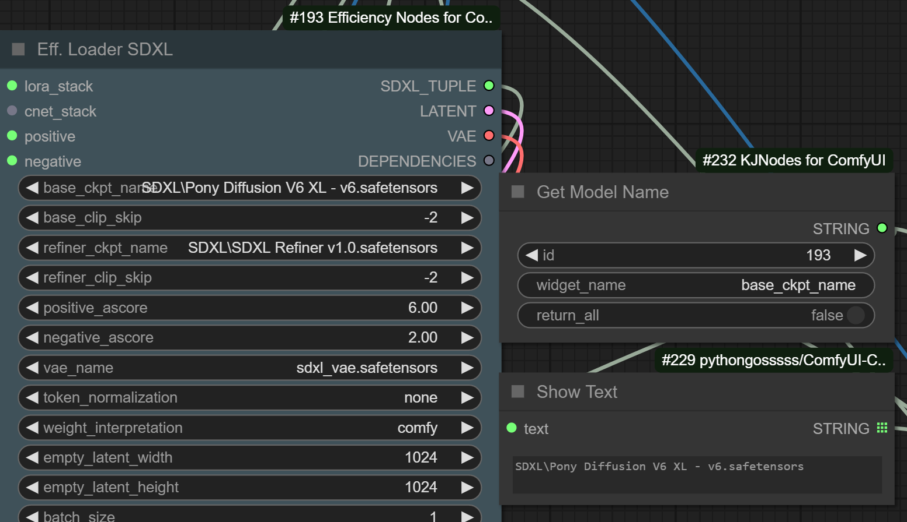
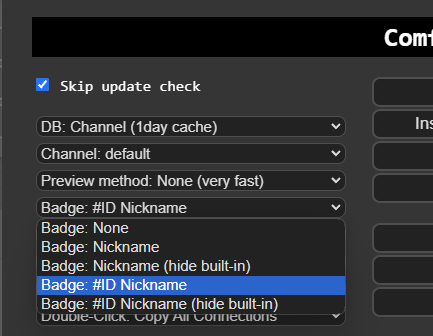
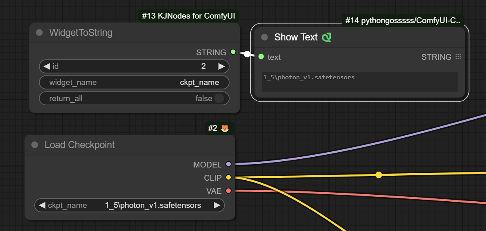

# KJNodes for ComfyUI

Various quality of life and masking related -nodes and scripts made by combining functionality of existing nodes for ComfyUI.

I know I'm bad at documentation, especially this project that has grown from random practice nodes to... too many lines in one file.
I have however started to add descriptions to the nodes themselves, there's a small ? you can click for info what the node does.
This is still work in progress, like everything else.

# Installation
1. Clone this repo into `custom_nodes` folder.
2. Install dependencies: `pip install -r requirements.txt`
   or if you use the portable install, run this in ComfyUI_windows_portable -folder:

  `python_embeded\python.exe -m pip install -r ComfyUI\custom_nodes\ComfyUI-KJNodes\requirements.txt`
   

## Javascript

### browserstatus.js
Sets the favicon to green circle when not processing anything, sets it to red when processing and shows progress percentage and the length of your queue. 
Default off, needs to be enabled from options, overrides Custom-Scripts favicon when enabled.

## Nodes:

### Set/Get

Javascript nodes to set and get constants to reduce unnecessary lines. Takes in and returns anything, purely visual nodes.
On the right click menu of these nodes there's now an options to visualize the paths, as well as option to jump to the corresponding node on the other end.

**Known limitations**:
  - Will not work with any node that dynamically sets it's outpute, such as reroute or other Set/Get node
  - Will not work when directly connected to a bypassed node
  - Other possible conflicts with javascript based nodes.

### ColorToMask

RBG color value to mask, works with batches and AnimateDiff.

### ConditioningMultiCombine

Combine any number of conditions, saves space.

### ConditioningSetMaskAndCombine

Mask and combine two sets of conditions, saves space.

### GrowMaskWithBlur

Grows or shrinks (with negative values) mask, option to invert input, returns mask and inverted mask. Additionally Blurs the mask, this is a slow operation especially with big batches.

### RoundMask

### WidgetToString
Outputs the value of a widget on any node as a string

Enable node id display from Manager menu, to get the ID of the node you want to read a widget from:

Use the node id of the target node, and add the name of the widget to read from

Recreating or reloading the target node will change its id, and the WidgetToString node will no longer be able to find it until you update the node id value with the new id.
