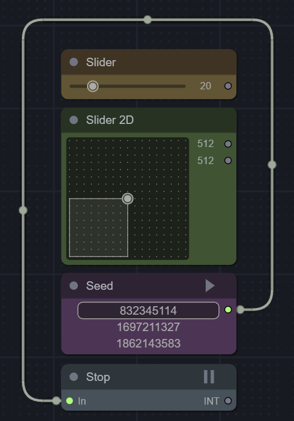

# ComfyUI-mxToolkit

A set of useful nodes for convenient use of ComfyUI, including: Seed randomization before the generation process starts, with saving of the last used values and the ability to automatically interrupt the current generation; A function to pause the generation process; Slider nodes for convenient control of input parameters; An alternative version of the standard Reroute node.

----------
Check the [Wiki](https://github.com/Smirnov75/comfyui-mxtoolkit/wiki) for an example of usage.

Nodes are available in the `utils` section

##### Seed (v0.9.0)

Allows randomizing the seed parameter before generation starts, preserving it for subsequent copying or reapplication. It retains memory of the 2 previous values. The node has the option to enable or disable automatic generation startup, as well as to interrupt the current generation when starting the next. If you press the randomization button while holding the shift key, the seed value will increase by one.

##### Stop (v0.9.2)

Interrupts generation, passing input data to output. Generation can be resumed from the interruption point by pressing the Continue button in the top right corner of the node or the Queue button.

##### Slider (v0.9.2)

Slider with a single output. If the `decimals` parameter value is zero, the output is an INT variable; otherwise, the output is a FLOAT variable. The `snap` parameter toggles snapping according to the set `step` parameter. Pressing the shift key while adjusting inverts the snap parameter value. Pressing the Ctrl key allows setting a value outside the defined range. To change the value manually, double-click on it.

##### Slider2D (v0.9.2)

Functions similarly to Slider but has 2 outputs. It also has additional parameters: `dots` - displays dots according to the snap parameter, `frame` - displays a frame, `framealert` - changes the frame color if the product of the output parameters exceeds the specified value (if 0 is specified in the parameter, the function is disabled). To swap X and Y, press the shift key and click on the area displaying these parameters (works only if other parameters do not prevent the swap). To change the value manually, double-click on it.

##### Reroute (v0.9.2)

Alternative version of the Reroute node. Parameters indicate the input and output directions. Allowable values: LEFT, RIGHT, DOWN, UP, or TOP. Case does not matter. Shortened values can also be input: L, R, D, U, or T. You can also use the context menu to select a direction. The direction can also be changed by selecting a node and configuring it with two consecutive arrow key presses.

----------

##### Seed

Позволяет рандомизировать seed перед запуском генерации, что сохраняет его для последующего копирования или повторного применения. Имеется память на 2 предыдущих значения. Нода имеет параметры включения и отключения автоматического запуска генерации, а также прерывания текущей генерации при запуске следующей. Если использовать ноду с зажатой клавишей shift, то значение будет увеличиваться на еденицу.

##### Stop

Прерывает генерацию, но при этом передаёт входные данные на выход. При нажатии на кнопку Continue в правом верхнем углу ноды, или при повторном запуске кнопкой Queue, генерация продолжается с места прерывания.

##### Slider

Слайдер с одним выходом. Если значение параметра `decimals` равно нулю, то на выходе переменная INT, иначе на выходе переменная FLOAT. Параметр `snap` включает и отключает привязку согласно установленному параметром `step` шагу. Нажатие клавиши shift при регулировке инвертирует значение параметра `snap`. Нажатие клавиши Ctrl позволяет установить значение за пределами установленного диапазона. По двойному клику на значении можно установить его вручную.

##### Slider2D

Работает аналогично Slider, но имеет 2 выхода. Также имеет дополнительные параметры: `dots` - отображение точек согласно параметру `snap`, `frame` - отображение рамки, `framealert` - изменяет цвет рамки, если произведение параметров выхода превышает заданное значение (если в параметре указан 0, то функция отключена). Чтобы поменять местами X и Y необходимо нажать shift и кликнуть на зону отображения этих параметров (работает только, если прочие параметры не препятствуют замене). По двойному клику на значении можно установить его вручную.

##### mxReroute

Альтернативная версия стандартной ноды Reroute. В качестве параметров указывается направление входа и выхода. Допустимые значения: LEFT, RIGHT, DOWN, UP или TOP. Размер символов роли не играет. Можно вводить укороченные значения: L, R, D, U или T. Так же для выбора направления можно использовать контекстное меню, или, выбрав ноду, задать её конфигурацию двумя последовательными нажатиями на клавиши стрелок.

----------

Max Smirnov . 2024
