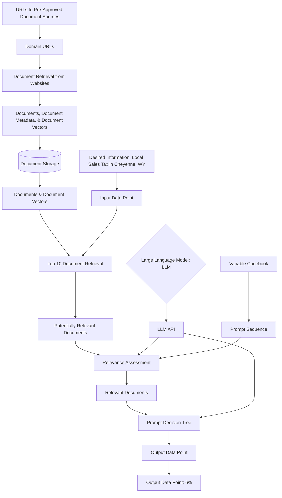
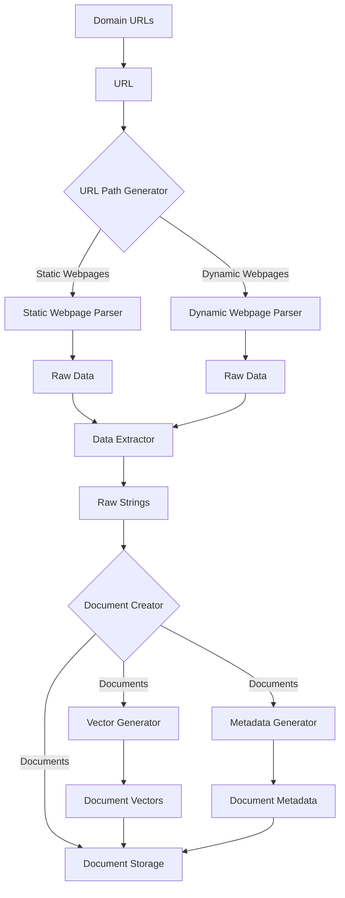
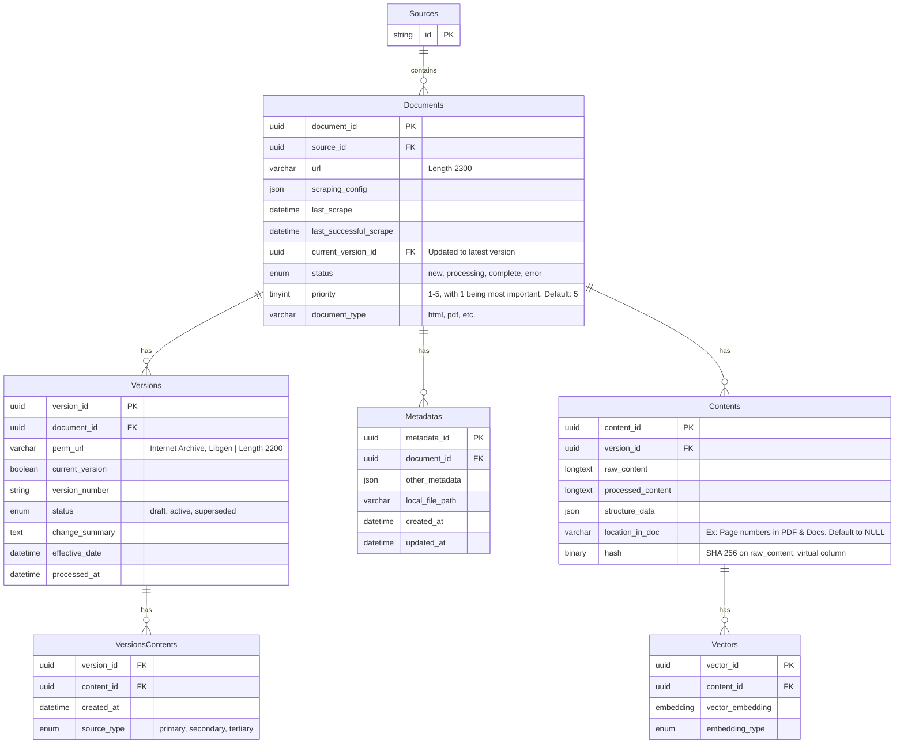
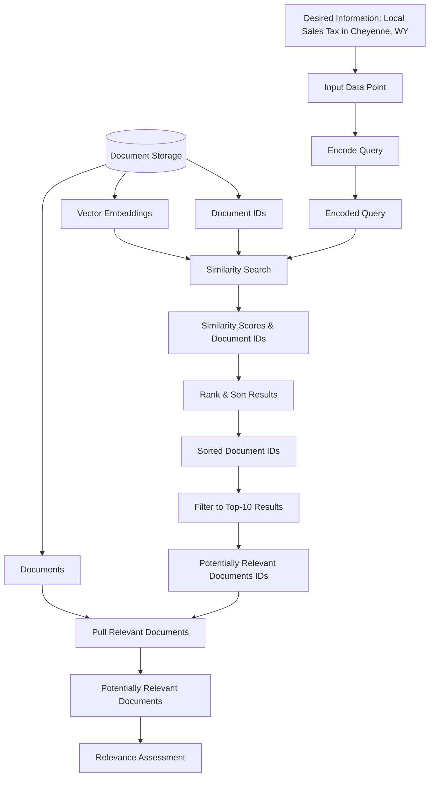
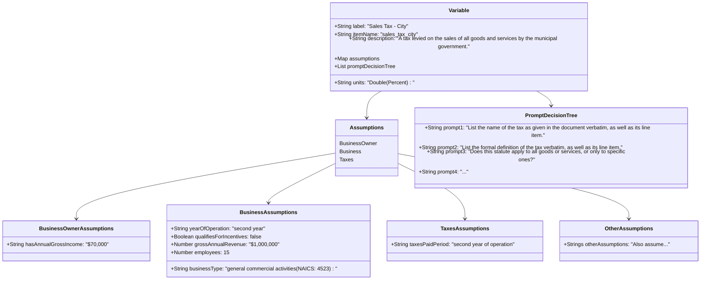
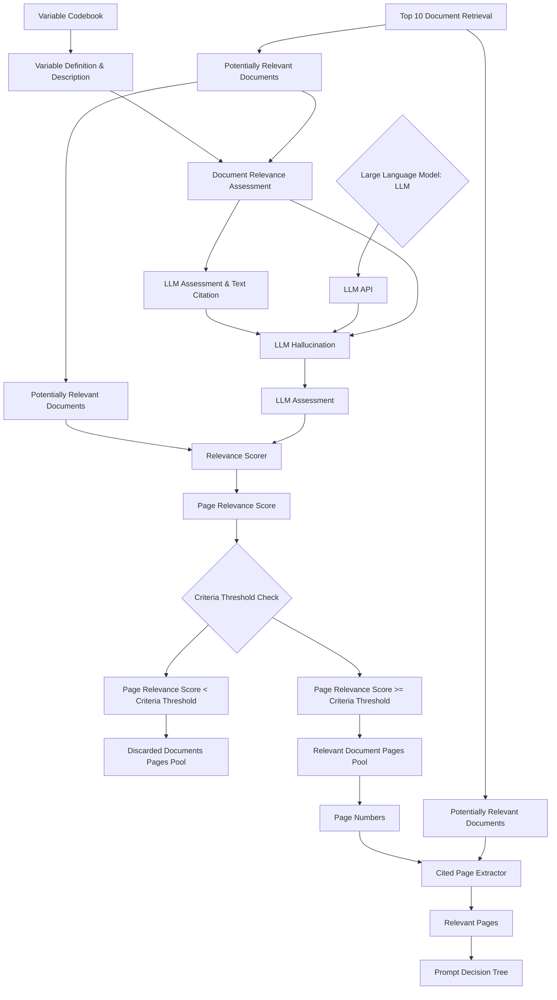
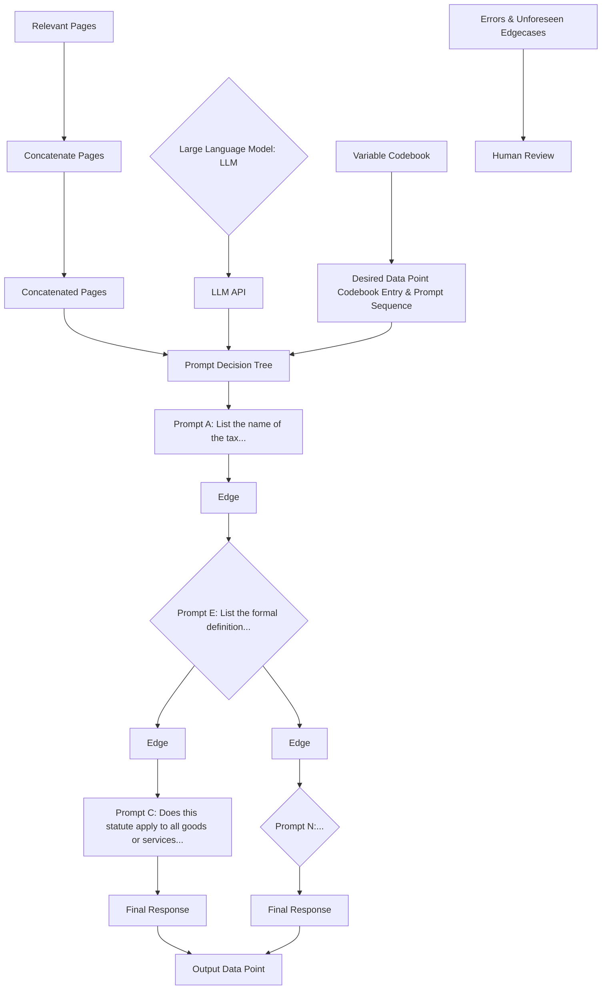

# High Level Architecture

```mermaid
flowchart TD
    A[URLs to Pre-Approved Document Sources] --> B[Domain URLs]
    B --> C[Document Retrieval from Websites]
    C --> D[Documents, Document Metadata, & Document Vectors]
    D --> E[(Document Storage)]
    E --> F[Documents & Document Vectors]
    G[Desired Information: Local Sales Tax in Cheyenne, WY] --> H[Input Data Point]
    F --> I[Top 10 Document Retrieval]
    H --> I
    I --> J[Potentially Relevant Documents]
    J --> K[Relevance Assessment]
    L{Large Language Model: LLM} --> M[LLM API]
    M --> K
    N[Variable Codebook] --> O[Prompt Sequence]
    O --> K
    K --> P[Relevant Documents]
    P --> Q[Prompt Decision Tree]
    M --> Q
    Q --> R[Output Data Point]
    R --> S[Output Data Point: 6%]
```

# Document Retrieval from Websites

```mermaid
flowchart TD
    A[Domain URLs] --> B[URL]
    B --> C{URL Path Generator}
    C -->|Static Webpages| D[Static Webpage Parser]
    C -->|Dynamic Webpages| E[Dynamic Webpage Parser]
    D --> F[Raw Data]
    E --> G[Raw Data]
    F --> H[Data Extractor]
    G --> H
    H --> I[Raw Strings]
    I --> J{Document Creator}
    J -->|Documents| K[Vector Generator]
    J -->|Documents| L[Metadata Generator]
    J -->|Documents| N[Document Storage]
    K --> M[Document Vectors]
    L --> O[Document Metadata]
    M --> N
    O --> N
```

# Document Storage

```mermaid
erDiagram
    Sources ||--o{ Documents : contains
    Documents ||--o{ Versions : has
    Documents ||--o{ Metadatas : has
    Documents ||--o{ Contents : has
    Versions ||--o{ VersionsContents : has
    Contents ||--o{ Vectors : has
    
    Sources {
        string id PK
    }
    
    Documents {
        uuid document_id PK
        uuid source_id FK
        varchar url "Length 2300"
        json scraping_config
        datetime last_scrape
        datetime last_successful_scrape
        uuid current_version_id FK "Updated to latest version"
        enum status "new, processing, complete, error"
        tinyint priority "1-5, with 1 being most important. Default: 5"
        varchar document_type "html, pdf, etc."
    }
    
    Versions {
        uuid version_id PK
        uuid document_id FK
        varchar perm_url "Internet Archive, Libgen | Length 2200"
        boolean current_version
        string version_number
        enum status "draft, active, superseded"
        text change_summary
        datetime effective_date
        datetime processed_at
    }
    
    Metadatas {
        uuid metadata_id PK
        uuid document_id FK
        json other_metadata
        varchar local_file_path
        datetime created_at
        datetime updated_at
    }
    
    Contents {
        uuid content_id PK
        uuid version_id FK
        longtext raw_content
        longtext processed_content
        json structure_data
        varchar location_in_doc "Ex: Page numbers in PDF & Docs. Default to NULL"
        binary hash "SHA 256 on raw_content, virtual column"
    }
    
    VersionsContents {
        uuid version_id FK
        uuid content_id FK
        datetime created_at
        enum source_type "primary, secondary, tertiary"
    }
    
    Vectors {
        uuid vector_id PK
        uuid content_id FK
        embedding vector_embedding
        enum embedding_type
    }
```

# Top-10 Document Retrieval

```mermaid
flowchart TD
    A[Desired Information: Local Sales Tax in Cheyenne, WY] --> B[Input Data Point]
    B --> C[Encode Query]
    D[(Document Storage)] --> E[Vector Embeddings]
    D --> F[Document IDs]
    C --> G[Encoded Query]
    E --> H[Similarity Search]
    F --> H
    G --> H
    H --> I[Similarity Scores & Document IDs]
    I --> J[Rank & Sort Results]
    J --> K[Sorted Document IDs]
    K --> L[Filter to Top-10 Results]
    L --> M[Potentially Relevant Documents IDs]
    D --> N[Documents]
    N --> O[Pull Relevant Documents]
    M --> O
    O --> P[Potentially Relevant Documents]
    P --> Q[Relevance Assessment]
```

# Variable Codebook

```mermaid
classDiagram
    class Variable {
        +String label: "Sales Tax - City"
        +String itemName: "sales_tax_city"
        +String description: "A tax levied on the sales of all goods and services by the municipal government."
        +String units: "Double (Percent)"
        +Map assumptions
        +List promptDecisionTree
    }
    
    class Assumptions {
        BusinessOwner
        Business
        Taxes
    }
    
    class BusinessOwnerAssumptions {
        +String hasAnnualGrossIncome: "$70,000"
    }
    
    class BusinessAssumptions {
        +String yearOfOperation: "second year"
        +Boolean qualifiesForIncentives: false
        +Number grossAnnualRevenue: "$1,000,000"
        +Number employees: 15
        +String businessType: "general commercial activities (NAICS: 4523)"
    }
    
    class TaxesAssumptions {
        +String taxesPaidPeriod: "second year of operation"
    }

    class OtherAssumptions {
        +Strings otherAssumptions: "Also assume..."
    }
    
    class PromptDecisionTree {
        +String prompt1: "List the name of the tax as given in the document verbatim, as well as its line item."
        +String prompt2: "List the formal definition of the tax verbatim, as well as its line item."
        +String prompt3: "Does this statute apply to all goods or services, or only to specific ones?"
        +String prompt4: "..."
    }
    
    Variable --> Assumptions
    Variable --> PromptDecisionTree
    Assumptions --> BusinessOwnerAssumptions
    Assumptions --> BusinessAssumptions
    Assumptions --> TaxesAssumptions
    Assumptions --> OtherAssumptions
```

# Relevance Assessment

```mermaid
flowchart TD
    A[Top 10 Document Retrieval] --> B[Potentially Relevant Documents]
    C[Variable Codebook] --> D[Variable Definition & Description]
    E{Large Language Model: LLM} --> F[LLM API]
    B --> G[Document Relevance Assessment]
    D --> G
    G --> H[LLM Hallucination]
    F --> H
    G --> I[LLM Assessment & Text Citation]
    I --> H
    H --> J[LLM Assessment]
    J --> K[Relevance Scorer]
    K --> L[Page Relevance Score]
    L --> M{Criteria Threshold Check}
    B --> N[Potentially Relevant Documents]
    N --> K
    M --> O[Page Relevance Score < Criteria Threshold] & P[Page Relevance Score >= Criteria Threshold]
    O --> Q[Discarded Documents Pages Pool]
    P --> R[Relevant Document Pages Pool]
    R --> S[Page Numbers]
    A --> T[Potentially Relevant Documents]
    T --> U[Cited Page Extractor]
    S --> U
    U --> V[Relevant Pages]
    V --> W[Prompt Decision Tree]
```

# Prompt Decision Tree

```mermaid
flowchart TD
    A[Relevant Pages] --> B[Concatenate Pages]
    B --> C[Concatenated Pages]
    D{Large Language Model: LLM} --> E[LLM API]
    F[Variable Codebook] --> G[Desired Data Point Codebook Entry & Prompt Sequence]
    C --> H[Prompt Decision Tree]
    E --> H
    G --> H
    H --> I[Prompt A: List the name of the tax...]
    I --> J[Edge]
    J --> K{Prompt E: List the formal definition...}
    K --> L[Edge] & M[Edge]
    L --> N[Prompt C: Does this statute apply to all goods or services...]
    M --> O{Prompt N:...}
    N --> P[Final Response]
    O --> Q[Final Response]
    P --> R[Output Data Point]
    Q --> R
    S[Errors & Unforeseen Edgecases] --> T[Human Review]
```
