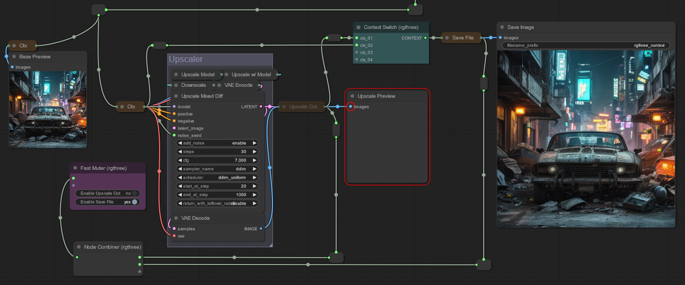
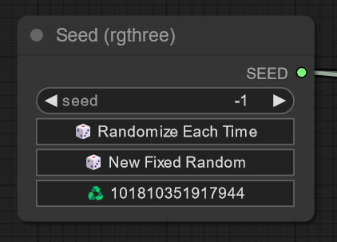
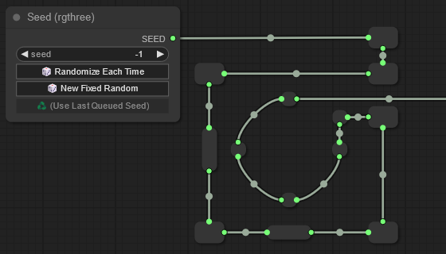

<h1 align="center">
    rgthree-comfy
    <br>
    <sub><sup><i>Making ComfyUI more comfortable!</i></sup></sub>
    <br>
</h1>
<p align="center">
    <a href="#️-the-nodes">The Nodes</a> &nbsp; | &nbsp; <a href="#-improvements--features">Improvements & Features</a>  &nbsp; | &nbsp; <a href="#-link-fixer">Link Fixer</a>
</p>
<hr>

A collection of nodes and improvements created while messing around with ComfyUI. I made them for myself to make my workflow cleaner, easier, and faster. You're welcome to try them out. But remember, I made them for my own use cases :)



# Get Started

## Install

1. Install the great [ComfyUi](https://github.com/comfyanonymous/ComfyUI).
2. Clone this repo into `custom_modules`:
    ```
    cd ComfyUI/custom_nodes
    git clone https://github.com/rgthree/rgthree-comfy.git
    ```
3. Start up ComfyUI.

## Settings

You can configure certain aspect of rgthree-comfy. For instance, perhaps a future ComfyUI change breaks rgthree-comfy, or you already have another extension that does something similar and you want to turn it off for rgthree-comfy.

You can get to rgthree-settings by right-clicking on the empty part of the graph, and selecting `rgthree-comfy > Settings (rgthree-comfy)` or by clicking the `rgthree-comfy settings` in the ComfyUI settings dialog.

_(Note, settings are stored in an `rgthree_config.json` in the `rgthree-comfy` directory. There are other advanced settings that can only be configured there; You can copy default settings from `rgthree_config.json.default` before `rgthree_config.json` before modifying)_.

<br>

# ✴️ The Nodes

Note, you can right-click on a bunch of the rgthree-comfy nodes and select `🛟 Node Help` menu item for in-app help when available.

## Seed
> An intuitive seed control node for ComfyUI that works very much like Automatic1111's seed control.
> <details>
>    <summary>ℹ️ <i>See More Information</i></summary>
>
>    - Set the seed value to "-1" to use a random seed every time
>    - Set any other number in there to use as a static/fixed seed
>    - Quick actions to randomize, or (re-)use the last queued seed.
>    - Images metadata will store the seed value _(so dragging an image in, will have the seed field already fixed to its seed)_.
>    - _Secret Features_: You can manually set the seed value to "-2" or "-3" to increment or decrement the last seed value. If there was not last seed value, it will randomly use on first.
>
>    
>    </details>


## Reroute
> Keep your workflow neat with this much improved Reroute node with, like, actual rerouting with multiple directions and sizes.
> <details>
>    <summary>ℹ️ <i>More Information</i></summary>
>
>    - Use the right-click context menu to change the width, height and connection layout
>    - Also toggle resizability (min size is 40x43 if resizing though), and title/type display.
>
>    
>    </details>

## Bookmark (🔖)
> Place the bookmark node anywhere on screen to quickly navigate to that with a shortcut key.
> <details>
>    <summary>ℹ️ <i>See More Information</i></summary>
>
>    - Define the `shortcut_key` to press to go right to that bookmark node, anchored in the top left.
>    - You can also define the zoom level as well!
>    - Pro tip: `shortcut_key` can be multiple keys. For instance "alt + shift + !" would require
>      pressing the alt key, the shift key, and the "!" (as in the "1" key, but with shift pressed)
>      in order to trigger.
>    </details>


## Context / Context Big
> Pass along in general flow properties, and merge in new data. Similar to some other node suites "pipes" but easier merging, is more easily interoperable with standard nodes by both combining and exploding all in a single node.
> <details>
>    <summary>ℹ️ <i>More Information</i></summary>
>
>    - Context and Context Big are backwards compatible with each other. That is, an input connected to a Context Big will be passed through the CONTEXT outputs through normal Context nodes and available as an output on either (or, Context Big if the output is only on that node, like "steps").
>    - Pro Tip: When dragging a Context output over a nother node, hold down "ctrl" and release to automatically connect the other Context outputs to the hovered node.
>    - Pro Tip: You can change between Context and Context Big nodes from the menu.
>
>    
>    </details>

## Image Comparer
> The Image Comparer node compares two images on top of each other.
> <details>
>    <summary>ℹ️ <i>More Information</i></summary>
>
>    - **Note:** The right-click menu may show image options (Open Image, Save Image, etc.) which will correspond to the first image (image_a) if clicked on the left-half of the node, or the second image if on the right half of the node.
>    - **Inputs:**
>      - `image_a` _Required._ The first image to use to compare. If image_b is not supplied and image_a is a batch, the comparer will use the first two images of image_a.
>      - `image_b` _Optional._ The second image to use to compare. Optional only if image_a is a batch with two images.
>    - **Properties:** You can change the following properties (by right-clicking on the node, and select "Properties" or "Properties Panel" from the menu):
>      - `comparer_mode` - Choose between "Slide" and "Click". Defaults to "Slide".


## Image Inset Crop
> The node that lets you crop an input image by either pixel value, or percentage value.


## Display Any
> Displays most any piece of text data from the backend _after execution_.

## Power Lora Loader
> A super-simply Lora Loader node that can load multiple Loras at once, and quick toggle each, all in an ultra-condensed node.
> <details>
>    <summary>ℹ️ <i>More Information</i></summary>
>
>    - Add as many Lora's as you would like by clicking the "+ Add Lora" button. There's no real limit!
>    - Right-click on a Lora widget for special options to move the lora up or down
>      _(no affect on image, just presentation)_, toggle it on/off, or delete the row all together.
>    - from the properties, change the `Show Strengths` to choose between showing a single, simple
>      strength value (which will be used for both model and clip), or a more advanced view with
>      both model and clip strengths being modifiable.
>    </details>


## ~~Lora Loader Stack~~
> _**Deprecated.** Used the `Power Lora Loader` instead._
>
> A simplified Lora Loader stack. Much like other suites, but more interoperable with standard inputs/outputs.


## Power Prompt
> Power up your prompt and get drop downs for adding your embeddings, loras, and even have saved prompt snippets.
> <details>
>    <summary>ℹ️ <i>More Information</i></summary>
>
>    - At the core, you can use Power Prompt almost as a String Primitive node with additional features of dropdowns for choosing your embeddings, and even loras, with no further processing. This will output just the raw `TEXT` to another node for any lora processing, CLIP Encoding, etc.
>    - Connect a `CLIP` to the input to encode the text, with both the `CLIP` and `CONDITIONING` output right from the node.
>    - Connect a `MODEL` to the input to parse and load any `<lora:...>` tags in the text automatically, without
>      needing a separate Lora Loaders
>    </details>

## Power Prompt - Simple
> Same as Power Prompt above, but without LORA support; made for a slightly cleaner negative prompt _(since negative prompts do not support loras)_.

## SDXL Power Prompt - Positive
> The SDXL sibling to the Power Prompt above. It contains the text_g and text_l as separate text inputs, as well a couple more input slots necessary to ensure proper clipe encoding. Combine with

## SDXL Power Prompt - Simple
> Like the non-SDXL `Power Prompt - Simple` node, this one is essentially the same as the SDXL Power Prompt but without lora support for either non-lora positive prompts or SDXL negative prompts _(since negative prompts do not support loras)_.

## SDXL Config
> Just some configuration fields for SDXL prompting. Honestly, could be used for non SDXL too.

## Context Switch / Context Switch Big
> A powerful node to branch your workflow. Works by choosing the first Context input that is not null/empty.
> <details>
>    <summary>ℹ️ <i>More Information</i></summary>
>
>    - Pass in several context nodes and the Context Switch will automatically choose the first non-null context to continue onward with.
>    - Wondering how to toggle contexts to null? Use in conjuction with the **Fast Muter** or **Fast Groups Muter**
>
>    </details>

## Any Switch
> A powerful node to similar to the Context Switch above, that chooses the first input that is not null/empty.
> <details>
>    <summary>ℹ️ <i>More Information</i></summary>
>
>    - Pass in several inmputs of the same type and the Any Switch will automatically choose the first non-null value to continue onward with.
>    - Wondering how to toggle contexts to null? Use in conjuction with the **Fast Muter** or **Fast Groups Muter**
>
>    </details>


## Power Primitive
> A single node that can output primitives (STRING, INT, FLOAT, BOOLEAN). If connecting an input, it will cast/convert the primitive input to the desired output.
> <details>
>    <summary>ℹ️ <i>More Information</i></summary>
>
>    - You can hide the type selector input from the right-click menu or properties.
>    - You can also fast-switch the output type from the right-click menu as well.
>
>    </details>


## Power Puter
> A  powerful and versatile node that opens the door for a wide range of utility by offering mult-line code parsing for output. This node can be used for simple string concatenation, or math operations; to an image dimension or a node's widgets with advanced list comprehension. If you want to output something in your workflow, this is the node to do it.
>
> Additional documentation available in the [wiki](https://github.com/rgthree/rgthree-comfy/wiki/Node:-Power-Puter)
> <details>
>    <summary>ℹ️ <i>More Information</i></summary>
>
>    - Evaluate almost any kind of input and more, and choose your output from INT, FLOAT, STRING, or BOOLEAN.
>    - Connect some nodes and do simply math operations like `a + b` or `ceil(1 / 2)`.
>    - Or do more advanced things, like input an image, and get the width like `a.shape[2]`.
>    - Even more powerful, you can target nodes in the prompt that's sent to the backend. For instance; if you have a Power Lora Loader node at id #5, and want to get a comma-delimited list of the enabled loras, you could enter:
>
>      ```
>      loras = [v.lora for v in node(5).inputs.values() if 'lora' in v and v.on]
>      ', '.join(loras)
>      ```
>
>    </details>

## Fast Groups Muter
> The Fast Groups Muter is an input-less node that automatically collects all groups in your current workflow and allows you to quickly mute and unmute all nodes within the group.
> <details>
>    <summary>ℹ️ <i>More Information</i></summary>
>
>    - Groups will automatically be shown, though you can filter, sort and more from the **node Properties** _(by right-clicking on the node, and select "Properties" or "Properties Panel" from the menu)_. Properties include:
>    -  `matchColors` - Only add groups that match the provided colors. Can be ComfyUI colors (red, pale_blue) or hex codes (#a4d399). Multiple can be added, comma delimited.
>    -  `matchTitle` - Filter the list of toggles by title match (string match, or regular expression).
>    -  `showNav` - Add / remove a quick navigation arrow to take you to the group. (default: true)
>    -  `showAllGraphs` - Show groups from all [sub]graphs in the workflow. (default: true)
>    -  `sort` - Sort the toggles' order by "alphanumeric", graph "position", or "custom alphabet". (default: "position")
>    -  `customSortAlphabet` - When the sort property is "custom alphabet" you can define the alphabet to use here, which will match the beginning of each group name and sort against it. If group titles do not match any custom alphabet entry, then they will be put after groups that do, ordered alphanumerically.
>
>        This can be a list of single characters, like "zyxw..." or comma delimited strings for more control, like "sdxl,pro,sd,n,p".
>
>        Note, when two group title match the same custom alphabet entry, the normal alphanumeric alphabet breaks the tie. For instance, a custom alphabet of "e,s,d" will order groups names like "SDXL, SEGS, Detailer" eventhough the custom alphabet has an "e" before "d" (where one may expect "SE" to be before "SD").
>
>        To have "SEGS" appear before "SDXL" you can use longer strings. For instance, the custom alphabet value of "se,s,f" would work here.
>    -  `toggleRestriction` - Optionally, attempt to restrict the number of widgets that can be enabled to a maximum of one, or always one.
>
>        _Note: If using "max one" or "always one" then this is only enforced when clicking a toggle on this node; if nodes within groups are changed outside of the initial toggle click, then these restriction will not be enforced, and could result in a state where more than one toggle is enabled. This could also happen if nodes are overlapped with multiple groups._
>    </details>

## Fast Groups Bypasser
> _Same as **Fast Groups Muter** above, but sets the connected nodes to "Bypass" instead of "Mute"_


## Fast Muter
> A powerful 'control panel' node to quickly toggle connected nodes allowing them to quickly be muted or enabled
> <details>
>    <summary>ℹ️ <i>More Information</i></summary>
>
>    - Add a collection of all connected nodes allowing a single-spot as a "dashboard" to quickly enable and disable nodes. Two distinct nodes; one for "Muting" connected nodes, and one for "Bypassing" connected nodes.
>    </details>


## Fast Bypasser
> Same as Fast Muter but sets the connected nodes to "Bypass"

## Fast Actions Button
> Oh boy, this node allows you to semi-automate connected nodes and/or ConfyUI.
> <details>
>    <summary>ℹ️ <i>More Information</i></summary>
>
>    - Connect nodes and, at the least, mute, bypass or enable them when the button is pressed.
>    - Certain nodes expose additional actions. For instance, the `Seed` node you can set `Randomize Each Time` or `Use Last Queued Seed` when the button is pressed.
>    - Also, from the node properties, set a shortcut key to toggle the button actions, without needing a click!
>    </details>


## Node Collector
> Used to cleanup noodles, this will accept any number of input nodes and passes it along to another node.
>
> ⚠️ *Currently, this should really only be connected to **Fast Muter**, **Fast Bypasser**, or **Mute / Bypass Relay**.*


## Mute / Bypass Repeater
> A powerful node that will dispatch its Mute/Bypass/Active mode to all connected input nodes or, if in a group w/o any connected inputs, will dispatch its Mute/Bypass/Active mode to all nodes in that group.
> <details>
>    <summary>ℹ️ <i>More Information</i></summary>
>
>    - 💡 Pro Tip #1: Connect this node's output to a **Fast Muter** or **Fast Bypasser** to have a single toggle there that can mute/bypass/enable many nodes with one click.
>
>    - 💡 Pro Tip #2: Connect a **Mute / Bypass Relay** node to this node's inputs to have the relay automatically dispatch a mute/bypass/enable change to the repeater.
>    </details>


## Mute / Bypass Relay
> An advanced node that, when working with a **Mute / Bypass Repeater**, will relay its input nodes'
> modes (Mute, Bypass, or Active) to a connected repeater (which would then repeat that mode change
> to all of its inputs).
> <details>
>    <summary>ℹ️ <i>More Information</i></summary>
>
>    - When all connected input nodes are muted, the relay will set a connected repeater to mute (by
>      default).
>    - When all connected input nodes are bypassed, the relay will set a connected repeater to
>      bypass (by default).
>    - When _any_ connected input nodes are active, the relay will set a connected repeater to
>      active (by default).
>    - **Note:** If no inputs are connected, the relay will set a connected repeater to its mode
>      _when its own mode is changed_. **Note**, if any inputs are connected, then the above bullets
>      will occur and the Relay's mode does not matter.
>    - **Pro Tip:** You can change which signals get sent on the above in the `Properties`.
>       For instance, you could configure an inverse relay which will send a MUTE when any of its
>       inputs are active (instead of sending an ACTIVE signal), and send an ACTIVE signal when all
>       of its inputs are muted (instead of sending a MUTE signal), etc.
>    </details>


## Random Unmuter
> An advanced node used to unmute one of its inputs randomly when the graph is queued (and, immediately mute it back).
> <details>
>    <summary>ℹ️ <i>More Information</i></summary>
>
>    - **Note:** All input nodes MUST be muted to start; if not this node will not randomly unmute another. (This is powerful, as the generated image can be dragged in and the chosen input will already by unmuted and work w/o any further action.)
>    - **Tip:** Connect a Repeater's output to this nodes input and place that Repeater on a group without any other inputs, and it will mute/unmute the entire group.
>    </details>


## Label
> A purely visual node, this allows you to add a floating label to your workflow.
> <details>
>    <summary>ℹ️ <i>More Information</i></summary>
>
>    - The text shown is the "Title" of the node and you can adjust the the font size, font family,
>      font color, text alignment as well as a background color, padding, and background border
>      radius from the node's properties. You can double-click the node to open the properties
>      panel.
>    - **Pro Tip #1:** You can add multiline text from the properties panel _(because ComfyUI let's
>      you shift + enter there, only)._
>    - **Pro Tip #2:** You can use ComfyUI's native "pin" option in the right-click menu to make the
>      label stick to the workflow and clicks to "go through". You can right-click at any time to
>      unpin.
>    - **Pro Tip #3:** Color values are hexidecimal strings, like "#FFFFFF" for white, or "#660000"
>      for dark red. You can supply a 7th & 8th value (or 5th if using shorthand) to create a
>      transluscent color. For instance, "#FFFFFF88" is semi-transparent white.
>    </details>


# Advanced Techniques

## First, a word on muting

A lot of the power of these nodes comes from *Muting*. Muting is the basis of correctly implementing multiple paths for a workflow utlizing the Context Switch node.

While other extensions may provide switches, they often get it wrong causing your workflow to do more work than is needed. While other switches may have a selector to choose which input to pass along, they don't stop the execution of the other inputs, which will result in wasted work. Instead, Context Switch works by choosing the first non-empty context to pass along and correctly Muting is one way to make a previous node empty, and causes no extra work to be done when set up correctly.

### To understand muting, is to understand the graph flow

Muting, and therefore using Switches, can often confuse people at first because it _feels_ like muting a node, or using a switch, should be able to stop or direct the _forward_ flow of the graph. However, this is not the case and, in fact, the graph actually starts working backwards.

If you have a workflow that has a path like `... > Context > KSampler > VAE Decode > Save Image` it may initially _feel_ like you should be able to mute that first Context node and the graph would stop there when moving forward and skip the rest of that workflow.

But you'll quickly find that will cause an error, becase the graph doesn't actually move forward. When a workflow is processed, it _first moves backwards_ starting at each "Output Node" (Preview Image, Save Image, even "Display String" etc.) and then walking backwards to all possible paths to get there.

So, with that `... > Context > KSampler > VAE Decode > Save Image` example from above, we actually want to mute the `Save Image` node to stop this path. Once we do, since the output node is gone, none of these nodes will be run.

Let's take a look at an example.

### A powerful combination: Using Context, Context Switch, & Fast Muter


1. Using the **Context Switch** (aqua colored in screenshot) feed context inputs in order of preference. In the workflow above, the `Upscale Out` context is first so, if that one is enabled, it will be chosen for the output. If not, the second input slot which comes from the context rerouted from above (before the Upscaler booth) will be chosen.

    - Notice the `Upscale Preview` is _after_ the `Upscale Out` context node, using the image from it instead of the image from the upscale `VAE Decoder`. This is on purpose so, when we disable the `Upscale Out` context, none of the Upscaler nodes will run, saving precious GPU cycles. If we had the preview hooked up directly to the `VAE Decoder` the upscaler would always run to generate the preview, even if we had the `Upscale Out` context node disabled.

2. We can now disable the `Upscale Out` context node by _muting_ it. Highlighting it and pressing `ctrl + m` will work. By doing so, it's output will be None, and it will not pass anthing onto the further nodes. In the diagram you can see the `Upscale Preview` is red, but that's OK; there are no actual errors to stop execution.

3. Now, let's hook it up to the `Fast Muter` node. `The Fast Muter` node works as dashboard by adding quick toggles for any connected node (ignoring reroutes). In the diagram, we have both the `Upscaler Out` context node, and the `Save File` context node hooked up. So, we can quickly enable and disable those.

    - The workflow seen here would be a common one where we can generate a handful of base previews cheaply with a random seed, and then choose one to upscale and save to disk.

4. Lastly, and optionally, you can see the `Node Collector`. Use it to clean up noodles if you want and connect it to the muter. You can connect anything to it, but doing so may break your workflow's execution.

<br>

# ⚡ Improvements & Features

rgthree-comfy adds several improvements, features, and optimizations to ComfyUI that are not directly tied to nodes.

## Progress Bar
> A minimal progress bar that run alongs the top of the app window that shows the queue size, the current progress of the a prompt execution (within the same window), and the progress of multi-step nodes as well.
>
> <i>You can remove/enable from rgthree-comfy settings, as well as configure the height/size.</i>


## ~~ComfyUI Recursive Optimization~~
> 🎉 The newest version of ComfyUI no longer suffers from poor execution recursion! This feature
> has been removed from rgthree-comfy.


## "Queue Selected Output Nodes" in right-click menu
> Sometimes you want to just queue one or two paths to specific output node(s) without executing the entire workflow. Well, now you can do just that by right-clicking on an output node and selecting `Queue Selected Output Nodes (rgthree)`.
>
> <details>
>    <summary>ℹ️ <i>More Information</i></summary>
>
>    - Select the _output_ nodes you want to execute.
>
>    - Note: Only output nodes are captured and traversed, not all selected nodes. So if you select an output AND a node from a different path, only the path connected to the output will be executed and not non-output nodes, even if they were selected.
>
>    - Note: The whole workflow is serialized, and then we trim what we don't want for the backend. So things like all seed random/increment/decrement will run even if that node isn't being sent in the end, etc.
>
> </details>


## Auto-Nest Subdirectories in long Combos
> _(Off by default while experimenting, turn on in rgthree-comfy settings)_.
>
> Automatically detect top-level subdirectories in long combo lists (like, Load Checkpoint) and break out into sub directories.


## Quick Mute/Bypass Toggles in Group Headers
> _(Off by default while experimenting, turn on in rgthree-comfy settings)_.
>
> Adds a mute and/or bypass toggle icons in the top-right of Group Headers for one-click toggling of groups you may be currently looking at.


## Import Individual Node Widgets (Drag & Drop)
> _(Off by default while experimenting, turn on in rgthree-comfy settings)_.
>
> Allows dragging and dropping an image/JSON workflow from a previous generation and overriding the same node's widgets
> (that match with the same id & type). This is useful if you have several generations using the same general workflow
> and would like to import just some data, like a previous generation's seed, or prompt, etc.


## "Copy Image" in right-click menu
> Right clicking on a node that has an image should have a context-menu item of "Copy Image" will allow you to copy the image right to your clipboard
>
> <i>🎓 I believe this has graduated, with ComfyUI recently adding this setting too. You won't get two menu items; my code checks that there isn't already a "Copy Image" item there before adding it.</i>


## Other/Smaller Fixes
- Fixed the width of ultra-wide node chooser on double click.
- Fixed z-indexes for textareas that would overlap above other elements, like Properties Panel, or @pythongosssss's image viewer.
- Check for bad links when loading a workflow and log to console, by default. _(See Link Fixer below)._

<br>

# 📄 Link Fixer

If your workflows sometimes have missing connections, or even errors on load, start up ComfyUI and go to http://127.0.0.1:8188/rgthree/link_fixer which will allow you to drop in an image or workflow json file and check for and fix any bad links.

You can also enable a link fixer check in the rgthree-comfy settings to give you an alert if you load a workflow with bad linking data to start.
